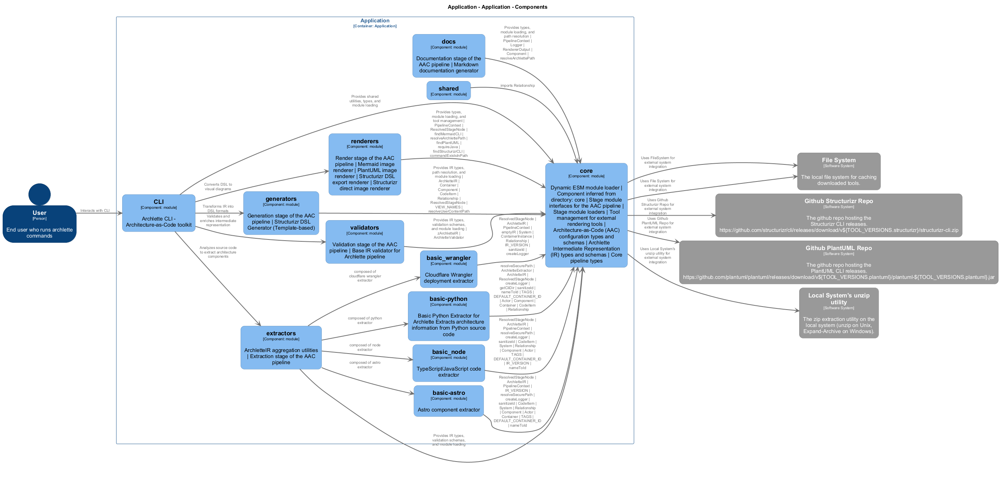

# 🏗️ Application

**Architecture Documentation**
Generated 2025-10-22 06:20:16

## Overview

Main application container

---

## System Architecture

### System Context

The system context diagram shows how Application fits into its environment, including external systems and users.

---

## Containers

The container diagram shows the high-level technology choices and how containers communicate.

<table>
<thead>
<tr>
<th>Container</th>
<th>Type</th>
<th>Description</th>
</tr>
</thead>
<tbody>
<tr>
<td><strong>Application</strong></td>
<td><code>Application</code></td>
<td>Main application container</td>
</tr>
</tbody>
</table>

---

## Components

The component diagram shows the internal structure of containers and their responsibilities.

<table>
<thead>
<tr>
<th>Component</th>
<th>Container</th>
<th>Type</th>
<th>Description</th>
<th>Details</th>
</tr>
</thead>
<tbody>
<tr>
<td><strong>CLI</strong></td>
<td>default-container</td>
<td><code>module</code></td>
<td>Archlette CLI - Architecture-as-Code toolkit</td>
<td><a href="./default-container__cli.md">View →</a></td>
</tr>
<tr>
<td><strong>extractors</strong></td>
<td>default-container</td>
<td><code>module</code></td>
<td>ArchletteIR aggregation utilities | Extraction stage of the AAC pipeline</td>
<td><a href="./default-container__extractors.md">View →</a></td>
</tr>
<tr>
<td><strong>validators</strong></td>
<td>default-container</td>
<td><code>module</code></td>
<td>Validation stage of the AAC pipeline | Base IR validator for Archlette pipeline</td>
<td><a href="./default-container__validators.md">View →</a></td>
</tr>
<tr>
<td><strong>generators</strong></td>
<td>default-container</td>
<td><code>module</code></td>
<td>Generation stage of the AAC pipeline | Structurizr DSL Generator (Template-based)</td>
<td><a href="./default-container__generators.md">View →</a></td>
</tr>
<tr>
<td><strong>renderers</strong></td>
<td>default-container</td>
<td><code>module</code></td>
<td>Render stage of the AAC pipeline | PlantUML image renderer | Structurizr DSL export renderer</td>
<td><a href="./default-container__renderers.md">View →</a></td>
</tr>
<tr>
<td><strong>docs</strong></td>
<td>default-container</td>
<td><code>module</code></td>
<td>Documentation stage of the AAC pipeline | Markdown documentation generator</td>
<td><a href="./default-container__docs.md">View →</a></td>
</tr>
<tr>
<td><strong>core</strong></td>
<td>default-container</td>
<td><code>module</code></td>
<td>Dynamic ESM module loader | Stage module interfaces for the AAC pipeline | Stage module loaders | Tool management for external rendering tools | Architecture-as-Code (AAC) configuration types and schemas | Archlette Intermediate Representation (IR) types and schemas | Core pipeline types</td>
<td><a href="./default-container__core.md">View →</a></td>
</tr>
<tr>
<td><strong>basic_node</strong></td>
<td>default-container</td>
<td><code>module</code></td>
<td>TypeScript/JavaScript code extractor</td>
<td><a href="./default-container__basicnode.md">View →</a></td>
</tr>
<tr>
<td><strong>basic</strong></td>
<td>default-container</td>
<td><code>module</code></td>
<td>Basic Python Extractor for Archlette
Extracts architecture information from Python source code</td>
<td><a href="./default-container__basic.md">View →</a></td>
</tr>
<tr>
<td><strong>basic_wrangler</strong></td>
<td>default-container</td>
<td><code>module</code></td>
<td>Cloudflare Wrangler deployment extractor</td>
<td><a href="./default-container__basicwrangler.md">View →</a></td>
</tr>
<tr>
<td><strong>basic_python</strong></td>
<td>default-container</td>
<td><code>module</code></td>
<td>—</td>
<td><a href="./default-container__basicpython.md">View →</a></td>
</tr>
</tbody>
</table>

---

## Actors

<table>
<thead>
<tr>
<th>Actor</th>
<th>Type</th>
<th>Description</th>
</tr>
</thead>
<tbody>
<tr>
<td><strong>User</strong></td>
<td><code>Person</code></td>
<td>End user who runs archlette commands</td>
</tr>
<tr>
<td><strong>FileSystem</strong></td>
<td><code>System</code></td>
<td>File system for reading and writing files</td>
</tr>
<tr>
<td><strong>Github Structurizr Repo</strong></td>
<td><code>System</code></td>
<td>The github repo hosting the Structurizr CLI releases. https://github.com/structurizr/cli/releases/download/v${TOOL_VERSIONS.structurizr}/structurizr-cli.zip</td>
</tr>
<tr>
<td><strong>Github PlantUML Repo</strong></td>
<td><code>System</code></td>
<td>The github repo hosting the PlantUML CLI releases. https://github.com/plantuml/plantuml/releases/download/v${TOOL_VERSIONS.plantuml}/plantuml-${TOOL_VERSIONS.plantuml}.jar</td>
</tr>
<tr>
<td><strong>Local System's unzip utility</strong></td>
<td><code>System</code></td>
<td>The zip extraction utility on the local system (unzip on Unix, Expand-Archive on Windows).</td>
</tr>
<tr>
<td><strong>File System</strong></td>
<td><code>System</code></td>
<td>The local file system for caching downloaded tools.</td>
</tr>
</tbody>
</table>

---

## Component Reference

Quick navigation to detailed component documentation:

- **[CLI](./default-container__cli.md)** — Archlette CLI - Architecture-as-Code toolkit
- **[extractors](./default-container__extractors.md)** — ArchletteIR aggregation utilities | Extraction stage of the AAC pipeline
- **[validators](./default-container__validators.md)** — Validation stage of the AAC pipeline | Base IR validator for Archlette pipeline
- **[generators](./default-container__generators.md)** — Generation stage of the AAC pipeline | Structurizr DSL Generator (Template-based)
- **[renderers](./default-container__renderers.md)** — Render stage of the AAC pipeline | PlantUML image renderer | Structurizr DSL export renderer
- **[docs](./default-container__docs.md)** — Documentation stage of the AAC pipeline | Markdown documentation generator
- **[core](./default-container__core.md)** — Dynamic ESM module loader | Stage module interfaces for the AAC pipeline | Stage module loaders | Tool management for external rendering tools | Architecture-as-Code (AAC) configuration types and schemas | Archlette Intermediate Representation (IR) types and schemas | Core pipeline types
- **[basic_node](./default-container__basicnode.md)** — TypeScript/JavaScript code extractor
- **[basic](./default-container__basic.md)** — Basic Python Extractor for Archlette
Extracts architecture information from Python source code
- **[basic_wrangler](./default-container__basicwrangler.md)** — Cloudflare Wrangler deployment extractor
- **[basic_python](./default-container__basicpython.md)** — Component documentation

---

Generated with <a href="https://github.com/architectlabs/archlette">Archlette</a> Architecture-as-Code toolkit

