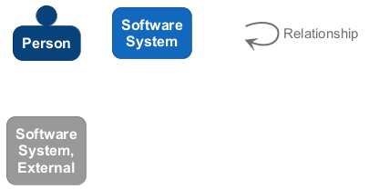
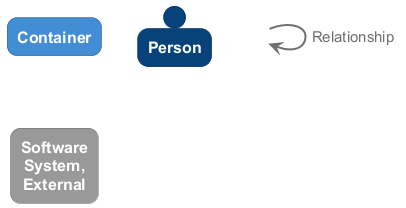

# 🏗️ @chrislyons-dev/archlette

> **Architecture Documentation**
> Generated on 2025-10-16 19:15:37

## 📋 Overview

Architecture-as-Code toolkit for automated diagrams, docs, and releases.

---

## 📐 System Architecture

### System Context

The system context diagram shows how @chrislyons-dev/archlette fits into its environment, including external systems and users.

---

## 🏢 Containers

The container diagram shows the high-level technology choices and how containers communicate.

<table>
<thead>
<tr>
<th>Container</th>
<th>Type</th>
<th>Description</th>
</tr>
</thead>
<tbody>
<tr>
<td><strong>@chrislyons-dev/archlette</strong></td>
<td><code>Application</code></td>
<td>Architecture-as-Code toolkit for automated diagrams, docs, and releases.</td>
</tr>
</tbody>
</table>

---

## 🧩 Components

The component diagram shows the internal structure of containers and their responsibilities.

<table>
<thead>
<tr>
<th>Component</th>
<th>Container</th>
<th>Type</th>
<th>Description</th>
<th>Details</th>
</tr>
</thead>
<tbody>
<tr>
<td><strong>CLI</strong></td>
<td>default-container</td>
<td><code>module</code></td>
<td>Archlette CLI - Architecture-as-Code toolkit</td>
<td><a href="./cli.md">View →</a></td>
</tr>
<tr>
<td><strong>extractors</strong></td>
<td>default-container</td>
<td><code>module</code></td>
<td>ArchletteIR aggregation utilities</td>
<td><a href="./extractors.md">View →</a></td>
</tr>
<tr>
<td><strong>validators</strong></td>
<td>default-container</td>
<td><code>module</code></td>
<td>Validation stage of the AAC pipeline</td>
<td><a href="./validators.md">View →</a></td>
</tr>
<tr>
<td><strong>generators</strong></td>
<td>default-container</td>
<td><code>module</code></td>
<td>Generation stage of the AAC pipeline</td>
<td><a href="./generators.md">View →</a></td>
</tr>
<tr>
<td><strong>renderers</strong></td>
<td>default-container</td>
<td><code>module</code></td>
<td>Render stage of the AAC pipeline</td>
<td><a href="./renderers.md">View →</a></td>
</tr>
<tr>
<td><strong>docs</strong></td>
<td>default-container</td>
<td><code>module</code></td>
<td>Documentation stage of the AAC pipeline</td>
<td><a href="./docs.md">View →</a></td>
</tr>
<tr>
<td><strong>core</strong></td>
<td>default-container</td>
<td><code>module</code></td>
<td>—</td>
<td><a href="./core.md">View →</a></td>
</tr>
</tbody>
</table>

---

## 👥 Actors

<table>
<thead>
<tr>
<th>Actor</th>
<th>Type</th>
<th>Description</th>
</tr>
</thead>
<tbody>
<tr>
<td><strong>User</strong></td>
<td><code>Person</code></td>
<td>End user who runs archlette commands</td>
</tr>
<tr>
<td><strong>FileSystem</strong></td>
<td><code>System</code></td>
<td>File system for reading and writing files</td>
</tr>
</tbody>
</table>

---

## 📚 Component Reference

Quick navigation to detailed component documentation:

- **[CLI](./cli.md)** — Archlette CLI - Architecture-as-Code toolkit
- **[extractors](./extractors.md)** — ArchletteIR aggregation utilities
- **[validators](./validators.md)** — Validation stage of the AAC pipeline
- **[generators](./generators.md)** — Generation stage of the AAC pipeline
- **[renderers](./renderers.md)** — Render stage of the AAC pipeline
- **[docs](./docs.md)** — Documentation stage of the AAC pipeline
- **[core](./core.md)** — Component documentation

---

Generated with <a href="https://github.com/architectlabs/archlette">Archlette</a> Architecture-as-Code toolkit

