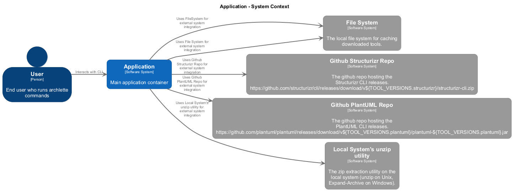
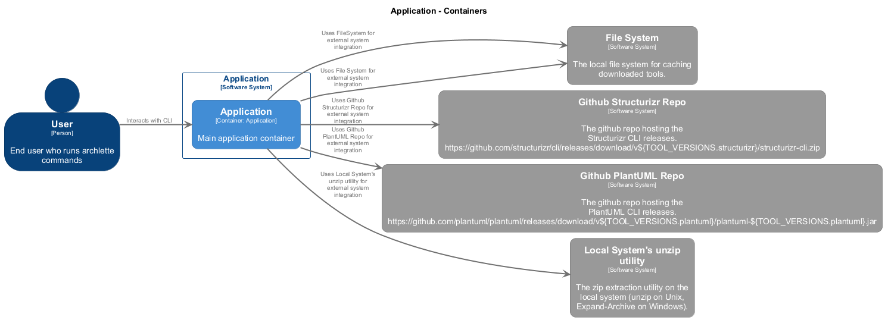

#  Application

**Architecture Documentation**
Generated 2026-03-01 15:37:40

## Overview

Main application container

---

## System Context

The system context diagram shows how Application fits into its environment, including external systems and users.

---

## Containers

The container diagram shows the high-level technology choices and how containers communicate.

| Container | Type | Description | Details |
| --- | --- | --- | --- |
| **Application** | `Application` | Main application container | [View](./default-container.md) |

---

Generated with <a href="https://github.com/chrislyons-dev/archlette">Archlette</a> Architecture-as-Code toolkit

