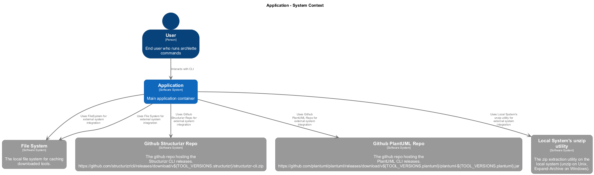

# 🏗️ Application

**Architecture Documentation**
Generated 2025-10-22 21:32:02

## Overview

Main application container

---

## System Context

The system context diagram shows how Application fits into its environment, including external systems and users.

---

## Containers

The container diagram shows the high-level technology choices and how containers communicate.

<table>
<thead>
<tr>
<th>Container</th>
<th>Type</th>
<th>Description</th>
<th>Details</th>
</tr>
</thead>
<tbody>
<tr>
<td><strong>Application</strong></td>
<td><code>Application</code></td>
<td>Main application container</td>
<td><a href="./default-container.md">View →</a></td>
</tr>
</tbody>
</table>

---

Generated with <a href="https://github.com/architectlabs/archlette">Archlette</a> Architecture-as-Code toolkit

