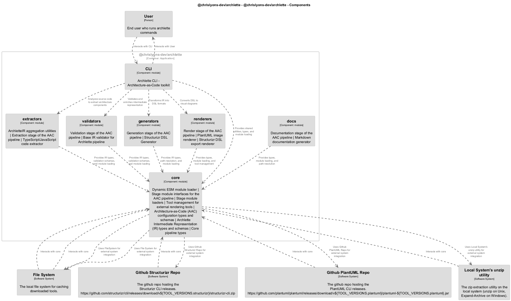

# 🧩 CLI

[← Back to System Overview](./README.md)

---

## 📋 Component Information

<table>
<tbody>
<tr>
<td><strong>Container</strong></td>
<td>@chrislyons-dev/archlette</td>
</tr>
<tr>
<td><strong>Type</strong></td>
<td><code>module</code></td>
</tr>
<tr>
<td><strong>Description</strong></td>
<td>Archlette CLI - Architecture-as-Code toolkit</td>
</tr>
</tbody>
</table>

---

## 🏗️ Component Architecture

---

## 💻 Code Structure

### Code Elements

<strong>5 code element(s)</strong>

#### Functions

##### `usageAndExit()`

<table>
<tbody>
<tr>
<td><strong>Type</strong></td>
<td><code>function</code></td>
</tr>
<tr>
<td><strong>Visibility</strong></td>
<td><code>private</code></td>
</tr>
<tr>
<td><strong>Returns</strong></td>
<td><code>void</code></td>
</tr>
<tr>
<td><strong>Location</strong></td>
<td><code>C:/Users/chris/git/archlette/src/cli.ts:68</code></td>
</tr>
</tbody>
</table>

**Parameters:**

- `msg`: <code>string</code>

---
##### `parseArgs()`

<table>
<tbody>
<tr>
<td><strong>Type</strong></td>
<td><code>function</code></td>
</tr>
<tr>
<td><strong>Visibility</strong></td>
<td><code>private</code></td>
</tr>
<tr>
<td><strong>Returns</strong></td>
<td><code>{ stageArg: string; yamlPathArg: any; }</code></td>
</tr>
<tr>
<td><strong>Location</strong></td>
<td><code>C:/Users/chris/git/archlette/src/cli.ts:82</code></td>
</tr>
</tbody>
</table>

**Parameters:**

- `argv`: <code>string[]</code>

---
##### `stageListFromArg()`

<table>
<tbody>
<tr>
<td><strong>Type</strong></td>
<td><code>function</code></td>
</tr>
<tr>
<td><strong>Visibility</strong></td>
<td><code>private</code></td>
</tr>
<tr>
<td><strong>Returns</strong></td>
<td><code>string[]</code></td>
</tr>
<tr>
<td><strong>Location</strong></td>
<td><code>C:/Users/chris/git/archlette/src/cli.ts:104</code></td>
</tr>
</tbody>
</table>

**Parameters:**

- `stageArg`: <code>string</code>

---
##### `loadYamlIfExists()`

<table>
<tbody>
<tr>
<td><strong>Type</strong></td>
<td><code>function</code></td>
</tr>
<tr>
<td><strong>Visibility</strong></td>
<td><code>private</code></td>
</tr>
<tr>
<td><strong>Async</strong></td>
<td>Yes</td>
</tr>
<tr>
<td><strong>Returns</strong></td>
<td><code>Promise<{ config: any; path: string; }></code></td>
</tr>
<tr>
<td><strong>Location</strong></td>
<td><code>C:/Users/chris/git/archlette/src/cli.ts:110</code></td>
</tr>
</tbody>
</table>

**Parameters:**

- `resolvedFile`: <code>string</code>

---
##### `run()`

<table>
<tbody>
<tr>
<td><strong>Type</strong></td>
<td><code>function</code></td>
</tr>
<tr>
<td><strong>Visibility</strong></td>
<td><code>public</code></td>
</tr>
<tr>
<td><strong>Async</strong></td>
<td>Yes</td>
</tr>
<tr>
<td><strong>Returns</strong></td>
<td><code>Promise<void></code></td>
</tr>
<tr>
<td><strong>Location</strong></td>
<td><code>C:/Users/chris/git/archlette/src/cli.ts:130</code></td>
</tr>
</tbody>
</table>

**Parameters:**

- `argv`: <code>string[]</code>

---

---

<a href="./README.md">← Back to System Overview</a> | Generated with <a href="https://github.com/architectlabs/archlette">Archlette</a>

