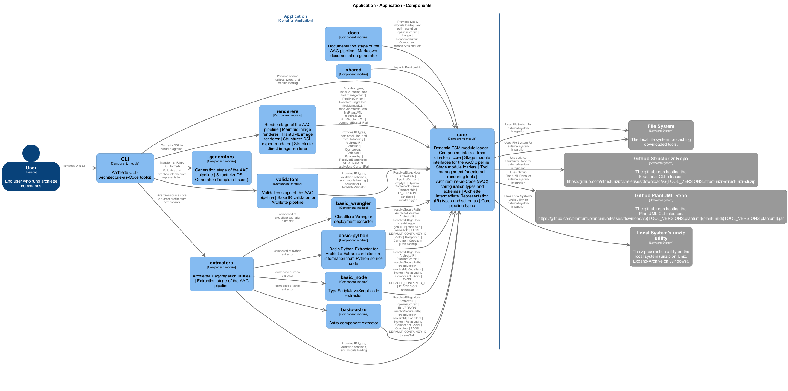

# Application

[← Back to System Overview](./README.md)

---

## Container Context

---

## Container Information

| Field | Value |
| --- | --- |
| **Name** | Application |
| **Type** | `Application` |
| **Description** | Main application container || **Tags** | `Auto-generated` |
---

## Components

### Component View

### Component Details

| Component | Type | Description | Code |
| --- | --- | --- | --- |
| **CLI** | `module` | Archlette CLI - Architecture-as-Code toolkit | [View](./default_container__cli.md) |
| **extractors** | `module` | ArchletteIR aggregation utilities \| Extraction stage of the AAC pipeline | [View](./default_container__extractors.md) |
| **validators** | `module` | Validation stage of the AAC pipeline \| Base IR validator for Archlette pipeline | [View](./default_container__validators.md) |
| **generators** | `module` | Generation stage of the AAC pipeline \| Structurizr DSL Generator (Template-based) | [View](./default_container__generators.md) |
| **renderers** | `module` | Render stage of the AAC pipeline \| Mermaid image renderer \| PlantUML image renderer \| Structurizr DSL export renderer \| Structurizr direct image renderer | [View](./default_container__renderers.md) |
| **docs** | `module` | Documentation stage of the AAC pipeline \| Markdown documentation generator | [View](./default_container__docs.md) |
| **core** | `module` | Dynamic ESM module loader \| Component inferred from directory: core \| Stage module interfaces for the AAC pipeline \| Stage module loaders \| Tool management for external rendering tools \| Architecture-as-Code (AAC) configuration types and schemas \| Archlette Intermediate Representation (IR) types and schemas \| Core pipeline types | [View](./default_container__core.md) |
| **basic-astro** | `module` | Astro component extractor | [View](./default_container__basic_astro.md) |
| **basic_node** | `module` | TypeScript/JavaScript code extractor | [View](./default_container__basic_node.md) |
| **basic-python** | `module` | Basic Python Extractor for Archlette Extracts architecture information from Python source code | [View](./default_container__basic_python.md) |
| **basic_wrangler** | `module` | Cloudflare Wrangler deployment extractor | [View](./default_container__basic_wrangler.md) |
| **shared** | `module` | - | [View](./default_container__shared.md) |

---

<a href="./README.md">← Back to System Overview</a> | Generated with <a href="https://github.com/chrislyons-dev/archlette">Archlette</a>

