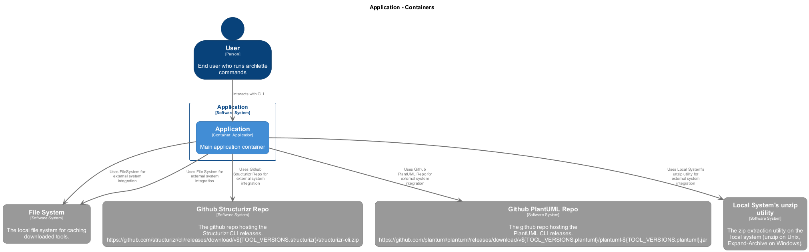
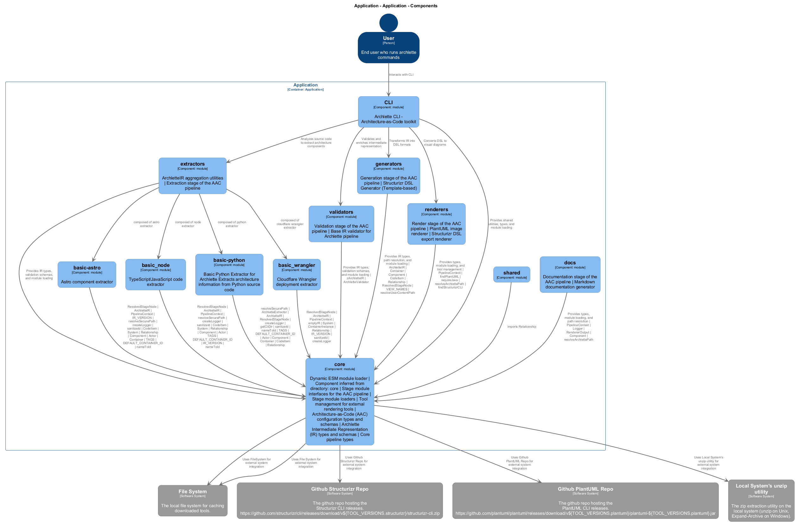

# Application

[← Back to System Overview](./README.md)

---

## Container Context

---

## Container Information

<table>
<tbody>
<tr>
<td><strong>Name</strong></td>
<td>Application</td>
</tr>
<tr>
<td><strong>Type</strong></td>
<td><code>Application</code></td>
</tr>
<tr>
<td><strong>Description</strong></td>
<td>Main application container</td>
</tr>
<tr>
<td><strong>Tags</strong></td>
<td><code>Auto-generated</code></td>
</tr>
</tbody>
</table>

---

## Components

### Component View

### Component Details

<table>
<thead>
<tr>
<th>Component</th>
<th>Type</th>
<th>Description</th>
<th>Code</th>
</tr>
</thead>
<tbody>
<tr>
<td><strong>CLI</strong></td>
<td><code>module</code></td>
<td>Archlette CLI - Architecture-as-Code toolkit</td>
<td><a href="./default_container__cli.md">View →</a></td>
</tr>
<tr>
<td><strong>extractors</strong></td>
<td><code>module</code></td>
<td>ArchletteIR aggregation utilities | Extraction stage of the AAC pipeline</td>
<td><a href="./default_container__extractors.md">View →</a></td>
</tr>
<tr>
<td><strong>validators</strong></td>
<td><code>module</code></td>
<td>Validation stage of the AAC pipeline | Base IR validator for Archlette pipeline</td>
<td><a href="./default_container__validators.md">View →</a></td>
</tr>
<tr>
<td><strong>generators</strong></td>
<td><code>module</code></td>
<td>Generation stage of the AAC pipeline | Structurizr DSL Generator (Template-based)</td>
<td><a href="./default_container__generators.md">View →</a></td>
</tr>
<tr>
<td><strong>renderers</strong></td>
<td><code>module</code></td>
<td>Render stage of the AAC pipeline | PlantUML image renderer | Structurizr DSL export renderer</td>
<td><a href="./default_container__renderers.md">View →</a></td>
</tr>
<tr>
<td><strong>docs</strong></td>
<td><code>module</code></td>
<td>Documentation stage of the AAC pipeline | Markdown documentation generator</td>
<td><a href="./default_container__docs.md">View →</a></td>
</tr>
<tr>
<td><strong>core</strong></td>
<td><code>module</code></td>
<td>Dynamic ESM module loader | Component inferred from directory: core | Stage module interfaces for the AAC pipeline | Stage module loaders | Tool management for external rendering tools | Architecture-as-Code (AAC) configuration types and schemas | Archlette Intermediate Representation (IR) types and schemas | Core pipeline types</td>
<td><a href="./default_container__core.md">View →</a></td>
</tr>
<tr>
<td><strong>basic-astro</strong></td>
<td><code>module</code></td>
<td>Astro component extractor</td>
<td><a href="./default_container__basic_astro.md">View →</a></td>
</tr>
<tr>
<td><strong>basic_node</strong></td>
<td><code>module</code></td>
<td>TypeScript/JavaScript code extractor</td>
<td><a href="./default_container__basic_node.md">View →</a></td>
</tr>
<tr>
<td><strong>basic-python</strong></td>
<td><code>module</code></td>
<td>Basic Python Extractor for Archlette
Extracts architecture information from Python source code</td>
<td><a href="./default_container__basic_python.md">View →</a></td>
</tr>
<tr>
<td><strong>basic_wrangler</strong></td>
<td><code>module</code></td>
<td>Cloudflare Wrangler deployment extractor</td>
<td><a href="./default_container__basic_wrangler.md">View →</a></td>
</tr>
</tbody>
</table>

---

<a href="./README.md">← Back to System Overview</a> | Generated with <a href="https://github.com/architectlabs/archlette">Archlette</a>

