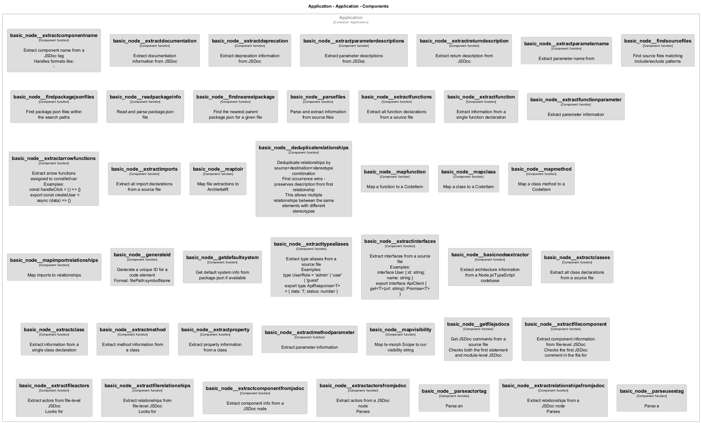
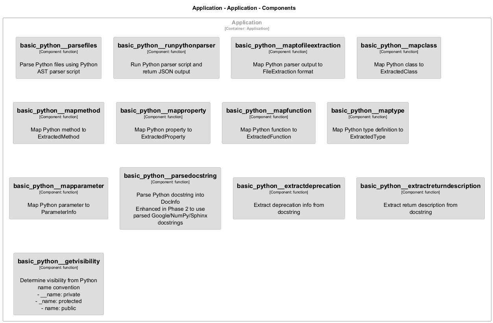
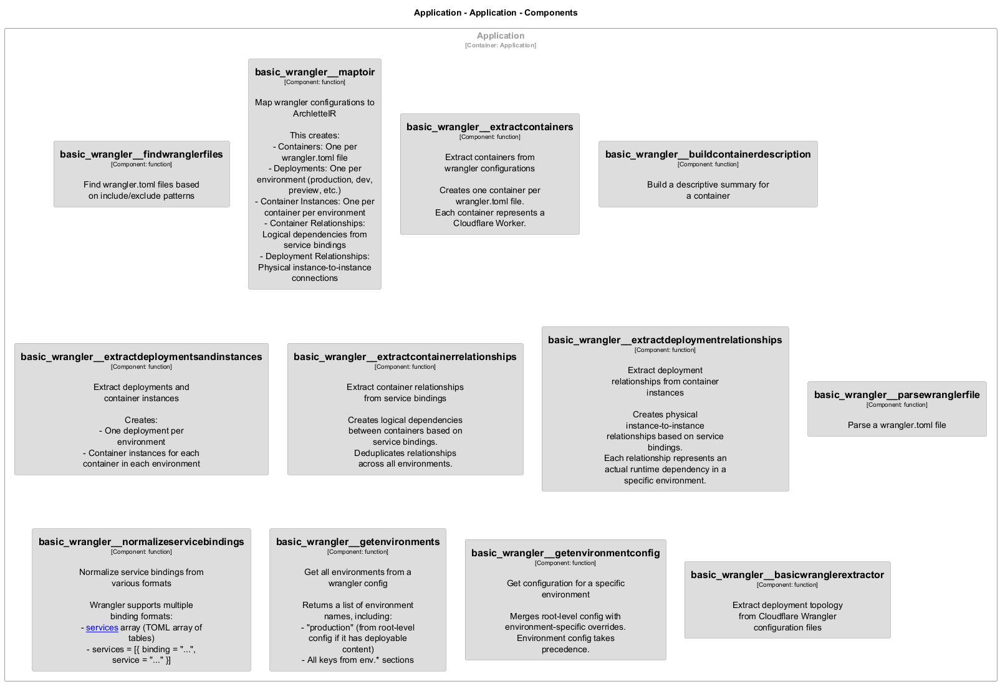

# basic

[← Back to System Overview](./README.md)

---

## Component Information

<table>
<tbody>
<tr>
<td><strong>Container</strong></td>
<td>Application</td>
</tr>
<tr>
<td><strong>Type</strong></td>
<td><code>module</code></td>
</tr>
<tr>
<td><strong>Description</strong></td>
<td>Basic Python Extractor for Archlette
Extracts architecture information from Python source code</td>
</tr>
</tbody>
</table>

---

## Architecture

---

## Code Structure

### Class Diagram

### Code Elements

<strong>11 code element(s)</strong>

#### Functions

##### `basic__createEmptyIR()`

Create empty IR when no files found

<table>
<tbody>
<tr>
<td><strong>Type</strong></td>
<td><code>function</code></td>
</tr>
<tr>
<td><strong>Visibility</strong></td>
<td><code>private</code></td>
</tr>
<tr>
<td><strong>Returns</strong></td>
<td><code>z.infer<any></code></td>
</tr>
<tr>
<td><strong>Location</strong></td>
<td><code>C:/Users/chris/git/archlette/src/extractors/builtin/basic-python.ts:77</code></td>
</tr>
</tbody>
</table>

**Parameters:**

- `systemName`: <code>string</code>

---
##### `basic__basicPython()`

Basic Python extractor
Analyzes Python source code and extracts architectural components

<table>
<tbody>
<tr>
<td><strong>Type</strong></td>
<td><code>function</code></td>
</tr>
<tr>
<td><strong>Visibility</strong></td>
<td><code>public</code></td>
</tr>
<tr>
<td><strong>Async</strong></td>
<td>Yes</td>
</tr>
<tr>
<td><strong>Returns</strong></td>
<td><code>Promise<z.infer<any>></code></td>
</tr>
<tr>
<td><strong>Location</strong></td>
<td><code>C:/Users/chris/git/archlette/src/extractors/builtin/basic-python.ts:20</code></td>
</tr>
</tbody>
</table>

**Parameters:**

- `node`: <code>any</code>- `ctx`: <code>import("C:/Users/chris/git/archlette/src/core/types").PipelineContext</code>

---
##### `basic__mapToIR()`

Map file extractions to ArchletteIR

<table>
<tbody>
<tr>
<td><strong>Type</strong></td>
<td><code>function</code></td>
</tr>
<tr>
<td><strong>Visibility</strong></td>
<td><code>public</code></td>
</tr>
<tr>
<td><strong>Returns</strong></td>
<td><code>z.infer<any></code></td>
</tr>
<tr>
<td><strong>Location</strong></td>
<td><code>C:/Users/chris/git/archlette/src/extractors/builtin/basic-python/to-ir-mapper.ts:31</code></td>
</tr>
</tbody>
</table>

**Parameters:**

- `extractions`: <code>import("C:/Users/chris/git/archlette/src/extractors/builtin/basic-python/types").FileExtraction[]</code>- `systemName`: <code>string</code>- `systemDescription`: <code>string</code>

---
##### `basic__mapComponentToIR()`

Map ComponentInfo to Component

<table>
<tbody>
<tr>
<td><strong>Type</strong></td>
<td><code>function</code></td>
</tr>
<tr>
<td><strong>Visibility</strong></td>
<td><code>private</code></td>
</tr>
<tr>
<td><strong>Returns</strong></td>
<td><code>z.infer<any></code></td>
</tr>
<tr>
<td><strong>Location</strong></td>
<td><code>C:/Users/chris/git/archlette/src/extractors/builtin/basic-python/to-ir-mapper.ts:131</code></td>
</tr>
</tbody>
</table>

**Parameters:**

- `comp`: <code>import("C:/Users/chris/git/archlette/src/extractors/builtin/basic-python/types").ComponentInfo</code>

---
##### `basic__mapActorToIR()`

Map ActorInfo to Actor

<table>
<tbody>
<tr>
<td><strong>Type</strong></td>
<td><code>function</code></td>
</tr>
<tr>
<td><strong>Visibility</strong></td>
<td><code>private</code></td>
</tr>
<tr>
<td><strong>Returns</strong></td>
<td><code>z.infer<any></code></td>
</tr>
<tr>
<td><strong>Location</strong></td>
<td><code>C:/Users/chris/git/archlette/src/extractors/builtin/basic-python/to-ir-mapper.ts:145</code></td>
</tr>
</tbody>
</table>

**Parameters:**

- `actor`: <code>import("C:/Users/chris/git/archlette/src/extractors/builtin/basic-python/types").ActorInfo</code>- `actorTargets`: <code>Map<string, string[]></code>

---
##### `basic__mapRelationshipsToIR()`

Map relationships to Relationship[]
Creates bidirectional actor relationships

<table>
<tbody>
<tr>
<td><strong>Type</strong></td>
<td><code>function</code></td>
</tr>
<tr>
<td><strong>Visibility</strong></td>
<td><code>private</code></td>
</tr>
<tr>
<td><strong>Returns</strong></td>
<td><code>z.infer<any>[]</code></td>
</tr>
<tr>
<td><strong>Location</strong></td>
<td><code>C:/Users/chris/git/archlette/src/extractors/builtin/basic-python/to-ir-mapper.ts:159</code></td>
</tr>
</tbody>
</table>

**Parameters:**

- `relationships`: <code>import("C:/Users/chris/git/archlette/src/extractors/builtin/basic-python/types").RelationshipInfo[]</code>- `componentMap`: <code>Map<string, import("C:/Users/chris/git/archlette/src/extractors/builtin/basic-python/types").ComponentInfo></code>- `actorMap`: <code>Map<string, import("C:/Users/chris/git/archlette/src/extractors/builtin/basic-python/types").ActorInfo></code>- `actorTargets`: <code>Map<string, string[]></code>

---
##### `basic__deduplicateRelationships()`

Deduplicate relationships by source+destination

<table>
<tbody>
<tr>
<td><strong>Type</strong></td>
<td><code>function</code></td>
</tr>
<tr>
<td><strong>Visibility</strong></td>
<td><code>private</code></td>
</tr>
<tr>
<td><strong>Returns</strong></td>
<td><code>z.infer<any>[]</code></td>
</tr>
<tr>
<td><strong>Location</strong></td>
<td><code>C:/Users/chris/git/archlette/src/extractors/builtin/basic-python/to-ir-mapper.ts:205</code></td>
</tr>
</tbody>
</table>

**Parameters:**

- `relationships`: <code>z.infer<any>[]</code>

---
##### `basic__mapClassToCodeItem()`

Map ExtractedClass to CodeItem

<table>
<tbody>
<tr>
<td><strong>Type</strong></td>
<td><code>function</code></td>
</tr>
<tr>
<td><strong>Visibility</strong></td>
<td><code>private</code></td>
</tr>
<tr>
<td><strong>Returns</strong></td>
<td><code>z.infer<any></code></td>
</tr>
<tr>
<td><strong>Location</strong></td>
<td><code>C:/Users/chris/git/archlette/src/extractors/builtin/basic-python/to-ir-mapper.ts:220</code></td>
</tr>
</tbody>
</table>

**Parameters:**

- `cls`: <code>import("C:/Users/chris/git/archlette/src/extractors/builtin/basic-python/types").ExtractedClass</code>- `componentId`: <code>string</code>

---
##### `basic__mapMethodToCodeItem()`

Map ExtractedMethod to CodeItem

<table>
<tbody>
<tr>
<td><strong>Type</strong></td>
<td><code>function</code></td>
</tr>
<tr>
<td><strong>Visibility</strong></td>
<td><code>private</code></td>
</tr>
<tr>
<td><strong>Returns</strong></td>
<td><code>z.infer<any></code></td>
</tr>
<tr>
<td><strong>Location</strong></td>
<td><code>C:/Users/chris/git/archlette/src/extractors/builtin/basic-python/to-ir-mapper.ts:245</code></td>
</tr>
</tbody>
</table>

**Parameters:**

- `method`: <code>import("C:/Users/chris/git/archlette/src/extractors/builtin/basic-python/types").ExtractedMethod</code>- `className`: <code>string</code>- `componentId`: <code>string</code>

---
##### `basic__mapFunctionToCodeItem()`

Map ExtractedFunction to CodeItem

<table>
<tbody>
<tr>
<td><strong>Type</strong></td>
<td><code>function</code></td>
</tr>
<tr>
<td><strong>Visibility</strong></td>
<td><code>private</code></td>
</tr>
<tr>
<td><strong>Returns</strong></td>
<td><code>z.infer<any></code></td>
</tr>
<tr>
<td><strong>Location</strong></td>
<td><code>C:/Users/chris/git/archlette/src/extractors/builtin/basic-python/to-ir-mapper.ts:280</code></td>
</tr>
</tbody>
</table>

**Parameters:**

- `func`: <code>import("C:/Users/chris/git/archlette/src/extractors/builtin/basic-python/types").ExtractedFunction</code>- `componentId`: <code>string</code>

---
##### `basic__mapTypeToCodeItem()`

Map ExtractedType to CodeItem

<table>
<tbody>
<tr>
<td><strong>Type</strong></td>
<td><code>function</code></td>
</tr>
<tr>
<td><strong>Visibility</strong></td>
<td><code>private</code></td>
</tr>
<tr>
<td><strong>Returns</strong></td>
<td><code>z.infer<any></code></td>
</tr>
<tr>
<td><strong>Location</strong></td>
<td><code>C:/Users/chris/git/archlette/src/extractors/builtin/basic-python/to-ir-mapper.ts:311</code></td>
</tr>
</tbody>
</table>

**Parameters:**

- `type`: <code>import("C:/Users/chris/git/archlette/src/extractors/builtin/basic-python/types").ExtractedType</code>- `componentId`: <code>string</code>

---

---

<a href="./README.md">← Back to System Overview</a> | Generated with <a href="https://github.com/architectlabs/archlette">Archlette</a>

