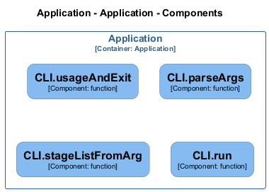

# CLI — Code View

[← Back to Container](./default-container.md) | [← Back to System](./README.md)

---

## Component Information

<table>
<tbody>
<tr>
<td><strong>Component</strong></td>
<td>CLI</td>
</tr>
<tr>
<td><strong>Container</strong></td>
<td>Application</td>
</tr>
<tr>
<td><strong>Type</strong></td>
<td><code>module</code></td>
</tr>
<tr>
<td><strong>Description</strong></td>
<td>Archlette CLI - Architecture-as-Code toolkit</td>
</tr>
</tbody>
</table>

---

## Code Structure

### Class Diagram

### Code Elements

<strong>5 code element(s)</strong>

#### Functions

##### `CLI__usageAndExit()`

<table>
<tbody>
<tr>
<td><strong>Type</strong></td>
<td><code>function</code></td>
</tr>
<tr>
<td><strong>Visibility</strong></td>
<td><code>private</code></td>
</tr>
<tr>
<td><strong>Returns</strong></td>
<td><code>void</code></td>
</tr>
<tr>
<td><strong>Location</strong></td>
<td><code>C:/Users/chris/git/archlette/src/cli.ts:69</code></td>
</tr>
</tbody>
</table>

**Parameters:**

- `msg`: <code>string</code>

---
##### `CLI__parseArgs()`

<table>
<tbody>
<tr>
<td><strong>Type</strong></td>
<td><code>function</code></td>
</tr>
<tr>
<td><strong>Visibility</strong></td>
<td><code>private</code></td>
</tr>
<tr>
<td><strong>Returns</strong></td>
<td><code>{ stageArg: string; yamlPathArg: any; }</code></td>
</tr>
<tr>
<td><strong>Location</strong></td>
<td><code>C:/Users/chris/git/archlette/src/cli.ts:91</code></td>
</tr>
</tbody>
</table>

**Parameters:**

- `argv`: <code>string[]</code>

---
##### `CLI__stageListFromArg()`

<table>
<tbody>
<tr>
<td><strong>Type</strong></td>
<td><code>function</code></td>
</tr>
<tr>
<td><strong>Visibility</strong></td>
<td><code>private</code></td>
</tr>
<tr>
<td><strong>Returns</strong></td>
<td><code>string[]</code></td>
</tr>
<tr>
<td><strong>Location</strong></td>
<td><code>C:/Users/chris/git/archlette/src/cli.ts:124</code></td>
</tr>
</tbody>
</table>

**Parameters:**

- `stageArg`: <code>string</code>

---
##### `CLI__loadYamlIfExists()`

<table>
<tbody>
<tr>
<td><strong>Type</strong></td>
<td><code>function</code></td>
</tr>
<tr>
<td><strong>Visibility</strong></td>
<td><code>private</code></td>
</tr>
<tr>
<td><strong>Async</strong></td>
<td>Yes</td>
</tr>
<tr>
<td><strong>Returns</strong></td>
<td><code>Promise<{ config: any; path: string; }></code></td>
</tr>
<tr>
<td><strong>Location</strong></td>
<td><code>C:/Users/chris/git/archlette/src/cli.ts:130</code></td>
</tr>
</tbody>
</table>

**Parameters:**

- `resolvedFile`: <code>string</code>

---
##### `CLI__run()`

<table>
<tbody>
<tr>
<td><strong>Type</strong></td>
<td><code>function</code></td>
</tr>
<tr>
<td><strong>Visibility</strong></td>
<td><code>public</code></td>
</tr>
<tr>
<td><strong>Async</strong></td>
<td>Yes</td>
</tr>
<tr>
<td><strong>Returns</strong></td>
<td><code>Promise<void></code></td>
</tr>
<tr>
<td><strong>Location</strong></td>
<td><code>C:/Users/chris/git/archlette/src/cli.ts:150</code></td>
</tr>
</tbody>
</table>

**Parameters:**

- `argv`: <code>string[]</code>

---

---

<a href="./default-container.md">← Back to Container</a> | <a href="./README.md">← Back to System</a> | Generated with <a href="https://github.com/architectlabs/archlette">Archlette</a>

