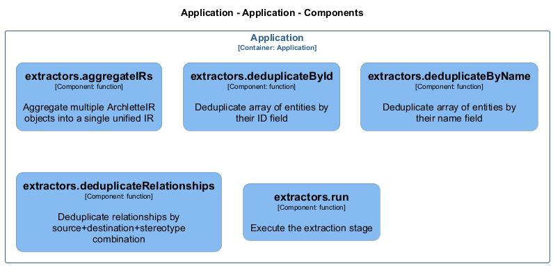

# extractors

[← Back to System Overview](./README.md)

---

## Component Information

<table>
<tbody>
<tr>
<td><strong>Container</strong></td>
<td>Application</td>
</tr>
<tr>
<td><strong>Type</strong></td>
<td><code>module</code></td>
</tr>
<tr>
<td><strong>Description</strong></td>
<td>ArchletteIR aggregation utilities | Extraction stage of the AAC pipeline</td>
</tr>
</tbody>
</table>

---

## Architecture


---

## Code Structure

### Class Diagram



### Code Elements

<details>
<summary><strong>5 code element(s)</strong></summary>


#### Functions

##### `extractors__aggregateIRs()`

Aggregate multiple ArchletteIR objects into a single unified IR

<table>
<tbody>
<tr>
<td><strong>Type</strong></td>
<td><code>function</code></td>
</tr>
<tr>
<td><strong>Visibility</strong></td>
<td><code>public</code></td>
</tr>
<tr>
<td><strong>Returns</strong></td>
<td><code>z.infer<any></code> — A single aggregated ArchletteIR with deduplicated elements</td>
</tr>
<tr>
<td><strong>Location</strong></td>
<td><code>C:/Users/chris/git/archlette/src/1-extract/aggregator.ts:47</code></td>
</tr>
</tbody>
</table>

**Parameters:**

- `irs`: <code>z.infer<any>[]</code> — - Array of ArchletteIR objects to merge
**Examples:**
```typescript

```

---
##### `extractors__deduplicateById()`

Deduplicate array of entities by their ID field

<table>
<tbody>
<tr>
<td><strong>Type</strong></td>
<td><code>function</code></td>
</tr>
<tr>
<td><strong>Visibility</strong></td>
<td><code>private</code></td>
</tr>
<tr>
<td><strong>Returns</strong></td>
<td><code>T[]</code> — Array with duplicates removed (first occurrence preserved, descriptions merged)</td>
</tr>
<tr>
<td><strong>Location</strong></td>
<td><code>C:/Users/chris/git/archlette/src/1-extract/aggregator.ts:104</code></td>
</tr>
</tbody>
</table>

**Parameters:**

- `items`: <code>T[]</code> — - Array of entities with id property

---
##### `extractors__deduplicateByName()`

Deduplicate array of entities by their name field

<table>
<tbody>
<tr>
<td><strong>Type</strong></td>
<td><code>function</code></td>
</tr>
<tr>
<td><strong>Visibility</strong></td>
<td><code>private</code></td>
</tr>
<tr>
<td><strong>Returns</strong></td>
<td><code>T[]</code> — Array with duplicates removed (first occurrence preserved, descriptions merged)</td>
</tr>
<tr>
<td><strong>Location</strong></td>
<td><code>C:/Users/chris/git/archlette/src/1-extract/aggregator.ts:142</code></td>
</tr>
</tbody>
</table>

**Parameters:**

- `items`: <code>T[]</code> — - Array of entities with name property

---
##### `extractors__deduplicateRelationships()`

Deduplicate relationships by source+destination+stereotype combination

<table>
<tbody>
<tr>
<td><strong>Type</strong></td>
<td><code>function</code></td>
</tr>
<tr>
<td><strong>Visibility</strong></td>
<td><code>private</code></td>
</tr>
<tr>
<td><strong>Returns</strong></td>
<td><code>z.infer<any>[]</code> — Array with duplicate relationships removed</td>
</tr>
<tr>
<td><strong>Location</strong></td>
<td><code>C:/Users/chris/git/archlette/src/1-extract/aggregator.ts:184</code></td>
</tr>
</tbody>
</table>

**Parameters:**

- `relationships`: <code>z.infer<any>[]</code> — - Array of relationships to deduplicate

---
##### `extractors__run()`

Execute the extraction stage

<table>
<tbody>
<tr>
<td><strong>Type</strong></td>
<td><code>function</code></td>
</tr>
<tr>
<td><strong>Visibility</strong></td>
<td><code>public</code></td>
</tr>
<tr>
<td><strong>Async</strong></td>
<td>Yes</td>
</tr>
<tr>
<td><strong>Returns</strong></td>
<td><code>Promise<void></code></td>
</tr>
<tr>
<td><strong>Location</strong></td>
<td><code>C:/Users/chris/git/archlette/src/1-extract/index.ts:42</code></td>
</tr>
</tbody>
</table>

**Parameters:**

- `ctx`: <code>import("C:/Users/chris/git/archlette/src/core/types").PipelineContext</code> — - Pipeline context with configuration and logging

---

</details>

---

<div align="center">
<sub><a href="./README.md">← Back to System Overview</a> | Generated with <a href="https://github.com/architectlabs/archlette">Archlette</a></sub>
</div>
