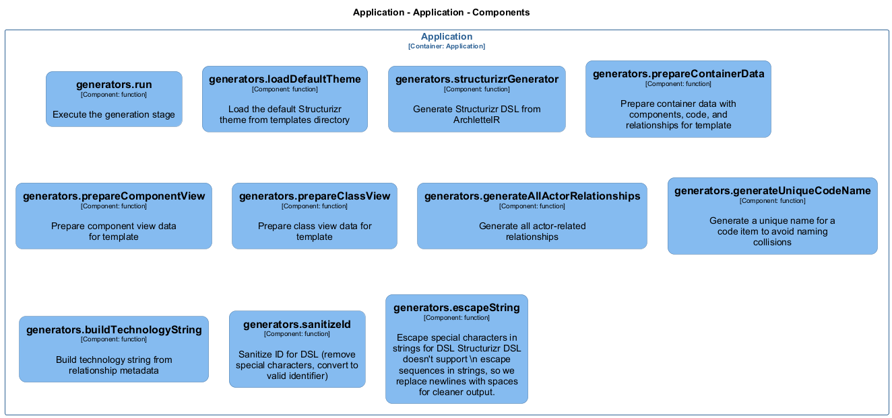

# generators

[← Back to System Overview](./README.md)

---

## Component Information

<table>
<tbody>
<tr>
<td><strong>Container</strong></td>
<td>Application</td>
</tr>
<tr>
<td><strong>Type</strong></td>
<td><code>module</code></td>
</tr>
<tr>
<td><strong>Description</strong></td>
<td>Generation stage of the AAC pipeline | Structurizr DSL Generator</td>
</tr>
</tbody>
</table>

---

## Architecture

---

## Code Structure

### Class Diagram

### Code Elements

<strong>19 code element(s)</strong>

#### Functions

##### `generators__run()`

Execute the generation stage

<table>
<tbody>
<tr>
<td><strong>Type</strong></td>
<td><code>function</code></td>
</tr>
<tr>
<td><strong>Visibility</strong></td>
<td><code>public</code></td>
</tr>
<tr>
<td><strong>Async</strong></td>
<td>Yes</td>
</tr>
<tr>
<td><strong>Returns</strong></td>
<td><code>Promise<void></code></td>
</tr>
<tr>
<td><strong>Location</strong></td>
<td><code>C:/Users/chris/git/archlette/src/3-generate/index.ts:36</code></td>
</tr>
</tbody>
</table>

**Parameters:**

- `ctx`: <code>import("C:/Users/chris/git/archlette/src/core/types").PipelineContext</code> — - Pipeline context with configuration, logging, and validated IR

---
##### `generators__structurizrGenerator()`

Generate Structurizr DSL from ArchletteIR

<table>
<tbody>
<tr>
<td><strong>Type</strong></td>
<td><code>function</code></td>
</tr>
<tr>
<td><strong>Visibility</strong></td>
<td><code>public</code></td>
</tr>
<tr>
<td><strong>Returns</strong></td>
<td><code>string</code> — Structurizr DSL as a string</td>
</tr>
<tr>
<td><strong>Location</strong></td>
<td><code>C:/Users/chris/git/archlette/src/generators/builtin/structurizr.ts:46</code></td>
</tr>
</tbody>
</table>

**Parameters:**

- `ir`: <code>z.infer<any></code> — - The validated ArchletteIR to transform- `_node`: <code>any</code> — - Configuration node (unused but required by interface)

---
##### `generators__generateAllActorRelationships()`

Generate all actor-related relationships (bidirectional)

Includes:
1. Actor → Component (from actor.targets) - users interacting with system
2. Component → Actor (from componentRelationships) - system using external actors

Structurizr automatically aggregates relationships in views:
- System Context view: Shows as actor ↔ system
- Container view: Shows as actor ↔ container
- Component view: Shows actual actor ↔ component relationships

<table>
<tbody>
<tr>
<td><strong>Type</strong></td>
<td><code>function</code></td>
</tr>
<tr>
<td><strong>Visibility</strong></td>
<td><code>private</code></td>
</tr>
<tr>
<td><strong>Returns</strong></td>
<td><code>z.infer<any>[]</code> — Array of relationships to include in the model</td>
</tr>
<tr>
<td><strong>Location</strong></td>
<td><code>C:/Users/chris/git/archlette/src/generators/builtin/structurizr.ts:87</code></td>
</tr>
</tbody>
</table>

**Parameters:**

- `ir`: <code>z.infer<any></code> — - The ArchletteIR containing actors and components

---
##### `generators__generateModel()`

Generate the model section of the DSL

<table>
<tbody>
<tr>
<td><strong>Type</strong></td>
<td><code>function</code></td>
</tr>
<tr>
<td><strong>Visibility</strong></td>
<td><code>private</code></td>
</tr>
<tr>
<td><strong>Returns</strong></td>
<td><code>string[]</code></td>
</tr>
<tr>
<td><strong>Location</strong></td>
<td><code>C:/Users/chris/git/archlette/src/generators/builtin/structurizr.ts:134</code></td>
</tr>
</tbody>
</table>

**Parameters:**

- `ir`: <code>z.infer<any></code>- `indent`: <code>string</code>

---
##### `generators__generateViews()`

Generate the views section of the DSL

<table>
<tbody>
<tr>
<td><strong>Type</strong></td>
<td><code>function</code></td>
</tr>
<tr>
<td><strong>Visibility</strong></td>
<td><code>private</code></td>
</tr>
<tr>
<td><strong>Returns</strong></td>
<td><code>string[]</code></td>
</tr>
<tr>
<td><strong>Location</strong></td>
<td><code>C:/Users/chris/git/archlette/src/generators/builtin/structurizr.ts:223</code></td>
</tr>
</tbody>
</table>

**Parameters:**

- `ir`: <code>z.infer<any></code>- `indent`: <code>string</code>

---
##### `generators__generateSystemContextView()`

Generate System Context view

Shows actors and the system boundary. Structurizr automatically aggregates
actor → component relationships to actor → system for this view since
components are not explicitly included.

<table>
<tbody>
<tr>
<td><strong>Type</strong></td>
<td><code>function</code></td>
</tr>
<tr>
<td><strong>Visibility</strong></td>
<td><code>private</code></td>
</tr>
<tr>
<td><strong>Returns</strong></td>
<td><code>string[]</code></td>
</tr>
<tr>
<td><strong>Location</strong></td>
<td><code>C:/Users/chris/git/archlette/src/generators/builtin/structurizr.ts:265</code></td>
</tr>
</tbody>
</table>

**Parameters:**

- `ir`: <code>z.infer<any></code>- `indent`: <code>string</code>

---
##### `generators__generateContainerView()`

Generate Container view

Shows actors, containers, and their relationships. Actor → component
relationships are automatically aggregated to actor → container level
by Structurizr since components are not shown in this view.

<table>
<tbody>
<tr>
<td><strong>Type</strong></td>
<td><code>function</code></td>
</tr>
<tr>
<td><strong>Visibility</strong></td>
<td><code>private</code></td>
</tr>
<tr>
<td><strong>Returns</strong></td>
<td><code>string[]</code></td>
</tr>
<tr>
<td><strong>Location</strong></td>
<td><code>C:/Users/chris/git/archlette/src/generators/builtin/structurizr.ts:294</code></td>
</tr>
</tbody>
</table>

**Parameters:**

- `ir`: <code>z.infer<any></code>- `indent`: <code>string</code>

---
##### `generators__generateComponentView()`

Generate Component view for a container (excludes Code elements)

Shows actors, components within the container, and their relationships.
Actor → component relationships are shown explicitly at this level.
Code elements are excluded to keep the view focused on architecture.

<table>
<tbody>
<tr>
<td><strong>Type</strong></td>
<td><code>function</code></td>
</tr>
<tr>
<td><strong>Visibility</strong></td>
<td><code>private</code></td>
</tr>
<tr>
<td><strong>Returns</strong></td>
<td><code>string[]</code></td>
</tr>
<tr>
<td><strong>Location</strong></td>
<td><code>C:/Users/chris/git/archlette/src/generators/builtin/structurizr.ts:324</code></td>
</tr>
</tbody>
</table>

**Parameters:**

- `ir`: <code>z.infer<any></code>- `container`: <code>z.infer<any></code>- `indent`: <code>string</code>

---
##### `generators__generateClassView()`

Generate Class view for a component (only Code elements within that component)
This supports the drill-down model: System → Container → Component → Code

Note: Component views in Structurizr require a container ID, not a component ID.
We use the component's container and filter to show only this component's code.

<table>
<tbody>
<tr>
<td><strong>Type</strong></td>
<td><code>function</code></td>
</tr>
<tr>
<td><strong>Visibility</strong></td>
<td><code>private</code></td>
</tr>
<tr>
<td><strong>Returns</strong></td>
<td><code>string[]</code></td>
</tr>
<tr>
<td><strong>Location</strong></td>
<td><code>C:/Users/chris/git/archlette/src/generators/builtin/structurizr.ts:388</code></td>
</tr>
</tbody>
</table>

**Parameters:**

- `ir`: <code>z.infer<any></code>- `component`: <code>z.infer<any></code>- `indent`: <code>string</code>

---
##### `generators__generateActor()`

Generate DSL for an actor (person or external system)

<table>
<tbody>
<tr>
<td><strong>Type</strong></td>
<td><code>function</code></td>
</tr>
<tr>
<td><strong>Visibility</strong></td>
<td><code>private</code></td>
</tr>
<tr>
<td><strong>Returns</strong></td>
<td><code>string</code></td>
</tr>
<tr>
<td><strong>Location</strong></td>
<td><code>C:/Users/chris/git/archlette/src/generators/builtin/structurizr.ts:428</code></td>
</tr>
</tbody>
</table>

**Parameters:**

- `actor`: <code>z.infer<any></code>- `indent`: <code>string</code>

---
##### `generators__generateContainer()`

Generate DSL for a container with its components

<table>
<tbody>
<tr>
<td><strong>Type</strong></td>
<td><code>function</code></td>
</tr>
<tr>
<td><strong>Visibility</strong></td>
<td><code>private</code></td>
</tr>
<tr>
<td><strong>Returns</strong></td>
<td><code>string</code></td>
</tr>
<tr>
<td><strong>Location</strong></td>
<td><code>C:/Users/chris/git/archlette/src/generators/builtin/structurizr.ts:443</code></td>
</tr>
</tbody>
</table>

**Parameters:**

- `container`: <code>z.infer<any></code>- `allComponents`: <code>z.infer<any>[]</code>- `allCode`: <code>z.infer<any>[]</code>- `allActors`: <code>z.infer<any>[]</code>- `componentRels`: <code>z.infer<any>[]</code>- `codeRels`: <code>z.infer<any>[]</code>- `indent`: <code>string</code>

---
##### `generators__generateComponent()`

Generate DSL for a component

<table>
<tbody>
<tr>
<td><strong>Type</strong></td>
<td><code>function</code></td>
</tr>
<tr>
<td><strong>Visibility</strong></td>
<td><code>private</code></td>
</tr>
<tr>
<td><strong>Returns</strong></td>
<td><code>string</code></td>
</tr>
<tr>
<td><strong>Location</strong></td>
<td><code>C:/Users/chris/git/archlette/src/generators/builtin/structurizr.ts:538</code></td>
</tr>
</tbody>
</table>

**Parameters:**

- `component`: <code>z.infer<any></code>- `indent`: <code>string</code>

---
##### `generators__generateCodeAsComponent()`

Generate DSL for a code item as a component
Always tagged with "Code" to separate from logical components in views

<table>
<tbody>
<tr>
<td><strong>Type</strong></td>
<td><code>function</code></td>
</tr>
<tr>
<td><strong>Visibility</strong></td>
<td><code>private</code></td>
</tr>
<tr>
<td><strong>Returns</strong></td>
<td><code>string</code></td>
</tr>
<tr>
<td><strong>Location</strong></td>
<td><code>C:/Users/chris/git/archlette/src/generators/builtin/structurizr.ts:561</code></td>
</tr>
</tbody>
</table>

**Parameters:**

- `code`: <code>z.infer<any></code>- `indent`: <code>string</code>

---
##### `generators__generateUniqueCodeName()`

Generate a unique name for a code item to avoid naming collisions

Handles both hierarchical IDs and file-path-based IDs:
- Hierarchical: "container::component::codeName"
- File-based: "C:/path/to/file.ts:functionName"

<table>
<tbody>
<tr>
<td><strong>Type</strong></td>
<td><code>function</code></td>
</tr>
<tr>
<td><strong>Visibility</strong></td>
<td><code>private</code></td>
</tr>
<tr>
<td><strong>Returns</strong></td>
<td><code>string</code> — Unique name for display</td>
</tr>
<tr>
<td><strong>Location</strong></td>
<td><code>C:/Users/chris/git/archlette/src/generators/builtin/structurizr.ts:601</code></td>
</tr>
</tbody>
</table>

**Parameters:**

- `code`: <code>z.infer<any></code> — - The code item

---
##### `generators__generateRelationship()`

Generate DSL for a relationship

<table>
<tbody>
<tr>
<td><strong>Type</strong></td>
<td><code>function</code></td>
</tr>
<tr>
<td><strong>Visibility</strong></td>
<td><code>private</code></td>
</tr>
<tr>
<td><strong>Returns</strong></td>
<td><code>string</code></td>
</tr>
<tr>
<td><strong>Location</strong></td>
<td><code>C:/Users/chris/git/archlette/src/generators/builtin/structurizr.ts:649</code></td>
</tr>
</tbody>
</table>

**Parameters:**

- `rel`: <code>z.infer<any></code>- `indent`: <code>string</code>

---
##### `generators__buildTechnologyString()`

Build technology string from relationship metadata

<table>
<tbody>
<tr>
<td><strong>Type</strong></td>
<td><code>function</code></td>
</tr>
<tr>
<td><strong>Visibility</strong></td>
<td><code>private</code></td>
</tr>
<tr>
<td><strong>Returns</strong></td>
<td><code>string</code></td>
</tr>
<tr>
<td><strong>Location</strong></td>
<td><code>C:/Users/chris/git/archlette/src/generators/builtin/structurizr.ts:664</code></td>
</tr>
</tbody>
</table>

**Parameters:**

- `rel`: <code>z.infer<any></code>

---
##### `generators__generateDeployment()`

Generate DSL for a deployment environment

Supports both legacy `nodes` format and new `instances` format.
Generates deployment relationships between container instances.

<table>
<tbody>
<tr>
<td><strong>Type</strong></td>
<td><code>function</code></td>
</tr>
<tr>
<td><strong>Visibility</strong></td>
<td><code>private</code></td>
</tr>
<tr>
<td><strong>Returns</strong></td>
<td><code>string</code></td>
</tr>
<tr>
<td><strong>Location</strong></td>
<td><code>C:/Users/chris/git/archlette/src/generators/builtin/structurizr.ts:683</code></td>
</tr>
</tbody>
</table>

**Parameters:**

- `deployment`: <code>z.infer<any></code>- `allDeploymentRelationships`: <code>z.infer<any>[]</code>- `indent`: <code>string</code>

---
##### `generators__sanitizeId()`

Sanitize ID for DSL (remove special characters, convert to camelCase)

<table>
<tbody>
<tr>
<td><strong>Type</strong></td>
<td><code>function</code></td>
</tr>
<tr>
<td><strong>Visibility</strong></td>
<td><code>private</code></td>
</tr>
<tr>
<td><strong>Returns</strong></td>
<td><code>string</code></td>
</tr>
<tr>
<td><strong>Location</strong></td>
<td><code>C:/Users/chris/git/archlette/src/generators/builtin/structurizr.ts:770</code></td>
</tr>
</tbody>
</table>

**Parameters:**

- `id`: <code>string</code>

---
##### `generators__escapeString()`

Escape special characters in strings for DSL

<table>
<tbody>
<tr>
<td><strong>Type</strong></td>
<td><code>function</code></td>
</tr>
<tr>
<td><strong>Visibility</strong></td>
<td><code>private</code></td>
</tr>
<tr>
<td><strong>Returns</strong></td>
<td><code>string</code></td>
</tr>
<tr>
<td><strong>Location</strong></td>
<td><code>C:/Users/chris/git/archlette/src/generators/builtin/structurizr.ts:777</code></td>
</tr>
</tbody>
</table>

**Parameters:**

- `str`: <code>string</code>

---

---

<a href="./README.md">← Back to System Overview</a> | Generated with <a href="https://github.com/architectlabs/archlette">Archlette</a>

