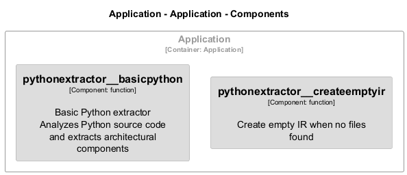

# PythonExtractor

[← Back to System Overview](./README.md)

---

## Component Information

<table>
<tbody>
<tr>
<td><strong>Container</strong></td>
<td>Application</td>
</tr>
<tr>
<td><strong>Type</strong></td>
<td><code>module</code></td>
</tr>
<tr>
<td><strong>Description</strong></td>
<td>Basic Python Extractor for Archlette
Extracts architecture information from Python source code</td>
</tr>
</tbody>
</table>

---

## Architecture

---

## Code Structure

### Class Diagram

### Code Elements

<strong>2 code element(s)</strong>

#### Functions

##### `PythonExtractor__createEmptyIR()`

Create empty IR when no files found

<table>
<tbody>
<tr>
<td><strong>Type</strong></td>
<td><code>function</code></td>
</tr>
<tr>
<td><strong>Visibility</strong></td>
<td><code>private</code></td>
</tr>
<tr>
<td><strong>Returns</strong></td>
<td><code>z.infer<any></code></td>
</tr>
<tr>
<td><strong>Location</strong></td>
<td><code>C:/Users/chris/git/archlette/src/extractors/builtin/basic-python/basic-python.ts:78</code></td>
</tr>
</tbody>
</table>

**Parameters:**

- `systemName`: <code>string</code>

---
##### `PythonExtractor__basicPython()`

Basic Python extractor
Analyzes Python source code and extracts architectural components

<table>
<tbody>
<tr>
<td><strong>Type</strong></td>
<td><code>function</code></td>
</tr>
<tr>
<td><strong>Visibility</strong></td>
<td><code>public</code></td>
</tr>
<tr>
<td><strong>Async</strong></td>
<td>Yes</td>
</tr>
<tr>
<td><strong>Returns</strong></td>
<td><code>Promise<z.infer<any>></code></td>
</tr>
<tr>
<td><strong>Location</strong></td>
<td><code>C:/Users/chris/git/archlette/src/extractors/builtin/basic-python/basic-python.ts:21</code></td>
</tr>
</tbody>
</table>

**Parameters:**

- `node`: <code>any</code>- `ctx`: <code>import("C:/Users/chris/git/archlette/src/core/types").PipelineContext</code>

---

---

<a href="./README.md">← Back to System Overview</a> | Generated with <a href="https://github.com/architectlabs/archlette">Archlette</a>

