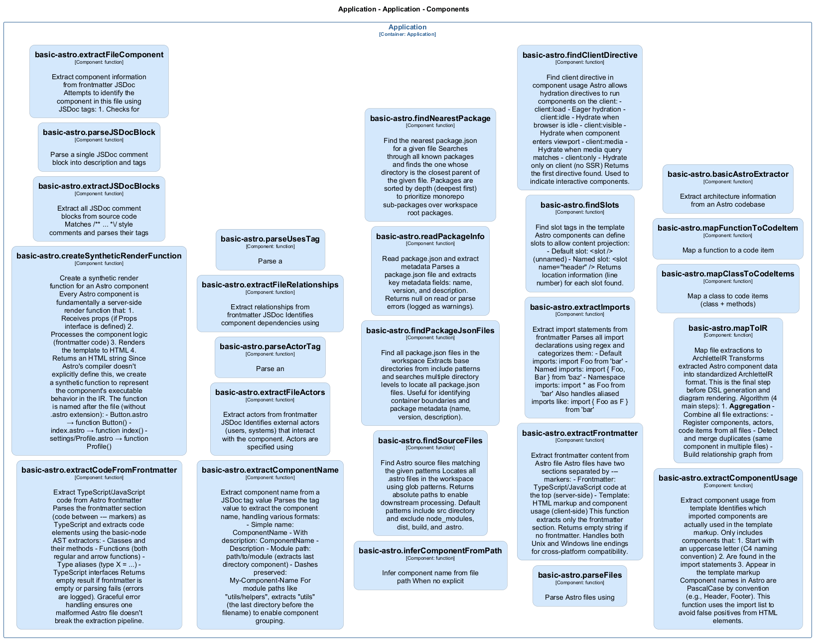

# basic-astro — Code View

[← Back to Container](./default-container.md) | [← Back to System](./README.md)

---

## Component Information

| Field | Value |
| --- | --- |
| **Component** | basic-astro |
| **Container** | Application |
| **Type** | `module` |
| **Description** | Astro component extractor |
---

## Code Structure

### Class Diagram



### Code Elements

<details>
<summary><strong>25 code element(s)</strong></summary>


#### Functions

##### `basicAstroExtractor()`

Extract architecture information from an Astro codebase

| Field | Value |
| --- | --- |
| **Type** | `function` |
| **Visibility** | `public` |
| **Async** | Yes || **Returns** | `Promise<z.infer<any>>` - Promise resolving to ArchletteIR with components, code, and relationships || **Location** | `C:/Users/chris/git/archlette/src/extractors/builtin/basic-astro.ts:71` |

**Parameters:**

- `node`: <code>any</code> — - Configuration node with include/exclude patterns- `ctx`: <code>import("C:/Users/chris/git/archlette/src/core/types").PipelineContext</code> — - Pipeline context with logger and config
**Examples:**
```typescript

```

---
##### `extractCodeFromFrontmatter()`

Extract TypeScript/JavaScript code from Astro frontmatter

Parses the frontmatter section (code between --- markers) as TypeScript
and extracts code elements using the basic-node AST extractors:
- Classes and their methods
- Functions (both regular and arrow functions)
- Type aliases (type X = ...)
- TypeScript interfaces

Returns empty result if frontmatter is empty or parsing fails (errors are logged).
Graceful error handling ensures one malformed Astro file doesn't break the extraction pipeline.

| Field | Value |
| --- | --- |
| **Type** | `function` |
| **Visibility** | `public` |
| **Returns** | `import("C:/Users/chris/git/archlette/src/extractors/builtin/basic-astro/code-extractor").CodeExtractionResult` - CodeExtractionResult with extracted classes, functions, types, and interfaces || **Location** | `C:/Users/chris/git/archlette/src/extractors/builtin/basic-astro/code-extractor.ts:61` |

**Parameters:**

- `frontmatter`: <code>string</code> — - The frontmatter code (TypeScript/JavaScript between --- markers)- `filePath`: <code>string</code> — - Original Astro file path (used for error reporting and virtual TS path)
**Examples:**
```typescript

```

---
##### `createSyntheticRenderFunction()`

Create a synthetic render function for an Astro component

Every Astro component is fundamentally a server-side render function that:
1. Receives props (if Props interface is defined)
2. Processes the component logic (frontmatter code)
3. Renders the template to HTML
4. Returns an HTML string

Since Astro's compiler doesn't explicitly define this, we create a synthetic function
to represent the component's executable behavior in the IR.

The function is named after the file (without .astro extension):
- Button.astro → function Button()
- index.astro → function index()
- settings/Profile.astro → function Profile()

| Field | Value |
| --- | --- |
| **Type** | `function` |
| **Visibility** | `public` |
| **Returns** | `import("C:/Users/chris/git/archlette/src/extractors/builtin/basic-node/types").ExtractedFunction` - Synthetic ExtractedFunction representing the component's render behavior || **Location** | `C:/Users/chris/git/archlette/src/extractors/builtin/basic-astro/code-extractor.ts:153` |

**Parameters:**

- `filePath`: <code>string</code> — - Absolute path to the Astro file- `interfaces`: <code>import("C:/Users/chris/git/archlette/src/extractors/builtin/basic-node/types").ExtractedInterface[]</code> — - Extracted interfaces from frontmatter (used to detect Props interface)
**Examples:**
```typescript

```

---
##### `extractJSDocBlocks()`

Extract all JSDoc comment blocks from source code
Matches /** ... *\/ style comments and parses their tags

| Field | Value |
| --- | --- |
| **Type** | `function` |
| **Visibility** | `private` |
| **Returns** | `JSDocBlock[]` || **Location** | `C:/Users/chris/git/archlette/src/extractors/builtin/basic-astro/component-detector.ts:27` |

**Parameters:**

- `source`: <code>string</code>

---
##### `parseJSDocBlock()`

Parse a single JSDoc comment block into description and tags

| Field | Value |
| --- | --- |
| **Type** | `function` |
| **Visibility** | `private` |
| **Returns** | `JSDocBlock` || **Location** | `C:/Users/chris/git/archlette/src/extractors/builtin/basic-astro/component-detector.ts:49` |

**Parameters:**

- `comment`: <code>string</code>

---
##### `extractFileComponent()`

Extract component information from frontmatter JSDoc

Attempts to identify the component in this file using JSDoc tags:
1. Checks for

| Field | Value |
| --- | --- |
| **Type** | `function` |
| **Visibility** | `public` |
| **Returns** | `import("C:/Users/chris/git/archlette/src/extractors/builtin/basic-astro/types").ComponentInfo` - ComponentInfo with id, name, and optional description, or undefined || **Location** | `C:/Users/chris/git/archlette/src/extractors/builtin/basic-astro/component-detector.ts:118` |

**Parameters:**

- `frontmatter`: <code>string</code> — - TypeScript/JavaScript code from frontmatter section- `filePath`: <code>string</code> — - Absolute path to the Astro file (used for inference)
**Examples:**
```typescript

```

---
##### `extractComponentName()`

Extract component name from a JSDoc tag value

Parses the tag value to extract the component name, handling various formats:
- Simple name: ComponentName
- With description: ComponentName - Description
- Module path: path/to/module (extracts last directory component)
- Dashes preserved: My-Component-Name

For module paths like "utils/helpers", extracts "utils" (the last directory
before the filename) to enable component grouping.

| Field | Value |
| --- | --- |
| **Type** | `function` |
| **Visibility** | `private` |
| **Returns** | `string` - Extracted component name, or undefined if value is empty || **Location** | `C:/Users/chris/git/archlette/src/extractors/builtin/basic-astro/component-detector.ts:191` |

**Parameters:**

- `value`: <code>string</code> — - The JSDoc tag value (text after
**Examples:**
```typescript

```

---
##### `extractFileActors()`

Extract actors from frontmatter JSDoc

Identifies external actors (users, systems) that interact with the component.
Actors are specified using

| Field | Value |
| --- | --- |
| **Type** | `function` |
| **Visibility** | `public` |
| **Returns** | `import("C:/Users/chris/git/archlette/src/extractors/builtin/basic-astro/types").ActorInfo[]` - Array of identified actors, or empty array if none found || **Location** | `C:/Users/chris/git/archlette/src/extractors/builtin/basic-astro/component-detector.ts:250` |

**Parameters:**

- `frontmatter`: <code>string</code> — - TypeScript/JavaScript code from frontmatter
**Examples:**
```typescript

```

---
##### `parseActorTag()`

Parse an

| Field | Value |
| --- | --- |
| **Type** | `function` |
| **Visibility** | `private` |
| **Returns** | `import("C:/Users/chris/git/archlette/src/extractors/builtin/basic-astro/types").ActorInfo` || **Location** | `C:/Users/chris/git/archlette/src/extractors/builtin/basic-astro/component-detector.ts:277` |

**Parameters:**

- `value`: <code>string</code>

---
##### `extractFileRelationships()`

Extract relationships from frontmatter JSDoc

Identifies component dependencies using

| Field | Value |
| --- | --- |
| **Type** | `function` |
| **Visibility** | `public` |
| **Returns** | `import("C:/Users/chris/git/archlette/src/extractors/builtin/basic-astro/types").RelationshipInfo[]` - Array of identified relationships, or empty array if none found || **Location** | `C:/Users/chris/git/archlette/src/extractors/builtin/basic-astro/component-detector.ts:333` |

**Parameters:**

- `frontmatter`: <code>string</code> — - TypeScript/JavaScript code from frontmatter
**Examples:**
```typescript

```

---
##### `parseUsesTag()`

Parse a

| Field | Value |
| --- | --- |
| **Type** | `function` |
| **Visibility** | `private` |
| **Returns** | `import("C:/Users/chris/git/archlette/src/extractors/builtin/basic-astro/types").RelationshipInfo` || **Location** | `C:/Users/chris/git/archlette/src/extractors/builtin/basic-astro/component-detector.ts:357` |

**Parameters:**

- `value`: <code>string</code>

---
##### `inferComponentFromPath()`

Infer component name from file path

When no explicit

| Field | Value |
| --- | --- |
| **Type** | `function` |
| **Visibility** | `private` |
| **Returns** | `import("C:/Users/chris/git/archlette/src/extractors/builtin/basic-astro/types").ComponentInfo` - ComponentInfo with inferred component name || **Location** | `C:/Users/chris/git/archlette/src/extractors/builtin/basic-astro/component-detector.ts:400` |

**Parameters:**

- `filePath`: <code>string</code> — - Absolute path to the Astro file
**Examples:**
```typescript

```

---
##### `findSourceFiles()`

Find Astro source files matching the given patterns

Locates all .astro files in the workspace using glob patterns.
Returns absolute paths to enable downstream processing.

Default patterns include src directory and exclude node_modules, dist, build, and .astro.

| Field | Value |
| --- | --- |
| **Type** | `function` |
| **Visibility** | `public` |
| **Async** | Yes || **Returns** | `Promise<string[]>` - Promise resolving to array of absolute file paths || **Location** | `C:/Users/chris/git/archlette/src/extractors/builtin/basic-astro/file-finder.ts:39` |

**Parameters:**

- `options`: <code>{ include?: string[]; exclude?: string[]; }</code> — - Configuration object
**Examples:**
```typescript

```

---
##### `findPackageJsonFiles()`

Find all package.json files in the workspace

Extracts base directories from include patterns and searches multiple directory levels
to locate all package.json files. Useful for identifying container boundaries and
package metadata (name, version, description).

| Field | Value |
| --- | --- |
| **Type** | `function` |
| **Visibility** | `public` |
| **Async** | Yes || **Returns** | `Promise<string[]>` - Promise resolving to array of absolute paths to package.json files || **Location** | `C:/Users/chris/git/archlette/src/extractors/builtin/basic-astro/file-finder.ts:73` |

**Parameters:**

- `options`: <code>{ include?: string[]; exclude?: string[]; }</code> — - Configuration object
**Examples:**
```typescript

```

---
##### `readPackageInfo()`

Read package.json and extract metadata

Parses a package.json file and extracts key metadata fields: name, version, and description.
Returns null on read or parse errors (logged as warnings).

| Field | Value |
| --- | --- |
| **Type** | `function` |
| **Visibility** | `public` |
| **Async** | Yes || **Returns** | `Promise<import("C:/Users/chris/git/archlette/src/extractors/builtin/basic-astro/types").PackageInfo>` - Promise resolving to PackageInfo object or null on error || **Location** | `C:/Users/chris/git/archlette/src/extractors/builtin/basic-astro/file-finder.ts:134` |

**Parameters:**

- `filePath`: <code>string</code> — - Absolute path to package.json file
**Examples:**
```typescript

```

---
##### `findNearestPackage()`

Find the nearest package.json for a given file

Searches through all known packages and finds the one whose directory is the closest
parent of the given file. Packages are sorted by depth (deepest first) to prioritize
monorepo sub-packages over workspace root packages.

| Field | Value |
| --- | --- |
| **Type** | `function` |
| **Visibility** | `public` |
| **Returns** | `import("C:/Users/chris/git/archlette/src/extractors/builtin/basic-astro/types").PackageInfo` - The closest parent package, or null if file is not within any package || **Location** | `C:/Users/chris/git/archlette/src/extractors/builtin/basic-astro/file-finder.ts:172` |

**Parameters:**

- `filePath`: <code>string</code> — - Absolute path to the file- `packages`: <code>import("C:/Users/chris/git/archlette/src/extractors/builtin/basic-astro/types").PackageInfo[]</code> — - Array of discovered package.json metadata objects
**Examples:**
```typescript

```

---
##### `parseFiles()`

Parse Astro files using

| Field | Value |
| --- | --- |
| **Type** | `function` |
| **Visibility** | `public` |
| **Async** | Yes || **Returns** | `Promise<import("C:/Users/chris/git/archlette/src/extractors/builtin/basic-astro/types").FileExtraction[]>` - Promise resolving to FileExtraction array (one per file) || **Location** | `C:/Users/chris/git/archlette/src/extractors/builtin/basic-astro/file-parser.ts:48` |

**Parameters:**

- `filePaths`: <code>string[]</code> — - Array of absolute paths to Astro files
**Examples:**
```typescript

```

---
##### `extractFrontmatter()`

Extract frontmatter content from Astro file

Astro files have two sections separated by --- markers:
- Frontmatter: TypeScript/JavaScript code at the top (server-side)
- Template: HTML markup and component usage (client-side)

This function extracts only the frontmatter section. Returns empty string if no frontmatter.
Handles both Unix and Windows line endings for cross-platform compatibility.

| Field | Value |
| --- | --- |
| **Type** | `function` |
| **Visibility** | `private` |
| **Returns** | `string` - Frontmatter code between the --- markers, or empty string || **Location** | `C:/Users/chris/git/archlette/src/extractors/builtin/basic-astro/file-parser.ts:157` |

**Parameters:**

- `content`: <code>string</code> — - Full Astro file content
**Examples:**
```typescript

```

---
##### `extractImports()`

Extract import statements from frontmatter

Parses all import declarations using regex and categorizes them:
- Default imports: import Foo from 'bar'
- Named imports: import { Foo, Bar } from 'baz'
- Namespace imports: import * as Foo from 'bar'

Also handles aliased imports like: import { Foo as F } from 'bar'

| Field | Value |
| --- | --- |
| **Type** | `function` |
| **Visibility** | `private` |
| **Returns** | `{ source: string; importedNames: string[]; isDefault: boolean; isNamespace: boolean; }[]` - Array of import declarations with categorization || **Location** | `C:/Users/chris/git/archlette/src/extractors/builtin/basic-astro/file-parser.ts:183` |

**Parameters:**

- `frontmatter`: <code>string</code> — - TypeScript/JavaScript code from frontmatter
**Examples:**
```typescript

```

---
##### `findSlots()`

Find slot tags in the template

Astro components can define slots to allow content projection:
- Default slot: <slot /> (unnamed)
- Named slot: <slot name="header" />

Returns location information (line number) for each slot found.

| Field | Value |
| --- | --- |
| **Type** | `function` |
| **Visibility** | `private` |
| **Returns** | `{ name: string; line: number; }[]` - Array of slots with names and line numbers || **Location** | `C:/Users/chris/git/archlette/src/extractors/builtin/basic-astro/file-parser.ts:255` |

**Parameters:**

- `content`: <code>string</code> — - Full Astro file content (used to calculate line numbers)
**Examples:**
```typescript

```

---
##### `findClientDirective()`

Find client directive in component usage

Astro allows hydration directives to run components on the client:
- client:load - Eager hydration
- client:idle - Hydrate when browser is idle
- client:visible - Hydrate when component enters viewport
- client:media - Hydrate when media query matches
- client:only - Hydrate only on client (no SSR)

Returns the first directive found. Used to indicate interactive components.

| Field | Value |
| --- | --- |
| **Type** | `function` |
| **Visibility** | `private` |
| **Returns** | `string` - The directive found (e.g., 'client:load'), or undefined || **Location** | `C:/Users/chris/git/archlette/src/extractors/builtin/basic-astro/file-parser.ts:291` |

**Parameters:**

- `content`: <code>string</code> — - Full Astro file content
**Examples:**
```typescript

```

---
##### `extractComponentUsage()`

Extract component usage from template

Identifies which imported components are actually used in the template markup.
Only includes components that:
1. Start with an uppercase letter (C4 naming convention)
2. Are found in the import statements
3. Appear in the template markup

Component names in Astro are PascalCase by convention (e.g., Header, Footer).
This function uses the import list to avoid false positives from HTML elements.

| Field | Value |
| --- | --- |
| **Type** | `function` |
| **Visibility** | `private` |
| **Returns** | `import("C:/Users/chris/git/archlette/src/extractors/builtin/basic-astro/types").ExtractedComponent[]` - Array of ExtractedComponent objects for used components || **Location** | `C:/Users/chris/git/archlette/src/extractors/builtin/basic-astro/file-parser.ts:317` |

**Parameters:**

- `content`: <code>string</code> — - Full Astro file content- `imports`: <code>{ source: string; importedNames: string[]; }[]</code> — - List of imports from extractImports()- `filePath`: <code>string</code> — - File path (used for location tracking)
**Examples:**
```typescript

```

---
##### `mapToIR()`

Map file extractions to ArchletteIR

Transforms extracted Astro component data into standardized ArchletteIR format.
This is the final step before DSL generation and diagram rendering.

Algorithm (4 main steps):

1. **Aggregation** - Combine all file extractions:
   - Register components, actors, code items from all files
   - Detect and merge duplicates (same component in multiple files)
   - Build relationship graph from

| Field | Value |
| --- | --- |
| **Type** | `function` |
| **Visibility** | `public` |
| **Returns** | `z.infer<any>` - ArchletteIR ready for DSL generation || **Location** | `C:/Users/chris/git/archlette/src/extractors/builtin/basic-astro/to-ir-mapper.ts:73` |

**Parameters:**

- `extractions`: <code>import("C:/Users/chris/git/archlette/src/extractors/builtin/basic-astro/types").FileExtraction[]</code> — - Array of FileExtraction (from parseFiles)- `packages`: <code>import("C:/Users/chris/git/archlette/src/extractors/builtin/basic-astro/types").PackageInfo[]</code> — - Optional array of PackageInfo for container detection- `systemInfo`: <code>z.infer<any></code> — - Optional system metadata (name, description, repository)
**Examples:**
```typescript

```

---
##### `mapClassToCodeItems()`

Map a class to code items (class + methods)

| Field | Value |
| --- | --- |
| **Type** | `function` |
| **Visibility** | `private` |
| **Returns** | `z.infer<any>[]` || **Location** | `C:/Users/chris/git/archlette/src/extractors/builtin/basic-astro/to-ir-mapper.ts:508` |

**Parameters:**

- `cls`: <code>import("C:/Users/chris/git/archlette/src/extractors/builtin/basic-node/types").ExtractedClass</code>- `componentId`: <code>string</code>- `filePath`: <code>string</code>

---
##### `mapFunctionToCodeItem()`

Map a function to a code item

| Field | Value |
| --- | --- |
| **Type** | `function` |
| **Visibility** | `private` |
| **Returns** | `z.infer<any>` || **Location** | `C:/Users/chris/git/archlette/src/extractors/builtin/basic-astro/to-ir-mapper.ts:555` |

**Parameters:**

- `func`: <code>import("C:/Users/chris/git/archlette/src/extractors/builtin/basic-node/types").ExtractedFunction</code>- `componentId`: <code>string</code>- `filePath`: <code>string</code>

---

</details>

---

<div align="center">
<sub><a href="./default-container.md">← Back to Container</a> | <a href="./README.md">← Back to System</a> | Generated with <a href="https://github.com/chrislyons-dev/archlette">Archlette</a></sub>
</div>

