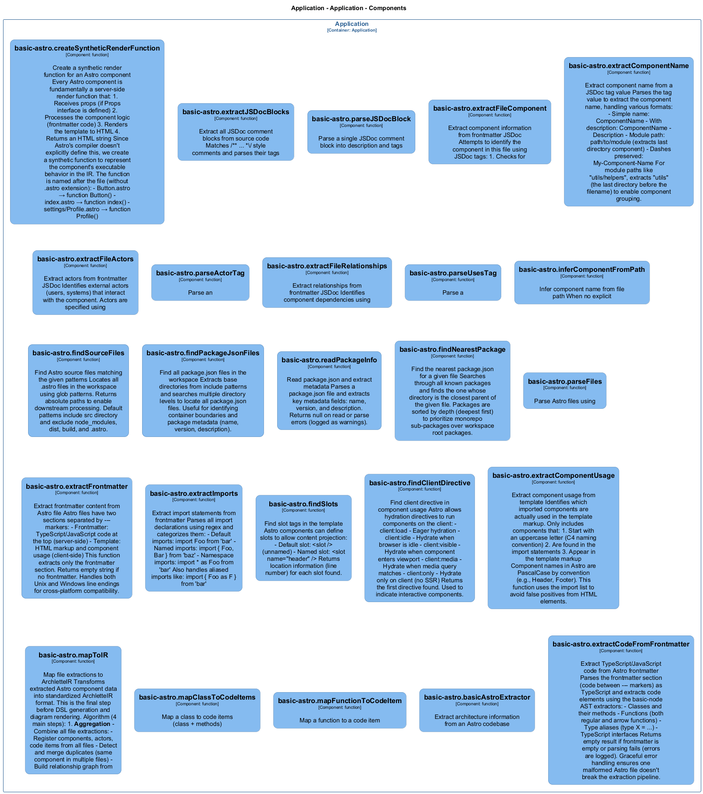

# basic-astro — Code View

[← Back to Container](./default-container.md) | [← Back to System](./README.md)

---

## Component Information

<table>
<tbody>
<tr>
<td><strong>Component</strong></td>
<td>basic-astro</td>
</tr>
<tr>
<td><strong>Container</strong></td>
<td>Application</td>
</tr>
<tr>
<td><strong>Type</strong></td>
<td><code>module</code></td>
</tr>
<tr>
<td><strong>Description</strong></td>
<td>Astro component extractor</td>
</tr>
</tbody>
</table>

---

## Code Structure

### Class Diagram



### Code Elements

<details>
<summary><strong>25 code element(s)</strong></summary>


#### Functions

##### `basicAstroExtractor()`

Extract architecture information from an Astro codebase

<table>
<tbody>
<tr>
<td><strong>Type</strong></td>
<td><code>function</code></td>
</tr>
<tr>
<td><strong>Visibility</strong></td>
<td><code>public</code></td>
</tr>
<tr>
<td><strong>Async</strong></td>
<td>Yes</td>
</tr>
<tr>
<td><strong>Returns</strong></td>
<td><code>Promise<z.infer<any>></code> — Promise resolving to ArchletteIR with components, code, and relationships</td>
</tr>
<tr>
<td><strong>Location</strong></td>
<td><code>C:/Users/chris/git/archlette/src/extractors/builtin/basic-astro.ts:71</code></td>
</tr>
</tbody>
</table>

**Parameters:**

- `node`: <code>any</code> — - Configuration node with include/exclude patterns- `ctx`: <code>import("C:/Users/chris/git/archlette/src/core/types").PipelineContext</code> — - Pipeline context with logger and config
**Examples:**
```typescript

```

---
##### `extractCodeFromFrontmatter()`

Extract TypeScript/JavaScript code from Astro frontmatter
Parses the frontmatter as TypeScript and uses basic-node extractors

<table>
<tbody>
<tr>
<td><strong>Type</strong></td>
<td><code>function</code></td>
</tr>
<tr>
<td><strong>Visibility</strong></td>
<td><code>public</code></td>
</tr>
<tr>
<td><strong>Returns</strong></td>
<td><code>import("C:/Users/chris/git/archlette/src/extractors/builtin/basic-astro/code-extractor").CodeExtractionResult</code> — Extracted code items (classes, functions, types, interfaces)</td>
</tr>
<tr>
<td><strong>Location</strong></td>
<td><code>C:/Users/chris/git/archlette/src/extractors/builtin/basic-astro/code-extractor.ts:41</code></td>
</tr>
</tbody>
</table>

**Parameters:**

- `frontmatter`: <code>string</code> — - The frontmatter content (code between --- markers)- `filePath`: <code>string</code> — - Original Astro file path (for error reporting)

---
##### `createSyntheticRenderFunction()`

Create a synthetic render function for an Astro component
Every Astro component is fundamentally a server-side render function
that takes props and returns HTML

Function is named after the file (e.g., "index", "about", "Header")
so each Astro file has a unique code-level representation

<table>
<tbody>
<tr>
<td><strong>Type</strong></td>
<td><code>function</code></td>
</tr>
<tr>
<td><strong>Visibility</strong></td>
<td><code>public</code></td>
</tr>
<tr>
<td><strong>Returns</strong></td>
<td><code>import("C:/Users/chris/git/archlette/src/extractors/builtin/basic-node/types").ExtractedFunction</code> — Synthetic render function named after the file</td>
</tr>
<tr>
<td><strong>Location</strong></td>
<td><code>C:/Users/chris/git/archlette/src/extractors/builtin/basic-astro/code-extractor.ts:117</code></td>
</tr>
</tbody>
</table>

**Parameters:**

- `filePath`: <code>string</code> — - Original Astro file path- `interfaces`: <code>import("C:/Users/chris/git/archlette/src/extractors/builtin/basic-node/types").ExtractedInterface[]</code> — - Extracted interfaces (to find Props interface)

---
##### `extractJSDocBlocks()`

Extract all JSDoc comment blocks from source code
Matches /** ... *\/ style comments and parses their tags

<table>
<tbody>
<tr>
<td><strong>Type</strong></td>
<td><code>function</code></td>
</tr>
<tr>
<td><strong>Visibility</strong></td>
<td><code>private</code></td>
</tr>
<tr>
<td><strong>Returns</strong></td>
<td><code>JSDocBlock[]</code></td>
</tr>
<tr>
<td><strong>Location</strong></td>
<td><code>C:/Users/chris/git/archlette/src/extractors/builtin/basic-astro/component-detector.ts:27</code></td>
</tr>
</tbody>
</table>

**Parameters:**

- `source`: <code>string</code>

---
##### `parseJSDocBlock()`

Parse a single JSDoc comment block into description and tags

<table>
<tbody>
<tr>
<td><strong>Type</strong></td>
<td><code>function</code></td>
</tr>
<tr>
<td><strong>Visibility</strong></td>
<td><code>private</code></td>
</tr>
<tr>
<td><strong>Returns</strong></td>
<td><code>JSDocBlock</code></td>
</tr>
<tr>
<td><strong>Location</strong></td>
<td><code>C:/Users/chris/git/archlette/src/extractors/builtin/basic-astro/component-detector.ts:49</code></td>
</tr>
</tbody>
</table>

**Parameters:**

- `comment`: <code>string</code>

---
##### `extractFileComponent()`

Extract component information from frontmatter JSDoc
Checks for

<table>
<tbody>
<tr>
<td><strong>Type</strong></td>
<td><code>function</code></td>
</tr>
<tr>
<td><strong>Visibility</strong></td>
<td><code>public</code></td>
</tr>
<tr>
<td><strong>Returns</strong></td>
<td><code>import("C:/Users/chris/git/archlette/src/extractors/builtin/basic-astro/types").ComponentInfo</code></td>
</tr>
<tr>
<td><strong>Location</strong></td>
<td><code>C:/Users/chris/git/archlette/src/extractors/builtin/basic-astro/component-detector.ts:98</code></td>
</tr>
</tbody>
</table>

**Parameters:**

- `frontmatter`: <code>string</code>- `filePath`: <code>string</code>

---
##### `extractComponentName()`

Extract component name from a JSDoc tag value
Handles formats like:
- ComponentName
- ComponentName - Description (space-dash-space separator)
- path/to/module
- My-Component (dashes in names are preserved)

<table>
<tbody>
<tr>
<td><strong>Type</strong></td>
<td><code>function</code></td>
</tr>
<tr>
<td><strong>Visibility</strong></td>
<td><code>private</code></td>
</tr>
<tr>
<td><strong>Returns</strong></td>
<td><code>string</code></td>
</tr>
<tr>
<td><strong>Location</strong></td>
<td><code>C:/Users/chris/git/archlette/src/extractors/builtin/basic-astro/component-detector.ts:154</code></td>
</tr>
</tbody>
</table>

**Parameters:**

- `value`: <code>string</code>

---
##### `extractFileActors()`

Extract actors from frontmatter JSDoc
Looks for

<table>
<tbody>
<tr>
<td><strong>Type</strong></td>
<td><code>function</code></td>
</tr>
<tr>
<td><strong>Visibility</strong></td>
<td><code>public</code></td>
</tr>
<tr>
<td><strong>Returns</strong></td>
<td><code>import("C:/Users/chris/git/archlette/src/extractors/builtin/basic-astro/types").ActorInfo[]</code></td>
</tr>
<tr>
<td><strong>Location</strong></td>
<td><code>C:/Users/chris/git/archlette/src/extractors/builtin/basic-astro/component-detector.ts:194</code></td>
</tr>
</tbody>
</table>

**Parameters:**

- `frontmatter`: <code>string</code>

---
##### `parseActorTag()`

Parse an

<table>
<tbody>
<tr>
<td><strong>Type</strong></td>
<td><code>function</code></td>
</tr>
<tr>
<td><strong>Visibility</strong></td>
<td><code>private</code></td>
</tr>
<tr>
<td><strong>Returns</strong></td>
<td><code>import("C:/Users/chris/git/archlette/src/extractors/builtin/basic-astro/types").ActorInfo</code></td>
</tr>
<tr>
<td><strong>Location</strong></td>
<td><code>C:/Users/chris/git/archlette/src/extractors/builtin/basic-astro/component-detector.ts:221</code></td>
</tr>
</tbody>
</table>

**Parameters:**

- `value`: <code>string</code>

---
##### `extractFileRelationships()`

Extract relationships from frontmatter JSDoc
Looks for

<table>
<tbody>
<tr>
<td><strong>Type</strong></td>
<td><code>function</code></td>
</tr>
<tr>
<td><strong>Visibility</strong></td>
<td><code>public</code></td>
</tr>
<tr>
<td><strong>Returns</strong></td>
<td><code>import("C:/Users/chris/git/archlette/src/extractors/builtin/basic-astro/types").RelationshipInfo[]</code></td>
</tr>
<tr>
<td><strong>Location</strong></td>
<td><code>C:/Users/chris/git/archlette/src/extractors/builtin/basic-astro/component-detector.ts:259</code></td>
</tr>
</tbody>
</table>

**Parameters:**

- `frontmatter`: <code>string</code>

---
##### `parseUsesTag()`

Parse a

<table>
<tbody>
<tr>
<td><strong>Type</strong></td>
<td><code>function</code></td>
</tr>
<tr>
<td><strong>Visibility</strong></td>
<td><code>private</code></td>
</tr>
<tr>
<td><strong>Returns</strong></td>
<td><code>import("C:/Users/chris/git/archlette/src/extractors/builtin/basic-astro/types").RelationshipInfo</code></td>
</tr>
<tr>
<td><strong>Location</strong></td>
<td><code>C:/Users/chris/git/archlette/src/extractors/builtin/basic-astro/component-detector.ts:283</code></td>
</tr>
</tbody>
</table>

**Parameters:**

- `value`: <code>string</code>

---
##### `inferComponentFromPath()`

Infer component name from file path
- Files in subdirectories use the immediate parent folder name
- Files in root directory use ROOT_COMPONENT_MARKER

Examples:
- /path/to/project/src/components/Button.astro -> 'components'
- /path/to/project/src/Layout.astro -> ROOT_COMPONENT_MARKER

<table>
<tbody>
<tr>
<td><strong>Type</strong></td>
<td><code>function</code></td>
</tr>
<tr>
<td><strong>Visibility</strong></td>
<td><code>private</code></td>
</tr>
<tr>
<td><strong>Returns</strong></td>
<td><code>import("C:/Users/chris/git/archlette/src/extractors/builtin/basic-astro/types").ComponentInfo</code></td>
</tr>
<tr>
<td><strong>Location</strong></td>
<td><code>C:/Users/chris/git/archlette/src/extractors/builtin/basic-astro/component-detector.ts:315</code></td>
</tr>
</tbody>
</table>

**Parameters:**

- `filePath`: <code>string</code>

---
##### `findSourceFiles()`

Find Astro source files matching the given patterns

<table>
<tbody>
<tr>
<td><strong>Type</strong></td>
<td><code>function</code></td>
</tr>
<tr>
<td><strong>Visibility</strong></td>
<td><code>public</code></td>
</tr>
<tr>
<td><strong>Async</strong></td>
<td>Yes</td>
</tr>
<tr>
<td><strong>Returns</strong></td>
<td><code>Promise<string[]></code></td>
</tr>
<tr>
<td><strong>Location</strong></td>
<td><code>C:/Users/chris/git/archlette/src/extractors/builtin/basic-astro/file-finder.ts:25</code></td>
</tr>
</tbody>
</table>

**Parameters:**

- `options`: <code>{ include?: string[]; exclude?: string[]; }</code>

---
##### `findPackageJsonFiles()`

Find all package.json files in the workspace

<table>
<tbody>
<tr>
<td><strong>Type</strong></td>
<td><code>function</code></td>
</tr>
<tr>
<td><strong>Visibility</strong></td>
<td><code>public</code></td>
</tr>
<tr>
<td><strong>Async</strong></td>
<td>Yes</td>
</tr>
<tr>
<td><strong>Returns</strong></td>
<td><code>Promise<string[]></code></td>
</tr>
<tr>
<td><strong>Location</strong></td>
<td><code>C:/Users/chris/git/archlette/src/extractors/builtin/basic-astro/file-finder.ts:44</code></td>
</tr>
</tbody>
</table>

**Parameters:**

- `options`: <code>{ include?: string[]; exclude?: string[]; }</code>

---
##### `readPackageInfo()`

Read package.json and extract metadata

<table>
<tbody>
<tr>
<td><strong>Type</strong></td>
<td><code>function</code></td>
</tr>
<tr>
<td><strong>Visibility</strong></td>
<td><code>public</code></td>
</tr>
<tr>
<td><strong>Async</strong></td>
<td>Yes</td>
</tr>
<tr>
<td><strong>Returns</strong></td>
<td><code>Promise<import("C:/Users/chris/git/archlette/src/extractors/builtin/basic-astro/types").PackageInfo></code></td>
</tr>
<tr>
<td><strong>Location</strong></td>
<td><code>C:/Users/chris/git/archlette/src/extractors/builtin/basic-astro/file-finder.ts:95</code></td>
</tr>
</tbody>
</table>

**Parameters:**

- `filePath`: <code>string</code>

---
##### `findNearestPackage()`

Find the nearest package.json for a given file

<table>
<tbody>
<tr>
<td><strong>Type</strong></td>
<td><code>function</code></td>
</tr>
<tr>
<td><strong>Visibility</strong></td>
<td><code>public</code></td>
</tr>
<tr>
<td><strong>Returns</strong></td>
<td><code>import("C:/Users/chris/git/archlette/src/extractors/builtin/basic-astro/types").PackageInfo</code></td>
</tr>
<tr>
<td><strong>Location</strong></td>
<td><code>C:/Users/chris/git/archlette/src/extractors/builtin/basic-astro/file-finder.ts:118</code></td>
</tr>
</tbody>
</table>

**Parameters:**

- `filePath`: <code>string</code>- `packages`: <code>import("C:/Users/chris/git/archlette/src/extractors/builtin/basic-astro/types").PackageInfo[]</code>

---
##### `parseFiles()`

Parse Astro files using

<table>
<tbody>
<tr>
<td><strong>Type</strong></td>
<td><code>function</code></td>
</tr>
<tr>
<td><strong>Visibility</strong></td>
<td><code>public</code></td>
</tr>
<tr>
<td><strong>Async</strong></td>
<td>Yes</td>
</tr>
<tr>
<td><strong>Returns</strong></td>
<td><code>Promise<import("C:/Users/chris/git/archlette/src/extractors/builtin/basic-astro/types").FileExtraction[]></code></td>
</tr>
<tr>
<td><strong>Location</strong></td>
<td><code>C:/Users/chris/git/archlette/src/extractors/builtin/basic-astro/file-parser.ts:26</code></td>
</tr>
</tbody>
</table>

**Parameters:**

- `filePaths`: <code>string[]</code>

---
##### `extractFrontmatter()`

Extract frontmatter content from Astro file
Frontmatter is the TypeScript/JavaScript code between --- markers at the top of the file
Handles both Unix (\n) and Windows (\r\n) line endings

<table>
<tbody>
<tr>
<td><strong>Type</strong></td>
<td><code>function</code></td>
</tr>
<tr>
<td><strong>Visibility</strong></td>
<td><code>private</code></td>
</tr>
<tr>
<td><strong>Returns</strong></td>
<td><code>string</code></td>
</tr>
<tr>
<td><strong>Location</strong></td>
<td><code>C:/Users/chris/git/archlette/src/extractors/builtin/basic-astro/file-parser.ts:120</code></td>
</tr>
</tbody>
</table>

**Parameters:**

- `content`: <code>string</code>

---
##### `extractImports()`

Extract import statements from frontmatter

<table>
<tbody>
<tr>
<td><strong>Type</strong></td>
<td><code>function</code></td>
</tr>
<tr>
<td><strong>Visibility</strong></td>
<td><code>private</code></td>
</tr>
<tr>
<td><strong>Returns</strong></td>
<td><code>{ source: string; importedNames: string[]; isDefault: boolean; isNamespace: boolean; }[]</code></td>
</tr>
<tr>
<td><strong>Location</strong></td>
<td><code>C:/Users/chris/git/archlette/src/extractors/builtin/basic-astro/file-parser.ts:128</code></td>
</tr>
</tbody>
</table>

**Parameters:**

- `frontmatter`: <code>string</code>

---
##### `findSlots()`

Find slot tags in the template

<table>
<tbody>
<tr>
<td><strong>Type</strong></td>
<td><code>function</code></td>
</tr>
<tr>
<td><strong>Visibility</strong></td>
<td><code>private</code></td>
</tr>
<tr>
<td><strong>Returns</strong></td>
<td><code>{ name: string; line: number; }[]</code></td>
</tr>
<tr>
<td><strong>Location</strong></td>
<td><code>C:/Users/chris/git/archlette/src/extractors/builtin/basic-astro/file-parser.ts:183</code></td>
</tr>
</tbody>
</table>

**Parameters:**

- `content`: <code>string</code>

---
##### `findClientDirective()`

Find client directive in component usage
Examples: client:load, client:idle, client:visible, client:media, client:only

<table>
<tbody>
<tr>
<td><strong>Type</strong></td>
<td><code>function</code></td>
</tr>
<tr>
<td><strong>Visibility</strong></td>
<td><code>private</code></td>
</tr>
<tr>
<td><strong>Returns</strong></td>
<td><code>string</code></td>
</tr>
<tr>
<td><strong>Location</strong></td>
<td><code>C:/Users/chris/git/archlette/src/extractors/builtin/basic-astro/file-parser.ts:203</code></td>
</tr>
</tbody>
</table>

**Parameters:**

- `content`: <code>string</code>

---
##### `extractComponentUsage()`

Extract component usage from template
Finds which imported components are used in the template markup

<table>
<tbody>
<tr>
<td><strong>Type</strong></td>
<td><code>function</code></td>
</tr>
<tr>
<td><strong>Visibility</strong></td>
<td><code>private</code></td>
</tr>
<tr>
<td><strong>Returns</strong></td>
<td><code>import("C:/Users/chris/git/archlette/src/extractors/builtin/basic-astro/types").ExtractedComponent[]</code></td>
</tr>
<tr>
<td><strong>Location</strong></td>
<td><code>C:/Users/chris/git/archlette/src/extractors/builtin/basic-astro/file-parser.ts:212</code></td>
</tr>
</tbody>
</table>

**Parameters:**

- `content`: <code>string</code>- `imports`: <code>{ source: string; importedNames: string[]; }[]</code>- `filePath`: <code>string</code>

---
##### `mapToIR()`

Map file extractions to ArchletteIR
Transforms Astro component analysis into standardized architecture representation

<table>
<tbody>
<tr>
<td><strong>Type</strong></td>
<td><code>function</code></td>
</tr>
<tr>
<td><strong>Visibility</strong></td>
<td><code>public</code></td>
</tr>
<tr>
<td><strong>Returns</strong></td>
<td><code>z.infer<any></code></td>
</tr>
<tr>
<td><strong>Location</strong></td>
<td><code>C:/Users/chris/git/archlette/src/extractors/builtin/basic-astro/to-ir-mapper.ts:35</code></td>
</tr>
</tbody>
</table>

**Parameters:**

- `extractions`: <code>import("C:/Users/chris/git/archlette/src/extractors/builtin/basic-astro/types").FileExtraction[]</code>- `packages`: <code>import("C:/Users/chris/git/archlette/src/extractors/builtin/basic-astro/types").PackageInfo[]</code>- `systemInfo`: <code>z.infer<any></code>

---
##### `mapClassToCodeItems()`

Map a class to code items (class + methods)

<table>
<tbody>
<tr>
<td><strong>Type</strong></td>
<td><code>function</code></td>
</tr>
<tr>
<td><strong>Visibility</strong></td>
<td><code>private</code></td>
</tr>
<tr>
<td><strong>Returns</strong></td>
<td><code>z.infer<any>[]</code></td>
</tr>
<tr>
<td><strong>Location</strong></td>
<td><code>C:/Users/chris/git/archlette/src/extractors/builtin/basic-astro/to-ir-mapper.ts:470</code></td>
</tr>
</tbody>
</table>

**Parameters:**

- `cls`: <code>import("C:/Users/chris/git/archlette/src/extractors/builtin/basic-node/types").ExtractedClass</code>- `componentId`: <code>string</code>- `filePath`: <code>string</code>

---
##### `mapFunctionToCodeItem()`

Map a function to a code item

<table>
<tbody>
<tr>
<td><strong>Type</strong></td>
<td><code>function</code></td>
</tr>
<tr>
<td><strong>Visibility</strong></td>
<td><code>private</code></td>
</tr>
<tr>
<td><strong>Returns</strong></td>
<td><code>z.infer<any></code></td>
</tr>
<tr>
<td><strong>Location</strong></td>
<td><code>C:/Users/chris/git/archlette/src/extractors/builtin/basic-astro/to-ir-mapper.ts:517</code></td>
</tr>
</tbody>
</table>

**Parameters:**

- `func`: <code>import("C:/Users/chris/git/archlette/src/extractors/builtin/basic-node/types").ExtractedFunction</code>- `componentId`: <code>string</code>- `filePath`: <code>string</code>

---

</details>

---

<div align="center">
<sub><a href="./default-container.md">← Back to Container</a> | <a href="./README.md">← Back to System</a> | Generated with <a href="https://github.com/architectlabs/archlette">Archlette</a></sub>
</div>
