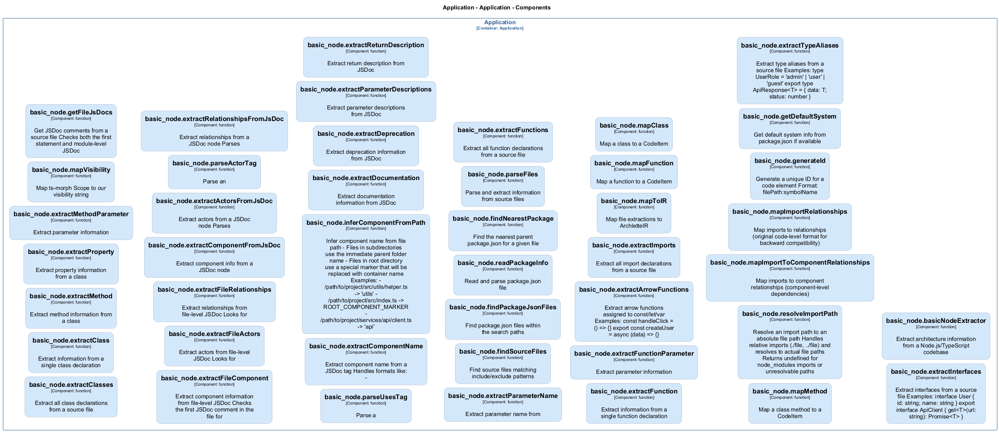

# basic_node — Code View

[← Back to Container](./default-container.md) | [← Back to System](./README.md)

---

## Component Information

| Field | Value |
| --- | --- |
| **Component** | basic_node |
| **Container** | Application |
| **Type** | `module` |
| **Description** | TypeScript/JavaScript code extractor |
---

## Code Structure

### Class Diagram



### Code Elements

<details>
<summary><strong>44 code element(s)</strong></summary>


#### Functions

##### `basicNodeExtractor()`

Extract architecture information from a Node.js/TypeScript codebase

| Field | Value |
| --- | --- |
| **Type** | `function` |
| **Visibility** | `public` |
| **Async** | Yes || **Returns** | `Promise<z.infer<any>>` - Promise resolving to ArchletteIR with code, components, and relationships || **Location** | `C:/Users/chris/git/archlette/src/extractors/builtin/basic-node.ts:74` |

**Parameters:**

- `node`: <code>any</code> — - Configuration node with include/exclude patterns- `ctx`: <code>import("C:/Users/chris/git/archlette/src/core/types").PipelineContext</code> — - Optional pipeline context with logger
**Examples:**
```typescript

```

---
##### `extractClasses()`

Extract all class declarations from a source file

| Field | Value |
| --- | --- |
| **Type** | `function` |
| **Visibility** | `public` |
| **Returns** | `import("C:/Users/chris/git/archlette/src/extractors/builtin/basic-node/types").ExtractedClass[]` || **Location** | `C:/Users/chris/git/archlette/src/extractors/builtin/basic-node/class-extractor.ts:32` |

**Parameters:**

- `sourceFile`: <code>SourceFile</code>

---
##### `extractClass()`

Extract information from a single class declaration

| Field | Value |
| --- | --- |
| **Type** | `function` |
| **Visibility** | `private` |
| **Returns** | `import("C:/Users/chris/git/archlette/src/extractors/builtin/basic-node/types").ExtractedClass` || **Location** | `C:/Users/chris/git/archlette/src/extractors/builtin/basic-node/class-extractor.ts:53` |

**Parameters:**

- `cls`: <code>ClassDeclaration</code>- `filePath`: <code>string</code>

---
##### `extractMethod()`

Extract method information from a class

| Field | Value |
| --- | --- |
| **Type** | `function` |
| **Visibility** | `private` |
| **Returns** | `import("C:/Users/chris/git/archlette/src/extractors/builtin/basic-node/types").ExtractedMethod` || **Location** | `C:/Users/chris/git/archlette/src/extractors/builtin/basic-node/class-extractor.ts:92` |

**Parameters:**

- `method`: <code>MethodDeclaration</code>- `filePath`: <code>string</code>

---
##### `extractProperty()`

Extract property information from a class

| Field | Value |
| --- | --- |
| **Type** | `function` |
| **Visibility** | `private` |
| **Returns** | `import("C:/Users/chris/git/archlette/src/extractors/builtin/basic-node/types").ExtractedProperty` || **Location** | `C:/Users/chris/git/archlette/src/extractors/builtin/basic-node/class-extractor.ts:121` |

**Parameters:**

- `prop`: <code>PropertyDeclaration</code>- `filePath`: <code>string</code>

---
##### `extractMethodParameter()`

Extract parameter information

| Field | Value |
| --- | --- |
| **Type** | `function` |
| **Visibility** | `private` |
| **Returns** | `import("C:/Users/chris/git/archlette/src/extractors/builtin/basic-node/types").ParameterInfo` || **Location** | `C:/Users/chris/git/archlette/src/extractors/builtin/basic-node/class-extractor.ts:147` |

**Parameters:**

- `param`: <code>any</code>- `descriptions`: <code>Map<string, string></code>

---
##### `mapVisibility()`

Map ts-morph Scope to our visibility string

| Field | Value |
| --- | --- |
| **Type** | `function` |
| **Visibility** | `private` |
| **Returns** | `"public" \| "private" \| "protected"` || **Location** | `C:/Users/chris/git/archlette/src/extractors/builtin/basic-node/class-extractor.ts:168` |

**Parameters:**

- `scope`: <code>any</code>

---
##### `getFileJsDocs()`

Get JSDoc comments from a source file
Checks both the first statement and module-level JSDoc

| Field | Value |
| --- | --- |
| **Type** | `function` |
| **Visibility** | `private` |
| **Returns** | `Node[]` - Array of JSDoc nodes (empty if none found) || **Location** | `C:/Users/chris/git/archlette/src/extractors/builtin/basic-node/component-detector.ts:38` |

**Parameters:**

- `sourceFile`: <code>SourceFile</code> — - TypeScript source file to extract JSDoc from

---
##### `extractFileComponent()`

Extract component information from file-level JSDoc
Checks the first JSDoc comment in the file for

| Field | Value |
| --- | --- |
| **Type** | `function` |
| **Visibility** | `public` |
| **Returns** | `import("C:/Users/chris/git/archlette/src/extractors/builtin/basic-node/component-detector").ComponentInfo` || **Location** | `C:/Users/chris/git/archlette/src/extractors/builtin/basic-node/component-detector.ts:64` |

**Parameters:**

- `sourceFile`: <code>SourceFile</code>

---
##### `extractFileActors()`

Extract actors from file-level JSDoc
Looks for

| Field | Value |
| --- | --- |
| **Type** | `function` |
| **Visibility** | `public` |
| **Returns** | `import("C:/Users/chris/git/archlette/src/extractors/builtin/basic-node/component-detector").ActorInfo[]` || **Location** | `C:/Users/chris/git/archlette/src/extractors/builtin/basic-node/component-detector.ts:90` |

**Parameters:**

- `sourceFile`: <code>SourceFile</code>

---
##### `extractFileRelationships()`

Extract relationships from file-level JSDoc
Looks for

| Field | Value |
| --- | --- |
| **Type** | `function` |
| **Visibility** | `public` |
| **Returns** | `import("C:/Users/chris/git/archlette/src/extractors/builtin/basic-node/component-detector").RelationshipInfo[]` || **Location** | `C:/Users/chris/git/archlette/src/extractors/builtin/basic-node/component-detector.ts:109` |

**Parameters:**

- `sourceFile`: <code>SourceFile</code>

---
##### `extractComponentFromJsDoc()`

Extract component info from a JSDoc node

| Field | Value |
| --- | --- |
| **Type** | `function` |
| **Visibility** | `private` |
| **Returns** | `import("C:/Users/chris/git/archlette/src/extractors/builtin/basic-node/component-detector").ComponentInfo` || **Location** | `C:/Users/chris/git/archlette/src/extractors/builtin/basic-node/component-detector.ts:125` |

**Parameters:**

- `jsDoc`: <code>Node</code>

---
##### `extractActorsFromJsDoc()`

Extract actors from a JSDoc node
Parses

| Field | Value |
| --- | --- |
| **Type** | `function` |
| **Visibility** | `private` |
| **Returns** | `import("C:/Users/chris/git/archlette/src/extractors/builtin/basic-node/component-detector").ActorInfo[]` || **Location** | `C:/Users/chris/git/archlette/src/extractors/builtin/basic-node/component-detector.ts:157` |

**Parameters:**

- `jsDoc`: <code>Node</code>

---
##### `parseActorTag()`

Parse an

| Field | Value |
| --- | --- |
| **Type** | `function` |
| **Visibility** | `private` |
| **Returns** | `import("C:/Users/chris/git/archlette/src/extractors/builtin/basic-node/component-detector").ActorInfo` || **Location** | `C:/Users/chris/git/archlette/src/extractors/builtin/basic-node/component-detector.ts:188` |

**Parameters:**

- `tag`: <code>JSDocTag</code>

---
##### `extractRelationshipsFromJsDoc()`

Extract relationships from a JSDoc node
Parses

| Field | Value |
| --- | --- |
| **Type** | `function` |
| **Visibility** | `private` |
| **Returns** | `import("C:/Users/chris/git/archlette/src/extractors/builtin/basic-node/component-detector").RelationshipInfo[]` || **Location** | `C:/Users/chris/git/archlette/src/extractors/builtin/basic-node/component-detector.ts:225` |

**Parameters:**

- `jsDoc`: <code>Node</code>

---
##### `parseUsesTag()`

Parse a

| Field | Value |
| --- | --- |
| **Type** | `function` |
| **Visibility** | `private` |
| **Returns** | `import("C:/Users/chris/git/archlette/src/extractors/builtin/basic-node/component-detector").RelationshipInfo` || **Location** | `C:/Users/chris/git/archlette/src/extractors/builtin/basic-node/component-detector.ts:252` |

**Parameters:**

- `tag`: <code>JSDocTag</code>

---
##### `extractComponentName()`

Extract component name from a JSDoc tag
Handles formats like:
-

| Field | Value |
| --- | --- |
| **Type** | `function` |
| **Visibility** | `private` |
| **Returns** | `string` || **Location** | `C:/Users/chris/git/archlette/src/extractors/builtin/basic-node/component-detector.ts:285` |

**Parameters:**

- `tag`: <code>JSDocTag</code>

---
##### `inferComponentFromPath()`

Infer component name from file path
- Files in subdirectories use the immediate parent folder name
- Files in root directory use a special marker that will be replaced with container name

Examples:
- /path/to/project/src/utils/helper.ts -> 'utils'
- /path/to/project/src/index.ts -> ROOT_COMPONENT_MARKER
- /path/to/project/services/api/client.ts -> 'api'

| Field | Value |
| --- | --- |
| **Type** | `function` |
| **Visibility** | `private` |
| **Returns** | `import("C:/Users/chris/git/archlette/src/extractors/builtin/basic-node/component-detector").ComponentInfo` || **Location** | `C:/Users/chris/git/archlette/src/extractors/builtin/basic-node/component-detector.ts:327` |

**Parameters:**

- `filePath`: <code>string</code>

---
##### `extractDocumentation()`

Extract documentation information from JSDoc

| Field | Value |
| --- | --- |
| **Type** | `function` |
| **Visibility** | `public` |
| **Returns** | `import("C:/Users/chris/git/archlette/src/extractors/builtin/basic-node/types").DocInfo` || **Location** | `C:/Users/chris/git/archlette/src/extractors/builtin/basic-node/doc-extractor.ts:13` |

**Parameters:**

- `jsDocs`: <code>JSDoc[]</code>

---
##### `extractDeprecation()`

Extract deprecation information from JSDoc

| Field | Value |
| --- | --- |
| **Type** | `function` |
| **Visibility** | `public` |
| **Returns** | `import("C:/Users/chris/git/archlette/src/extractors/builtin/basic-node/types").DeprecationInfo` || **Location** | `C:/Users/chris/git/archlette/src/extractors/builtin/basic-node/doc-extractor.ts:64` |

**Parameters:**

- `jsDocs`: <code>JSDoc[]</code>

---
##### `extractParameterDescriptions()`

Extract parameter descriptions from JSDoc

| Field | Value |
| --- | --- |
| **Type** | `function` |
| **Visibility** | `public` |
| **Returns** | `Map<string, string>` || **Location** | `C:/Users/chris/git/archlette/src/extractors/builtin/basic-node/doc-extractor.ts:93` |

**Parameters:**

- `jsDocs`: <code>JSDoc[]</code>

---
##### `extractReturnDescription()`

Extract return description from JSDoc

| Field | Value |
| --- | --- |
| **Type** | `function` |
| **Visibility** | `public` |
| **Returns** | `string` || **Location** | `C:/Users/chris/git/archlette/src/extractors/builtin/basic-node/doc-extractor.ts:116` |

**Parameters:**

- `jsDocs`: <code>JSDoc[]</code>

---
##### `extractParameterName()`

Extract parameter name from

| Field | Value |
| --- | --- |
| **Type** | `function` |
| **Visibility** | `private` |
| **Returns** | `string` || **Location** | `C:/Users/chris/git/archlette/src/extractors/builtin/basic-node/doc-extractor.ts:131` |

**Parameters:**

- `tag`: <code>JSDocTag</code> — Handles formats like:

---
##### `findSourceFiles()`

Find source files matching include/exclude patterns

| Field | Value |
| --- | --- |
| **Type** | `function` |
| **Visibility** | `public` |
| **Async** | Yes || **Returns** | `Promise<string[]>` || **Location** | `C:/Users/chris/git/archlette/src/extractors/builtin/basic-node/file-finder.ts:32` |

**Parameters:**

- `inputs`: <code>import("C:/Users/chris/git/archlette/src/extractors/builtin/basic-node/types").ExtractorInputs</code>

---
##### `findPackageJsonFiles()`

Find package.json files within the search paths

| Field | Value |
| --- | --- |
| **Type** | `function` |
| **Visibility** | `public` |
| **Async** | Yes || **Returns** | `Promise<string[]>` || **Location** | `C:/Users/chris/git/archlette/src/extractors/builtin/basic-node/file-finder.ts:48` |

**Parameters:**

- `inputs`: <code>import("C:/Users/chris/git/archlette/src/extractors/builtin/basic-node/types").ExtractorInputs</code>

---
##### `readPackageInfo()`

Read and parse package.json file

| Field | Value |
| --- | --- |
| **Type** | `function` |
| **Visibility** | `public` |
| **Async** | Yes || **Returns** | `Promise<import("C:/Users/chris/git/archlette/src/extractors/builtin/basic-node/types").PackageInfo>` || **Location** | `C:/Users/chris/git/archlette/src/extractors/builtin/basic-node/file-finder.ts:98` |

**Parameters:**

- `filePath`: <code>string</code>

---
##### `findNearestPackage()`

Find the nearest parent package.json for a given file

| Field | Value |
| --- | --- |
| **Type** | `function` |
| **Visibility** | `public` |
| **Returns** | `import("C:/Users/chris/git/archlette/src/extractors/builtin/basic-node/types").PackageInfo` || **Location** | `C:/Users/chris/git/archlette/src/extractors/builtin/basic-node/file-finder.ts:122` |

**Parameters:**

- `filePath`: <code>string</code>- `packages`: <code>import("C:/Users/chris/git/archlette/src/extractors/builtin/basic-node/types").PackageInfo[]</code>

---
##### `parseFiles()`

Parse and extract information from source files

| Field | Value |
| --- | --- |
| **Type** | `function` |
| **Visibility** | `public` |
| **Async** | Yes || **Returns** | `Promise<import("C:/Users/chris/git/archlette/src/extractors/builtin/basic-node/types").FileExtraction[]>` || **Location** | `C:/Users/chris/git/archlette/src/extractors/builtin/basic-node/file-parser.ts:24` |

**Parameters:**

- `filePaths`: <code>string[]</code>

---
##### `extractFunctions()`

Extract all function declarations from a source file

| Field | Value |
| --- | --- |
| **Type** | `function` |
| **Visibility** | `public` |
| **Returns** | `import("C:/Users/chris/git/archlette/src/extractors/builtin/basic-node/types").ExtractedFunction[]` || **Location** | `C:/Users/chris/git/archlette/src/extractors/builtin/basic-node/function-extractor.ts:21` |

**Parameters:**

- `sourceFile`: <code>SourceFile</code>

---
##### `extractFunction()`

Extract information from a single function declaration

| Field | Value |
| --- | --- |
| **Type** | `function` |
| **Visibility** | `private` |
| **Returns** | `import("C:/Users/chris/git/archlette/src/extractors/builtin/basic-node/types").ExtractedFunction` || **Location** | `C:/Users/chris/git/archlette/src/extractors/builtin/basic-node/function-extractor.ts:44` |

**Parameters:**

- `func`: <code>FunctionDeclaration</code>- `filePath`: <code>string</code>

---
##### `extractFunctionParameter()`

Extract parameter information

| Field | Value |
| --- | --- |
| **Type** | `function` |
| **Visibility** | `private` |
| **Returns** | `import("C:/Users/chris/git/archlette/src/extractors/builtin/basic-node/types").ParameterInfo` || **Location** | `C:/Users/chris/git/archlette/src/extractors/builtin/basic-node/function-extractor.ts:80` |

**Parameters:**

- `param`: <code>any</code>- `descriptions`: <code>Map<string, string></code>

---
##### `extractArrowFunctions()`

Extract arrow functions assigned to const/let/var
Examples:
  const handleClick = () => {}
  export const createUser = async (data) => {}

| Field | Value |
| --- | --- |
| **Type** | `function` |
| **Visibility** | `public` |
| **Returns** | `import("C:/Users/chris/git/archlette/src/extractors/builtin/basic-node/types").ExtractedFunction[]` || **Location** | `C:/Users/chris/git/archlette/src/extractors/builtin/basic-node/function-extractor.ts:104` |

**Parameters:**

- `sourceFile`: <code>SourceFile</code>

---
##### `extractImports()`

Extract all import declarations from a source file

| Field | Value |
| --- | --- |
| **Type** | `function` |
| **Visibility** | `public` |
| **Returns** | `import("C:/Users/chris/git/archlette/src/extractors/builtin/basic-node/types").ExtractedImport[]` || **Location** | `C:/Users/chris/git/archlette/src/extractors/builtin/basic-node/import-extractor.ts:15` |

**Parameters:**

- `sourceFile`: <code>SourceFile</code>

---
##### `mapToIR()`

Map file extractions to ArchletteIR

| Field | Value |
| --- | --- |
| **Type** | `function` |
| **Visibility** | `public` |
| **Returns** | `z.infer<any>` || **Location** | `C:/Users/chris/git/archlette/src/extractors/builtin/basic-node/to-ir-mapper.ts:37` |

**Parameters:**

- `extractions`: <code>import("C:/Users/chris/git/archlette/src/extractors/builtin/basic-node/types").FileExtraction[]</code>- `packages`: <code>import("C:/Users/chris/git/archlette/src/extractors/builtin/basic-node/types").PackageInfo[]</code>- `systemInfo`: <code>z.infer<any></code>

---
##### `mapFunction()`

Map a function to a CodeItem

| Field | Value |
| --- | --- |
| **Type** | `function` |
| **Visibility** | `private` |
| **Returns** | `z.infer<any>` || **Location** | `C:/Users/chris/git/archlette/src/extractors/builtin/basic-node/to-ir-mapper.ts:425` |

**Parameters:**

- `func`: <code>import("C:/Users/chris/git/archlette/src/extractors/builtin/basic-node/types").ExtractedFunction</code>- `filePath`: <code>string</code>- `componentId`: <code>string</code>

---
##### `mapClass()`

Map a class to a CodeItem

| Field | Value |
| --- | --- |
| **Type** | `function` |
| **Visibility** | `private` |
| **Returns** | `z.infer<any>` || **Location** | `C:/Users/chris/git/archlette/src/extractors/builtin/basic-node/to-ir-mapper.ts:453` |

**Parameters:**

- `cls`: <code>import("C:/Users/chris/git/archlette/src/extractors/builtin/basic-node/types").ExtractedClass</code>- `filePath`: <code>string</code>- `componentId`: <code>string</code>

---
##### `mapMethod()`

Map a class method to a CodeItem

| Field | Value |
| --- | --- |
| **Type** | `function` |
| **Visibility** | `private` |
| **Returns** | `z.infer<any>` || **Location** | `C:/Users/chris/git/archlette/src/extractors/builtin/basic-node/to-ir-mapper.ts:482` |

**Parameters:**

- `method`: <code>import("C:/Users/chris/git/archlette/src/extractors/builtin/basic-node/types").ExtractedMethod</code>- `className`: <code>string</code>- `filePath`: <code>string</code>- `componentId`: <code>string</code>

---
##### `resolveImportPath()`

Resolve an import path to an absolute file path
Handles relative imports (./file, ../file) and resolves to actual file paths
Returns undefined for node_modules imports or unresolvable paths

| Field | Value |
| --- | --- |
| **Type** | `function` |
| **Visibility** | `private` |
| **Returns** | `string` || **Location** | `C:/Users/chris/git/archlette/src/extractors/builtin/basic-node/to-ir-mapper.ts:518` |

**Parameters:**

- `importSource`: <code>string</code>- `fromFilePath`: <code>string</code>

---
##### `mapImportToComponentRelationships()`

Map imports to component relationships (component-level dependencies)

| Field | Value |
| --- | --- |
| **Type** | `function` |
| **Visibility** | `private` |
| **Returns** | `z.infer<any>[]` || **Location** | `C:/Users/chris/git/archlette/src/extractors/builtin/basic-node/to-ir-mapper.ts:574` |

**Parameters:**

- `imp`: <code>import("C:/Users/chris/git/archlette/src/extractors/builtin/basic-node/types").ExtractedImport</code>- `filePath`: <code>string</code>- `componentId`: <code>string</code>- `fileToComponentMap`: <code>Map<string, string></code>

---
##### `mapImportRelationships()`

Map imports to relationships (original code-level format for backward compatibility)

| Field | Value |
| --- | --- |
| **Type** | `function` |
| **Visibility** | `private` |
| **Returns** | `z.infer<any>[]` || **Location** | `C:/Users/chris/git/archlette/src/extractors/builtin/basic-node/to-ir-mapper.ts:611` |

**Parameters:**

- `imp`: <code>import("C:/Users/chris/git/archlette/src/extractors/builtin/basic-node/types").ExtractedImport</code>- `filePath`: <code>string</code>

---
##### `generateId()`

Generate a unique ID for a code element
Format: filePath:symbolName

| Field | Value |
| --- | --- |
| **Type** | `function` |
| **Visibility** | `private` |
| **Returns** | `string` || **Location** | `C:/Users/chris/git/archlette/src/extractors/builtin/basic-node/to-ir-mapper.ts:634` |

**Parameters:**

- `filePath`: <code>string</code>- `symbolName`: <code>string</code>

---
##### `getDefaultSystem()`

Get default system info from package.json if available

| Field | Value |
| --- | --- |
| **Type** | `function` |
| **Visibility** | `private` |
| **Returns** | `z.infer<any>` || **Location** | `C:/Users/chris/git/archlette/src/extractors/builtin/basic-node/to-ir-mapper.ts:644` |


---
##### `extractTypeAliases()`

Extract type aliases from a source file
Examples:
  type UserRole = 'admin' | 'user' | 'guest'
  export type ApiResponse<T> = { data: T; status: number }

| Field | Value |
| --- | --- |
| **Type** | `function` |
| **Visibility** | `public` |
| **Returns** | `import("C:/Users/chris/git/archlette/src/extractors/builtin/basic-node/types").ExtractedType[]` || **Location** | `C:/Users/chris/git/archlette/src/extractors/builtin/basic-node/type-extractor.ts:19` |

**Parameters:**

- `sourceFile`: <code>SourceFile</code>

---
##### `extractInterfaces()`

Extract interfaces from a source file
Examples:
  interface User { id: string; name: string }
  export interface ApiClient { get<T>(url: string): Promise<T> }

| Field | Value |
| --- | --- |
| **Type** | `function` |
| **Visibility** | `public` |
| **Returns** | `import("C:/Users/chris/git/archlette/src/extractors/builtin/basic-node/types").ExtractedInterface[]` || **Location** | `C:/Users/chris/git/archlette/src/extractors/builtin/basic-node/type-extractor.ts:59` |

**Parameters:**

- `sourceFile`: <code>SourceFile</code>

---

</details>

---

<div align="center">
<sub><a href="./default-container.md">← Back to Container</a> | <a href="./README.md">← Back to System</a> | Generated with <a href="https://github.com/chrislyons-dev/archlette">Archlette</a></sub>
</div>

