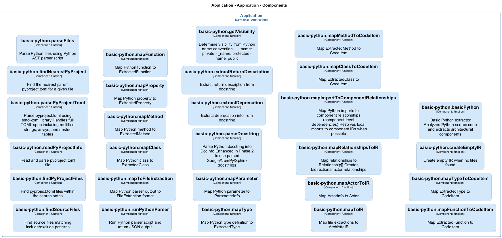

# basic-python — Code View

[← Back to Container](./default-container.md) | [← Back to System](./README.md)

---

## Component Information

| Field | Value |
| --- | --- |
| **Component** | basic-python |
| **Container** | Application |
| **Type** | `module` |
| **Description** | Basic Python Extractor for Archlette Extracts architecture information from Python source code |
---

## Code Structure

### Class Diagram

### Code Elements

<strong>28 code element(s)</strong>

#### Functions

##### `createEmptyIR()`

Create empty IR when no files found

| Field | Value |
| --- | --- |
| **Type** | `function` |
| **Visibility** | `private` |
| **Returns** | `z.infer<any>` || **Location** | `C:/Users/chris/git/archlette/src/extractors/builtin/basic-python.ts:150` |

**Parameters:**

- `systemName`: <code>string</code>

---
##### `basicPython()`

Basic Python extractor
Analyzes Python source code and extracts architectural components

| Field | Value |
| --- | --- |
| **Type** | `function` |
| **Visibility** | `public` |
| **Async** | Yes || **Returns** | `Promise<z.infer<any>>` || **Location** | `C:/Users/chris/git/archlette/src/extractors/builtin/basic-python.ts:26` |

**Parameters:**

- `node`: <code>any</code>- `ctx`: <code>import("C:/Users/chris/git/archlette/src/core/types").PipelineContext</code>

---
##### `findSourceFiles()`

Find source files matching include/exclude patterns

| Field | Value |
| --- | --- |
| **Type** | `function` |
| **Visibility** | `public` |
| **Async** | Yes || **Returns** | `Promise<string[]>` || **Location** | `C:/Users/chris/git/archlette/src/extractors/builtin/basic-python/file-finder.ts:26` |

**Parameters:**

- `inputs`: <code>import("C:/Users/chris/git/archlette/src/extractors/builtin/basic-python/types").ExtractorInputs</code>

---
##### `findPyProjectFiles()`

Find pyproject.toml files within the search paths

| Field | Value |
| --- | --- |
| **Type** | `function` |
| **Visibility** | `public` |
| **Async** | Yes || **Returns** | `Promise<string[]>` || **Location** | `C:/Users/chris/git/archlette/src/extractors/builtin/basic-python/file-finder.ts:42` |

**Parameters:**

- `inputs`: <code>import("C:/Users/chris/git/archlette/src/extractors/builtin/basic-python/types").ExtractorInputs</code>

---
##### `readPyProjectInfo()`

Read and parse pyproject.toml file

| Field | Value |
| --- | --- |
| **Type** | `function` |
| **Visibility** | `public` |
| **Async** | Yes || **Returns** | `Promise<import("C:/Users/chris/git/archlette/src/extractors/builtin/basic-python/file-finder").PyProjectInfo>` || **Location** | `C:/Users/chris/git/archlette/src/extractors/builtin/basic-python/file-finder.ts:91` |

**Parameters:**

- `filePath`: <code>string</code>

---
##### `parsePyProjectToml()`

Parse pyproject.toml using smol-toml library
Handles full TOML spec including multiline strings, arrays, and nested tables

| Field | Value |
| --- | --- |
| **Type** | `function` |
| **Visibility** | `private` |
| **Returns** | `PyProjectToml` || **Location** | `C:/Users/chris/git/archlette/src/extractors/builtin/basic-python/file-finder.ts:142` |

**Parameters:**

- `content`: <code>string</code>

---
##### `findNearestPyProject()`

Find the nearest parent pyproject.toml for a given file

| Field | Value |
| --- | --- |
| **Type** | `function` |
| **Visibility** | `public` |
| **Returns** | `import("C:/Users/chris/git/archlette/src/extractors/builtin/basic-python/file-finder").PyProjectInfo` || **Location** | `C:/Users/chris/git/archlette/src/extractors/builtin/basic-python/file-finder.ts:156` |

**Parameters:**

- `filePath`: <code>string</code>- `pyprojects`: <code>import("C:/Users/chris/git/archlette/src/extractors/builtin/basic-python/file-finder").PyProjectInfo[]</code>

---
##### `parseFiles()`

Parse Python files using Python AST parser script

| Field | Value |
| --- | --- |
| **Type** | `function` |
| **Visibility** | `public` |
| **Async** | Yes || **Returns** | `Promise<import("C:/Users/chris/git/archlette/src/extractors/builtin/basic-python/types").FileExtraction[]>` || **Location** | `C:/Users/chris/git/archlette/src/extractors/builtin/basic-python/file-parser.ts:29` |

**Parameters:**

- `filePaths`: <code>string[]</code>- `pythonPath`: <code>string</code>

---
##### `runPythonParser()`

Run Python parser script and return JSON output

| Field | Value |
| --- | --- |
| **Type** | `function` |
| **Visibility** | `private` |
| **Returns** | `Promise<string>` || **Location** | `C:/Users/chris/git/archlette/src/extractors/builtin/basic-python/file-parser.ts:95` |

**Parameters:**

- `scriptPath`: <code>string</code>- `filePaths`: <code>string[]</code>- `pythonPath`: <code>string</code>

---
##### `mapToFileExtraction()`

Map Python parser output to FileExtraction format

| Field | Value |
| --- | --- |
| **Type** | `function` |
| **Visibility** | `private` |
| **Returns** | `import("C:/Users/chris/git/archlette/src/extractors/builtin/basic-python/types").FileExtraction` || **Location** | `C:/Users/chris/git/archlette/src/extractors/builtin/basic-python/file-parser.ts:187` |

**Parameters:**

- `file`: <code>{ filePath: string; component?: { name: string; description?: string; }; actors: { name: string; type: "Person" | "System"; direction?: "in" | "out" | "both"; description?: string; }[]; relationships: { target: string; description?: string; }[]; classes: { name: string; baseClasses: string[]; decorators: string[]; decoratorDetails: import("C:/Users/chris/git/archlette/src/extractors/builtin/basic-python/types").DecoratorInfo[]; line: number; docstring?: string; methods: { name: string; isStatic: boolean; isAsync: boolean; isClassMethod: boolean; isAbstract: boolean; decorators: string[]; decoratorDetails: import("C:/Users/chris/git/archlette/src/extractors/builtin/basic-python/types").DecoratorInfo[]; line: number; docstring?: string; parsedDoc?: { summary?: string; description?: string; args?: { name: string; type?: string; description?: string; }[]; returns?: { type?: string; description?: string; }; raises?: { type: string; description?: string; }[]; examples?: string; }; parameters: { name: string; annotation?: string; default?: string; }[]; returnAnnotation?: string; }[]; properties: { name: string; type?: "property" | "class_variable"; annotation?: string; default?: string; line: number; docstring?: string; isReadonly?: boolean; hasGetter?: boolean; hasSetter?: boolean; hasDeleter?: boolean; }[]; }[]; functions: { name: string; isAsync: boolean; decorators: string[]; decoratorDetails: import("C:/Users/chris/git/archlette/src/extractors/builtin/basic-python/types").DecoratorInfo[]; line: number; docstring?: string; parsedDoc?: { summary?: string; description?: string; args?: { name: string; type?: string; description?: string; }[]; returns?: { type?: string; description?: string; }; raises?: { type: string; description?: string; }[]; examples?: string; }; parameters: { name: string; annotation?: string; default?: string; }[]; returnAnnotation?: string; }[]; types: { name: string; category: "TypeAlias" | "TypedDict" | "Protocol" | "Enum" | "NewType"; line: number; definition?: string; docstring?: string; }[]; imports: { source: string; names: string[]; isRelative: boolean; level?: number; category: "stdlib" | "third_party" | "local"; }[]; parseError?: string; }</code>

---
##### `mapClass()`

Map Python class to ExtractedClass

| Field | Value |
| --- | --- |
| **Type** | `function` |
| **Visibility** | `private` |
| **Returns** | `import("C:/Users/chris/git/archlette/src/extractors/builtin/basic-python/types").ExtractedClass` || **Location** | `C:/Users/chris/git/archlette/src/extractors/builtin/basic-python/file-parser.ts:254` |

**Parameters:**

- `cls`: <code>{ name: string; baseClasses: string[]; decorators: string[]; decoratorDetails: import("C:/Users/chris/git/archlette/src/extractors/builtin/basic-python/types").DecoratorInfo[]; line: number; docstring?: string; methods: { name: string; isStatic: boolean; isAsync: boolean; isClassMethod: boolean; isAbstract: boolean; decorators: string[]; decoratorDetails: import("C:/Users/chris/git/archlette/src/extractors/builtin/basic-python/types").DecoratorInfo[]; line: number; docstring?: string; parsedDoc?: { summary?: string; description?: string; args?: { name: string; type?: string; description?: string; }[]; returns?: { type?: string; description?: string; }; raises?: { type: string; description?: string; }[]; examples?: string; }; parameters: { name: string; annotation?: string; default?: string; }[]; returnAnnotation?: string; }[]; properties: { name: string; type?: "property" | "class_variable"; annotation?: string; default?: string; line: number; docstring?: string; isReadonly?: boolean; hasGetter?: boolean; hasSetter?: boolean; hasDeleter?: boolean; }[]; }</code>- `filePath`: <code>string</code>

---
##### `mapMethod()`

Map Python method to ExtractedMethod

| Field | Value |
| --- | --- |
| **Type** | `function` |
| **Visibility** | `private` |
| **Returns** | `import("C:/Users/chris/git/archlette/src/extractors/builtin/basic-python/types").ExtractedMethod` || **Location** | `C:/Users/chris/git/archlette/src/extractors/builtin/basic-python/file-parser.ts:279` |

**Parameters:**

- `method`: <code>{ name: string; isStatic: boolean; isAsync: boolean; isClassMethod: boolean; isAbstract: boolean; decorators: string[]; decoratorDetails: import("C:/Users/chris/git/archlette/src/extractors/builtin/basic-python/types").DecoratorInfo[]; line: number; docstring?: string; parsedDoc?: { summary?: string; description?: string; args?: { name: string; type?: string; description?: string; }[]; returns?: { type?: string; description?: string; }; raises?: { type: string; description?: string; }[]; examples?: string; }; parameters: { name: string; annotation?: string; default?: string; }[]; returnAnnotation?: string; }</code>- `filePath`: <code>string</code>

---
##### `mapProperty()`

Map Python property to ExtractedProperty

| Field | Value |
| --- | --- |
| **Type** | `function` |
| **Visibility** | `private` |
| **Returns** | `import("C:/Users/chris/git/archlette/src/extractors/builtin/basic-python/types").ExtractedProperty` || **Location** | `C:/Users/chris/git/archlette/src/extractors/builtin/basic-python/file-parser.ts:314` |

**Parameters:**

- `prop`: <code>{ name: string; type?: "property" | "class_variable"; annotation?: string; default?: string; line: number; docstring?: string; isReadonly?: boolean; hasGetter?: boolean; hasSetter?: boolean; hasDeleter?: boolean; }</code>- `filePath`: <code>string</code>

---
##### `mapFunction()`

Map Python function to ExtractedFunction

| Field | Value |
| --- | --- |
| **Type** | `function` |
| **Visibility** | `private` |
| **Returns** | `import("C:/Users/chris/git/archlette/src/extractors/builtin/basic-python/types").ExtractedFunction` || **Location** | `C:/Users/chris/git/archlette/src/extractors/builtin/basic-python/file-parser.ts:344` |

**Parameters:**

- `func`: <code>{ name: string; isAsync: boolean; decorators: string[]; decoratorDetails: import("C:/Users/chris/git/archlette/src/extractors/builtin/basic-python/types").DecoratorInfo[]; line: number; docstring?: string; parsedDoc?: { summary?: string; description?: string; args?: { name: string; type?: string; description?: string; }[]; returns?: { type?: string; description?: string; }; raises?: { type: string; description?: string; }[]; examples?: string; }; parameters: { name: string; annotation?: string; default?: string; }[]; returnAnnotation?: string; }</code>- `filePath`: <code>string</code>

---
##### `mapType()`

Map Python type definition to ExtractedType

| Field | Value |
| --- | --- |
| **Type** | `function` |
| **Visibility** | `private` |
| **Returns** | `import("C:/Users/chris/git/archlette/src/extractors/builtin/basic-python/types").ExtractedType` || **Location** | `C:/Users/chris/git/archlette/src/extractors/builtin/basic-python/file-parser.ts:373` |

**Parameters:**

- `type`: <code>{ name: string; category: "TypeAlias" | "TypedDict" | "Protocol" | "Enum" | "NewType"; line: number; definition?: string; docstring?: string; }</code>- `filePath`: <code>string</code>

---
##### `mapParameter()`

Map Python parameter to ParameterInfo

| Field | Value |
| --- | --- |
| **Type** | `function` |
| **Visibility** | `private` |
| **Returns** | `import("C:/Users/chris/git/archlette/src/extractors/builtin/basic-python/types").ParameterInfo` || **Location** | `C:/Users/chris/git/archlette/src/extractors/builtin/basic-python/file-parser.ts:395` |

**Parameters:**

- `param`: <code>{ name: string; annotation?: string; default?: string; }</code>- `parsedParam`: <code>{ name: string; type?: string; description?: string; }</code>

---
##### `parseDocstring()`

Parse Python docstring into DocInfo
Enhanced in Phase 2 to use parsed Google/NumPy/Sphinx docstrings

| Field | Value |
| --- | --- |
| **Type** | `function` |
| **Visibility** | `private` |
| **Returns** | `import("C:/Users/chris/git/archlette/src/extractors/builtin/basic-python/types").DocInfo` || **Location** | `C:/Users/chris/git/archlette/src/extractors/builtin/basic-python/file-parser.ts:412` |

**Parameters:**

- `docstring`: <code>string</code>- `parsedDoc`: <code>{ summary?: string; description?: string; args?: { name: string; type?: string; description?: string; }[]; returns?: { type?: string; description?: string; }; raises?: { type: string; description?: string; }[]; examples?: string; }</code>

---
##### `extractDeprecation()`

Extract deprecation info from docstring

| Field | Value |
| --- | --- |
| **Type** | `function` |
| **Visibility** | `private` |
| **Returns** | `{ reason?: string; alternative?: string; }` || **Location** | `C:/Users/chris/git/archlette/src/extractors/builtin/basic-python/file-parser.ts:448` |

**Parameters:**

- `docstring`: <code>string</code>

---
##### `extractReturnDescription()`

Extract return description from docstring

| Field | Value |
| --- | --- |
| **Type** | `function` |
| **Visibility** | `private` |
| **Returns** | `string` || **Location** | `C:/Users/chris/git/archlette/src/extractors/builtin/basic-python/file-parser.ts:464` |

**Parameters:**

- `docstring`: <code>string</code>

---
##### `getVisibility()`

Determine visibility from Python name convention
- __name: private
- _name: protected
- name: public

| Field | Value |
| --- | --- |
| **Type** | `function` |
| **Visibility** | `private` |
| **Returns** | `"public" \| "private" \| "protected"` || **Location** | `C:/Users/chris/git/archlette/src/extractors/builtin/basic-python/file-parser.ts:477` |

**Parameters:**

- `name`: <code>string</code>

---
##### `mapToIR()`

Map file extractions to ArchletteIR

| Field | Value |
| --- | --- |
| **Type** | `function` |
| **Visibility** | `public` |
| **Returns** | `z.infer<any>` || **Location** | `C:/Users/chris/git/archlette/src/extractors/builtin/basic-python/to-ir-mapper.ts:45` |

**Parameters:**

- `extractions`: <code>import("C:/Users/chris/git/archlette/src/extractors/builtin/basic-python/types").FileExtraction[]</code>- `pyprojects`: <code>import("C:/Users/chris/git/archlette/src/extractors/builtin/basic-python/file-finder").PyProjectInfo[]</code>- `systemInfo`: <code>SystemInfo</code>

---
##### `mapActorToIR()`

Map ActorInfo to Actor

| Field | Value |
| --- | --- |
| **Type** | `function` |
| **Visibility** | `private` |
| **Returns** | `z.infer<any>` || **Location** | `C:/Users/chris/git/archlette/src/extractors/builtin/basic-python/to-ir-mapper.ts:332` |

**Parameters:**

- `actor`: <code>import("C:/Users/chris/git/archlette/src/extractors/builtin/basic-python/types").ActorInfo</code>- `actorTargets`: <code>Map<string, string[]></code>

---
##### `mapRelationshipsToIR()`

Map relationships to Relationship[]
Creates bidirectional actor relationships

| Field | Value |
| --- | --- |
| **Type** | `function` |
| **Visibility** | `private` |
| **Returns** | `z.infer<any>[]` || **Location** | `C:/Users/chris/git/archlette/src/extractors/builtin/basic-python/to-ir-mapper.ts:346` |

**Parameters:**

- `relationships`: <code>import("C:/Users/chris/git/archlette/src/extractors/builtin/basic-python/types").RelationshipInfo[]</code>- `componentMap`: <code>Map<string, z.infer<any>></code>- `actorMap`: <code>Map<string, import("C:/Users/chris/git/archlette/src/extractors/builtin/basic-python/types").ActorInfo></code>- `actorTargets`: <code>Map<string, string[]></code>

---
##### `mapImportToComponentRelationships()`

Map Python imports to component relationships (component-level dependencies)
Resolves local imports to component IDs when possible

| Field | Value |
| --- | --- |
| **Type** | `function` |
| **Visibility** | `private` |
| **Returns** | `z.infer<any>[]` || **Location** | `C:/Users/chris/git/archlette/src/extractors/builtin/basic-python/to-ir-mapper.ts:394` |

**Parameters:**

- `imp`: <code>import("C:/Users/chris/git/archlette/src/extractors/builtin/basic-python/types").ExtractedImport</code>- `filePath`: <code>string</code>- `componentId`: <code>string</code>- `fileToComponentMap`: <code>Map<string, string></code>- `modulePathIndex`: <code>Map<string, string></code>

---
##### `mapClassToCodeItem()`

Map ExtractedClass to CodeItem

| Field | Value |
| --- | --- |
| **Type** | `function` |
| **Visibility** | `private` |
| **Returns** | `z.infer<any>` || **Location** | `C:/Users/chris/git/archlette/src/extractors/builtin/basic-python/to-ir-mapper.ts:498` |

**Parameters:**

- `cls`: <code>import("C:/Users/chris/git/archlette/src/extractors/builtin/basic-python/types").ExtractedClass</code>- `componentId`: <code>string</code>

---
##### `mapMethodToCodeItem()`

Map ExtractedMethod to CodeItem

| Field | Value |
| --- | --- |
| **Type** | `function` |
| **Visibility** | `private` |
| **Returns** | `z.infer<any>` || **Location** | `C:/Users/chris/git/archlette/src/extractors/builtin/basic-python/to-ir-mapper.ts:523` |

**Parameters:**

- `method`: <code>import("C:/Users/chris/git/archlette/src/extractors/builtin/basic-python/types").ExtractedMethod</code>- `className`: <code>string</code>- `componentId`: <code>string</code>

---
##### `mapFunctionToCodeItem()`

Map ExtractedFunction to CodeItem

| Field | Value |
| --- | --- |
| **Type** | `function` |
| **Visibility** | `private` |
| **Returns** | `z.infer<any>` || **Location** | `C:/Users/chris/git/archlette/src/extractors/builtin/basic-python/to-ir-mapper.ts:558` |

**Parameters:**

- `func`: <code>import("C:/Users/chris/git/archlette/src/extractors/builtin/basic-python/types").ExtractedFunction</code>- `componentId`: <code>string</code>

---
##### `mapTypeToCodeItem()`

Map ExtractedType to CodeItem

| Field | Value |
| --- | --- |
| **Type** | `function` |
| **Visibility** | `private` |
| **Returns** | `z.infer<any>` || **Location** | `C:/Users/chris/git/archlette/src/extractors/builtin/basic-python/to-ir-mapper.ts:589` |

**Parameters:**

- `type`: <code>import("C:/Users/chris/git/archlette/src/extractors/builtin/basic-python/types").ExtractedType</code>- `componentId`: <code>string</code>

---

---

<a href="./default-container.md">← Back to Container</a> | <a href="./README.md">← Back to System</a> | Generated with <a href="https://github.com/chrislyons-dev/archlette">Archlette</a>

