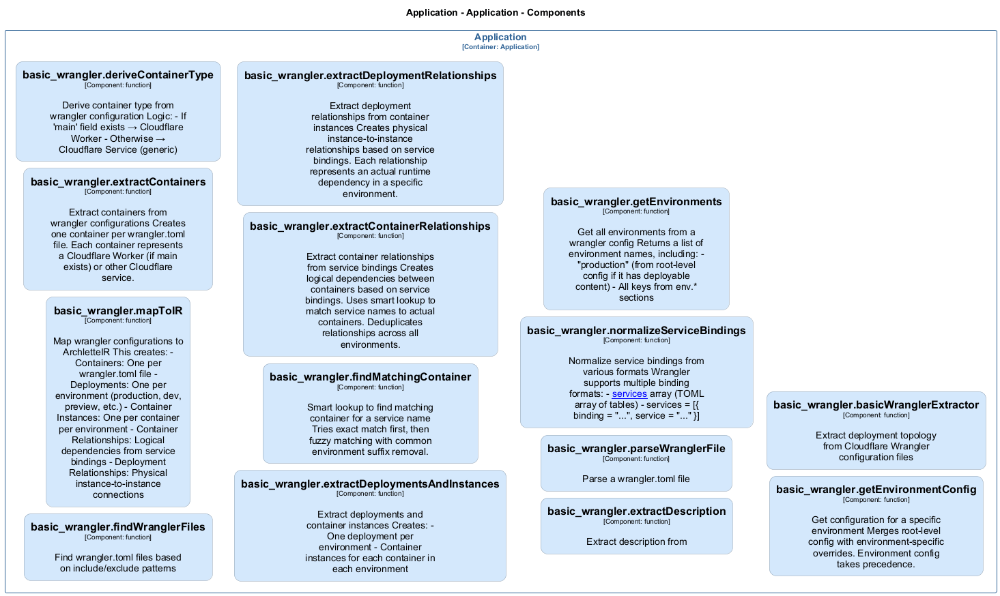

# basic_wrangler — Code View

[← Back to Container](./default-container.md) | [← Back to System](./README.md)

---

## Component Information

| Field | Value |
| --- | --- |
| **Component** | basic_wrangler |
| **Container** | Application |
| **Type** | `module` |
| **Description** | Cloudflare Wrangler deployment extractor |
---

## Code Structure

### Class Diagram



### Code Elements

<details>
<summary><strong>14 code element(s)</strong></summary>


#### Functions

##### `basicWranglerExtractor()`

Extract deployment topology from Cloudflare Wrangler configuration files

| Field | Value |
| --- | --- |
| **Type** | `function` |
| **Visibility** | `public` |
| **Async** | Yes || **Returns** | `Promise<z.infer<any>>` - Promise resolving to ArchletteIR with containers, deployments, and relationships || **Location** | `C:/Users/chris/git/archlette/src/extractors/builtin/basic-wrangler.ts:68` |

**Parameters:**

- `node`: <code>any</code> — - Configuration node with include/exclude patterns- `ctx`: <code>import("C:/Users/chris/git/archlette/src/core/types").PipelineContext</code> — - Optional pipeline context with logger
**Examples:**
```typescript

```

---
##### `findWranglerFiles()`

Find wrangler.toml files based on include/exclude patterns

| Field | Value |
| --- | --- |
| **Type** | `function` |
| **Visibility** | `public` |
| **Async** | Yes || **Returns** | `Promise<string[]>` - Array of absolute file paths to wrangler.toml files || **Location** | `C:/Users/chris/git/archlette/src/extractors/builtin/basic-wrangler/file-finder.ts:15` |

**Parameters:**

- `inputs`: <code>import("C:/Users/chris/git/archlette/src/extractors/builtin/basic-wrangler/types").ExtractorInputs</code> — - Optional include/exclude patterns

---
##### `mapToIR()`

Map wrangler configurations to ArchletteIR

This creates:
- Containers: One per wrangler.toml file
- Deployments: One per environment (production, dev, preview, etc.)
- Container Instances: One per container per environment
- Container Relationships: Logical dependencies from service bindings
- Deployment Relationships: Physical instance-to-instance connections

| Field | Value |
| --- | --- |
| **Type** | `function` |
| **Visibility** | `public` |
| **Returns** | `z.infer<any>` - Complete ArchletteIR || **Location** | `C:/Users/chris/git/archlette/src/extractors/builtin/basic-wrangler/to-ir-mapper.ts:30` |

**Parameters:**

- `configs`: <code>import("C:/Users/chris/git/archlette/src/extractors/builtin/basic-wrangler/types").WranglerConfig[]</code> — - Parsed wrangler.toml configurations- `systemInfo`: <code>z.infer<any></code> — - Optional system-level metadata

---
##### `extractContainers()`

Extract containers from wrangler configurations

Creates one container per wrangler.toml file.
Each container represents a Cloudflare Worker (if main exists) or other Cloudflare service.

| Field | Value |
| --- | --- |
| **Type** | `function` |
| **Visibility** | `private` |
| **Returns** | `{ id: string; name: string; type: string; layer: string; description: string; tags: string[]; props: { technology: string; filePath: string; }; }[]` - Array of Container objects || **Location** | `C:/Users/chris/git/archlette/src/extractors/builtin/basic-wrangler/to-ir-mapper.ts:78` |

**Parameters:**

- `configs`: <code>import("C:/Users/chris/git/archlette/src/extractors/builtin/basic-wrangler/types").WranglerConfig[]</code> — - Parsed wrangler configurations

---
##### `deriveContainerType()`

Derive container type from wrangler configuration

Logic:
- If 'main' field exists → Cloudflare Worker
- Otherwise → Cloudflare Service (generic)

| Field | Value |
| --- | --- |
| **Type** | `function` |
| **Visibility** | `private` |
| **Returns** | `string` - Container type string || **Location** | `C:/Users/chris/git/archlette/src/extractors/builtin/basic-wrangler/to-ir-mapper.ts:111` |

**Parameters:**

- `config`: <code>import("C:/Users/chris/git/archlette/src/extractors/builtin/basic-wrangler/types").WranglerConfig</code> — - Wrangler configuration

---
##### `extractDeploymentsAndInstances()`

Extract deployments and container instances

Creates:
- One deployment per environment
- Container instances for each container in each environment

| Field | Value |
| --- | --- |
| **Type** | `function` |
| **Visibility** | `private` |
| **Returns** | `{ deployments: { name: string; environment: string; platform: string; instances: z.infer<any>[]; }[]; instances: z.infer<any>[]; }` - Deployments and container instances || **Location** | `C:/Users/chris/git/archlette/src/extractors/builtin/basic-wrangler/to-ir-mapper.ts:132` |

**Parameters:**

- `configs`: <code>import("C:/Users/chris/git/archlette/src/extractors/builtin/basic-wrangler/types").WranglerConfig[]</code> — - Parsed wrangler configurations- `environments`: <code>string[]</code> — - Unique environment names

---
##### `findMatchingContainer()`

Smart lookup to find matching container for a service name

Tries exact match first, then fuzzy matching with common environment suffix removal.

| Field | Value |
| --- | --- |
| **Type** | `function` |
| **Visibility** | `private` |
| **Returns** | `string` - Matching container ID or null || **Location** | `C:/Users/chris/git/archlette/src/extractors/builtin/basic-wrangler/to-ir-mapper.ts:276` |

**Parameters:**

- `serviceName`: <code>string</code> — - Service name from binding (e.g., "content-service-preview")- `containers`: <code>{ id: string; name: string; }[]</code> — - Available containers

---
##### `extractContainerRelationships()`

Extract container relationships from service bindings

Creates logical dependencies between containers based on service bindings.
Uses smart lookup to match service names to actual containers.
Deduplicates relationships across all environments.

| Field | Value |
| --- | --- |
| **Type** | `function` |
| **Visibility** | `private` |
| **Returns** | `z.infer<any>[]` - Array of container relationships || **Location** | `C:/Users/chris/git/archlette/src/extractors/builtin/basic-wrangler/to-ir-mapper.ts:325` |

**Parameters:**

- `configs`: <code>import("C:/Users/chris/git/archlette/src/extractors/builtin/basic-wrangler/types").WranglerConfig[]</code> — - Parsed wrangler configurations- `containers`: <code>{ id: string; name: string; }[]</code> — - Available containers for matching

---
##### `extractDeploymentRelationships()`

Extract deployment relationships from container instances

Creates physical instance-to-instance relationships based on service bindings.
Each relationship represents an actual runtime dependency in a specific environment.

| Field | Value |
| --- | --- |
| **Type** | `function` |
| **Visibility** | `private` |
| **Returns** | `z.infer<any>[]` - Array of deployment relationships || **Location** | `C:/Users/chris/git/archlette/src/extractors/builtin/basic-wrangler/to-ir-mapper.ts:381` |

**Parameters:**

- `instances`: <code>z.infer<any>[]</code> — - Container instances

---
##### `extractDescription()`

Extract description from

| Field | Value |
| --- | --- |
| **Type** | `function` |
| **Visibility** | `private` |
| **Returns** | `string` - Description string if found, undefined otherwise || **Location** | `C:/Users/chris/git/archlette/src/extractors/builtin/basic-wrangler/wrangler-parser.ts:28` |

**Parameters:**

- `content`: <code>string</code> — - Raw TOML file content

---
##### `parseWranglerFile()`

Parse a wrangler.toml file

| Field | Value |
| --- | --- |
| **Type** | `function` |
| **Visibility** | `public` |
| **Async** | Yes || **Returns** | `Promise<import("C:/Users/chris/git/archlette/src/extractors/builtin/basic-wrangler/types").WranglerConfig>` - Parsed wrangler configuration || **Location** | `C:/Users/chris/git/archlette/src/extractors/builtin/basic-wrangler/wrangler-parser.ts:49` |

**Parameters:**

- `filePath`: <code>string</code> — - Absolute path to wrangler.toml file

---
##### `normalizeServiceBindings()`

Normalize service bindings from various formats

Wrangler supports multiple binding formats:
- [[services]] array (TOML array of tables)
- services = [{ binding = "...", service = "..." }]

| Field | Value |
| --- | --- |
| **Type** | `function` |
| **Visibility** | `public` |
| **Returns** | `import("C:/Users/chris/git/archlette/src/extractors/builtin/basic-wrangler/types").ServiceBinding[]` || **Location** | `C:/Users/chris/git/archlette/src/extractors/builtin/basic-wrangler/wrangler-parser.ts:109` |

**Parameters:**

- `services`: <code>unknown</code>

---
##### `getEnvironments()`

Get all environments from a wrangler config

Returns a list of environment names, including:
- "production" (from root-level config if it has deployable content)
- All keys from env.* sections

| Field | Value |
| --- | --- |
| **Type** | `function` |
| **Visibility** | `public` |
| **Returns** | `string[]` || **Location** | `C:/Users/chris/git/archlette/src/extractors/builtin/basic-wrangler/wrangler-parser.ts:130` |

**Parameters:**

- `config`: <code>import("C:/Users/chris/git/archlette/src/extractors/builtin/basic-wrangler/types").WranglerConfig</code>

---
##### `getEnvironmentConfig()`

Get configuration for a specific environment

Merges root-level config with environment-specific overrides.
Environment config takes precedence.

| Field | Value |
| --- | --- |
| **Type** | `function` |
| **Visibility** | `public` |
| **Returns** | `{ name: string; vars?: Record<string, string>; services?: import("C:/Users/chris/git/archlette/src/extractors/builtin/basic-wrangler/types").ServiceBinding[]; kv_namespaces?: import("C:/Users/chris/git/archlette/src/extractors/builtin/basic-wrangler/types").KVBinding[]; r2_buckets?: import("C:/Users/chris/git/archlette/src/extractors/builtin/basic-wrangler/types").R2Binding[]; d1_databases?: import("C:/Users/chris/git/archlette/src/extractors/builtin/basic-wrangler/types").D1Binding[]; durable_objects?: { bindings: import("C:/Users/chris/git/archlette/src/extractors/builtin/basic-wrangler/types").DurableObjectBinding[]; }; queues?: { producers?: import("C:/Users/chris/git/archlette/src/extractors/builtin/basic-wrangler/types").QueueBinding[]; consumers?: import("C:/Users/chris/git/archlette/src/extractors/builtin/basic-wrangler/types").QueueBinding[]; }; routes?: import("C:/Users/chris/git/archlette/src/extractors/builtin/basic-wrangler/types").Route[]; triggers?: { crons?: string[]; }; observability?: Record<string, unknown>; }` - Merged environment configuration || **Location** | `C:/Users/chris/git/archlette/src/extractors/builtin/basic-wrangler/wrangler-parser.ts:171` |

**Parameters:**

- `config`: <code>import("C:/Users/chris/git/archlette/src/extractors/builtin/basic-wrangler/types").WranglerConfig</code> — - Parsed wrangler config- `envName`: <code>string</code> — - Environment name (e.g., "production", "development")

---

</details>

---

<div align="center">
<sub><a href="./default-container.md">← Back to Container</a> | <a href="./README.md">← Back to System</a> | Generated with <a href="https://github.com/chrislyons-dev/archlette">Archlette</a></sub>
</div>

