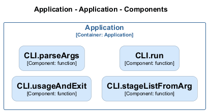

# CLI — Code View

[← Back to Container](./default-container.md) | [← Back to System](./README.md)

---

## Component Information

| Field | Value |
| --- | --- |
| **Component** | CLI |
| **Container** | Application |
| **Type** | `module` |
| **Description** | Archlette CLI - Architecture-as-Code toolkit |
---

## Code Structure

### Class Diagram

### Code Elements

<strong>4 code element(s)</strong>

#### Functions

##### `usageAndExit()`

| Field | Value |
| --- | --- |
| **Type** | `function` |
| **Visibility** | `private` |
| **Returns** | `void` || **Location** | `C:/Users/chris/git/archlette/src/cli.ts:62` |

**Parameters:**

- `msg`: <code>string</code>

---
##### `parseArgs()`

| Field | Value |
| --- | --- |
| **Type** | `function` |
| **Visibility** | `private` |
| **Returns** | `{ stageArg: string; yamlPathArg: string; }` || **Location** | `C:/Users/chris/git/archlette/src/cli.ts:86` |

**Parameters:**

- `argv`: <code>string[]</code>

---
##### `stageListFromArg()`

| Field | Value |
| --- | --- |
| **Type** | `function` |
| **Visibility** | `private` |
| **Returns** | `string[]` || **Location** | `C:/Users/chris/git/archlette/src/cli.ts:121` |

**Parameters:**

- `stageArg`: <code>string</code>

---
##### `run()`

| Field | Value |
| --- | --- |
| **Type** | `function` |
| **Visibility** | `public` |
| **Async** | Yes || **Returns** | `Promise<void>` || **Location** | `C:/Users/chris/git/archlette/src/cli.ts:127` |

**Parameters:**

- `argv`: <code>string[]</code>

---

---

<a href="./default-container.md">← Back to Container</a> | <a href="./README.md">← Back to System</a> | Generated with <a href="https://github.com/chrislyons-dev/archlette">Archlette</a>

