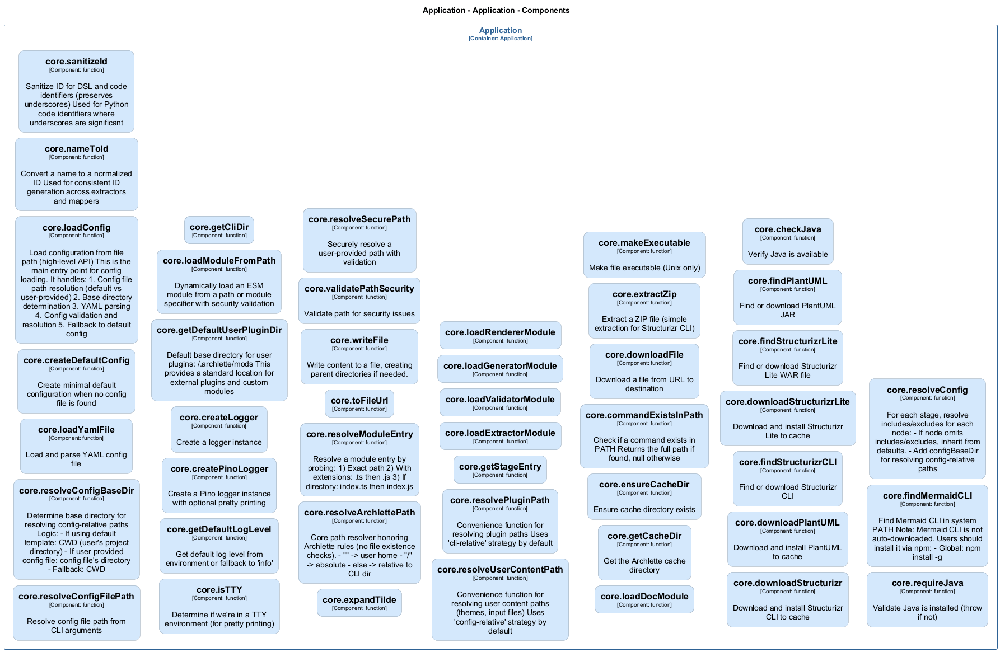

# core — Code View

[← Back to Container](./default-container.md) | [← Back to System](./README.md)

---

## Component Information

| Field | Value |
| --- | --- |
| **Component** | core |
| **Container** | Application |
| **Type** | `module` |
| **Description** | Dynamic ESM module loader \| Component inferred from directory: core \| Stage module interfaces for the AAC pipeline \| Stage module loaders \| Tool management for external rendering tools \| Architecture-as-Code (AAC) configuration types and schemas \| Archlette Intermediate Representation (IR) types and schemas \| Core pipeline types |
---

## Code Structure

### Class Diagram



### Code Elements

<details>
<summary><strong>45 code element(s)</strong></summary>


#### Functions

##### `resolveConfigFilePath()`

Resolve config file path from CLI arguments

| Field | Value |
| --- | --- |
| **Type** | `function` |
| **Visibility** | `public` |
| **Returns** | `import("C:/Users/chris/git/archlette/src/core/config-resolver").ResolvedConfigFile` - Resolved config file information || **Location** | `C:/Users/chris/git/archlette/src/core/config-resolver.ts:70` |

**Parameters:**

- `userProvidedPath`: <code>string</code> — - Path from -f argument (or undefined for default)
**Examples:**
```typescript

```

---
##### `resolveConfigBaseDir()`

Determine base directory for resolving config-relative paths

Logic:
- If using default template: CWD (user's project directory)
- If user provided config file: config file's directory
- Fallback: CWD

| Field | Value |
| --- | --- |
| **Type** | `function` |
| **Visibility** | `public` |
| **Returns** | `string` - Base directory for config-relative path resolution || **Location** | `C:/Users/chris/git/archlette/src/core/config-resolver.ts:117` |

**Parameters:**

- `configPath`: <code>string</code> — - Absolute path to config file (or undefined)- `isDefaultTemplate`: <code>boolean</code> — - Whether using default template
**Examples:**
```typescript

```

---
##### `loadYamlFile()`

Load and parse YAML config file

| Field | Value |
| --- | --- |
| **Type** | `function` |
| **Visibility** | `private` |
| **Returns** | `unknown` - Parsed config object or null if file doesn't exist/is invalid || **Location** | `C:/Users/chris/git/archlette/src/core/config-resolver.ts:141` |

**Parameters:**

- `filePath`: <code>string</code> — - Absolute path to YAML file

---
##### `createDefaultConfig()`

Create minimal default configuration when no config file is found

| Field | Value |
| --- | --- |
| **Type** | `function` |
| **Visibility** | `private` |
| **Returns** | `import("C:/Users/chris/git/archlette/src/core/types-aac").ResolvedAACConfig` - Default configuration || **Location** | `C:/Users/chris/git/archlette/src/core/config-resolver.ts:164` |

**Parameters:**

- `baseDir`: <code>string</code> — - Base directory for output paths

---
##### `loadConfig()`

Load configuration from file path (high-level API)

This is the main entry point for config loading. It handles:
1. Config file path resolution (default vs user-provided)
2. Base directory determination
3. YAML parsing
4. Config validation and resolution
5. Fallback to default config

| Field | Value |
| --- | --- |
| **Type** | `function` |
| **Visibility** | `public` |
| **Returns** | `import("C:/Users/chris/git/archlette/src/core/config-resolver").LoadedConfig` - Loaded configuration with all metadata || **Location** | `C:/Users/chris/git/archlette/src/core/config-resolver.ts:210` |

**Parameters:**

- `userProvidedPath`: <code>string</code> — - Path from -f argument (or undefined for default)
**Examples:**
```typescript

```

---
##### `nameToId()`

Convert a name to a normalized ID
Used for consistent ID generation across extractors and mappers

| Field | Value |
| --- | --- |
| **Type** | `function` |
| **Visibility** | `public` |
| **Returns** | `string` - Normalized ID (lowercase, hyphenated, alphanumeric) || **Location** | `C:/Users/chris/git/archlette/src/core/constants.ts:56` |

**Parameters:**

- `name`: <code>string</code> — - The name to convert (component, actor, etc.)
**Examples:**
```typescript

```

---
##### `sanitizeId()`

Sanitize ID for DSL and code identifiers (preserves underscores)
Used for Python code identifiers where underscores are significant

| Field | Value |
| --- | --- |
| **Type** | `function` |
| **Visibility** | `public` |
| **Returns** | `string` - Sanitized ID (lowercase alphanumeric and underscores only) || **Location** | `C:/Users/chris/git/archlette/src/core/constants.ts:78` |

**Parameters:**

- `id`: <code>string</code> — - The ID to sanitize
**Examples:**
```typescript

```

---
##### `isTTY()`

Determine if we're in a TTY environment (for pretty printing)

| Field | Value |
| --- | --- |
| **Type** | `function` |
| **Visibility** | `private` |
| **Returns** | `boolean` || **Location** | `C:/Users/chris/git/archlette/src/core/logger.ts:43` |


---
##### `getDefaultLogLevel()`

Get default log level from environment or fallback to 'info'

| Field | Value |
| --- | --- |
| **Type** | `function` |
| **Visibility** | `private` |
| **Returns** | `import("C:/Users/chris/git/archlette/src/core/logger").LogLevel` || **Location** | `C:/Users/chris/git/archlette/src/core/logger.ts:50` |


---
##### `createPinoLogger()`

Create a Pino logger instance with optional pretty printing

| Field | Value |
| --- | --- |
| **Type** | `function` |
| **Visibility** | `private` |
| **Returns** | `PinoLogger` || **Location** | `C:/Users/chris/git/archlette/src/core/logger.ts:66` |

**Parameters:**

- `level`: <code>import("C:/Users/chris/git/archlette/src/core/logger").LogLevel</code>- `pretty`: <code>boolean</code>

---
##### `createLogger()`

Create a logger instance

| Field | Value |
| --- | --- |
| **Type** | `function` |
| **Visibility** | `public` |
| **Returns** | `import("C:/Users/chris/git/archlette/src/core/logger").Logger` - Logger instance || **Location** | `C:/Users/chris/git/archlette/src/core/logger.ts:131` |

**Parameters:**

- `options`: <code>import("C:/Users/chris/git/archlette/src/core/logger").LoggerOptions</code> — - Logger configuration
**Examples:**
```typescript

```

---
##### `getDefaultUserPluginDir()`

Default base directory for user plugins: ~/.archlette/mods
This provides a standard location for external plugins and custom modules

| Field | Value |
| --- | --- |
| **Type** | `function` |
| **Visibility** | `private` |
| **Returns** | `string` || **Location** | `C:/Users/chris/git/archlette/src/core/module-loader.ts:59` |


---
##### `loadModuleFromPath()`

Dynamically load an ESM module from a path or module specifier with security validation

| Field | Value |
| --- | --- |
| **Type** | `function` |
| **Visibility** | `public` |
| **Async** | Yes || **Returns** | `Promise<import("C:/Users/chris/git/archlette/src/core/module-loader").LoadedModule<T>>` - Promise resolving to loaded module with metadata || **Location** | `C:/Users/chris/git/archlette/src/core/module-loader.ts:111` |

**Parameters:**

- `spec`: <code>string</code> — - Module specifier (relative path, absolute path, or ~/ path)- `exts`: <code>(".ts" | ".js")[]</code> — - File extensions to probe (in order of preference)- `allowedAbsolutePaths`: <code>string[]</code> — - Optional allowlist for absolute plugin paths (external plugins)
   Defaults to [~/.archlette/mods] for user plugins
**Examples:**
```typescript

```

---
##### `getCliDir()`


| Field | Value |
| --- | --- |
| **Type** | `function` |
| **Visibility** | `public` |
| **Returns** | `string` || **Location** | `C:/Users/chris/git/archlette/src/core/path-resolver.ts:17` |


---
##### `expandTilde()`


| Field | Value |
| --- | --- |
| **Type** | `function` |
| **Visibility** | `public` |
| **Returns** | `string` || **Location** | `C:/Users/chris/git/archlette/src/core/path-resolver.ts:24` |

**Parameters:**

- `p`: <code>string</code>- `homeDir`: <code>string</code>

---
##### `resolveArchlettePath()`

Core path resolver honoring Archlette rules (no file existence checks).
- "~"  -> user home
- "/"  -> absolute
- else -> relative to CLI dir

| Field | Value |
| --- | --- |
| **Type** | `function` |
| **Visibility** | `public` |
| **Returns** | `string` || **Location** | `C:/Users/chris/git/archlette/src/core/path-resolver.ts:42` |

**Parameters:**

- `input`: <code>string</code>- `opts`: <code>{ cliDir: string; }</code>

---
##### `resolveModuleEntry()`

Resolve a module entry by probing:
1) Exact path
2) With extensions: .ts then .js
3) If directory: index.ts then index.js

| Field | Value |
| --- | --- |
| **Type** | `function` |
| **Visibility** | `public` |
| **Returns** | `string` || **Location** | `C:/Users/chris/git/archlette/src/core/path-resolver.ts:64` |

**Parameters:**

- `input`: <code>string</code>- `opts`: <code>{ cliDir: string; wantedExts?: (".ts" | ".js")[]; }</code>

---
##### `toFileUrl()`


| Field | Value |
| --- | --- |
| **Type** | `function` |
| **Visibility** | `public` |
| **Returns** | `string` || **Location** | `C:/Users/chris/git/archlette/src/core/path-resolver.ts:100` |

**Parameters:**

- `p`: <code>string</code>

---
##### `writeFile()`

Write content to a file, creating parent directories if needed.

| Field | Value |
| --- | --- |
| **Type** | `function` |
| **Visibility** | `public` |
| **Returns** | `void` || **Location** | `C:/Users/chris/git/archlette/src/core/path-resolver.ts:110` |

**Parameters:**

- `filename`: <code>string</code> — - Absolute path to the file- `content`: <code>string</code> — - Content to write

---
##### `validatePathSecurity()`

Validate path for security issues

| Field | Value |
| --- | --- |
| **Type** | `function` |
| **Visibility** | `private` |
| **Returns** | `{ isSecure: boolean; warnings: string[]; }` || **Location** | `C:/Users/chris/git/archlette/src/core/path-security.ts:58` |

**Parameters:**

- `userPath`: <code>string</code>- `resolvedPath`: <code>string</code>- `baseDir`: <code>string</code>- `strategy`: <code>import("C:/Users/chris/git/archlette/src/core/path-security").PathResolutionStrategy</code>- `allowedAbsolutePaths`: <code>string[]</code>

---
##### `resolveSecurePath()`

Securely resolve a user-provided path with validation

| Field | Value |
| --- | --- |
| **Type** | `function` |
| **Visibility** | `public` |
| **Returns** | `import("C:/Users/chris/git/archlette/src/core/path-security").ResolvedSecurePath` - Resolved path with security metadata || **Location** | `C:/Users/chris/git/archlette/src/core/path-security.ts:203` |

**Parameters:**

- `userPath`: <code>string</code> — - Path provided by user (from config, CLI, etc.)- `options`: <code>import("C:/Users/chris/git/archlette/src/core/path-security").SecurePathOptions</code> — - Resolution and validation options
**Examples:**
```typescript

```

---
##### `resolveUserContentPath()`

Convenience function for resolving user content paths (themes, input files)
Uses 'config-relative' strategy by default

| Field | Value |
| --- | --- |
| **Type** | `function` |
| **Visibility** | `public` |
| **Returns** | `import("C:/Users/chris/git/archlette/src/core/path-security").ResolvedSecurePath` || **Location** | `C:/Users/chris/git/archlette/src/core/path-security.ts:289` |

**Parameters:**

- `userPath`: <code>string</code>- `configBaseDir`: <code>string</code>- `allowedExtensions`: <code>string[]</code>- `allowedAbsolutePaths`: <code>string[]</code>

---
##### `resolvePluginPath()`

Convenience function for resolving plugin paths
Uses 'cli-relative' strategy by default

| Field | Value |
| --- | --- |
| **Type** | `function` |
| **Visibility** | `public` |
| **Returns** | `import("C:/Users/chris/git/archlette/src/core/path-security").ResolvedSecurePath` || **Location** | `C:/Users/chris/git/archlette/src/core/path-security.ts:308` |

**Parameters:**

- `userPath`: <code>string</code>- `cliDir`: <code>string</code>- `allowedExtensions`: <code>string[]</code>- `allowedAbsolutePaths`: <code>string[]</code>

---
##### `getStageEntry()`


| Field | Value |
| --- | --- |
| **Type** | `function` |
| **Visibility** | `public` |
| **Returns** | `import("C:/Users/chris/git/archlette/src/core/stage-entry").StageEntry` || **Location** | `C:/Users/chris/git/archlette/src/core/stage-entry.js:12` |

**Parameters:**

- `mod`: <code>unknown</code>

---
##### `loadExtractorModule()`


| Field | Value |
| --- | --- |
| **Type** | `function` |
| **Visibility** | `public` |
| **Async** | Yes || **Returns** | `Promise<{ entry: Function; resolved: string; }>` || **Location** | `C:/Users/chris/git/archlette/src/core/stage-module-loader.ts:13` |

**Parameters:**

- `modulePath`: <code>string</code>

---
##### `loadValidatorModule()`


| Field | Value |
| --- | --- |
| **Type** | `function` |
| **Visibility** | `public` |
| **Async** | Yes || **Returns** | `Promise<{ entry: Function; resolved: string; }>` || **Location** | `C:/Users/chris/git/archlette/src/core/stage-module-loader.ts:26` |

**Parameters:**

- `modulePath`: <code>string</code>

---
##### `loadGeneratorModule()`


| Field | Value |
| --- | --- |
| **Type** | `function` |
| **Visibility** | `public` |
| **Async** | Yes || **Returns** | `Promise<{ entry: Function; resolved: string; }>` || **Location** | `C:/Users/chris/git/archlette/src/core/stage-module-loader.ts:39` |

**Parameters:**

- `modulePath`: <code>string</code>

---
##### `loadRendererModule()`


| Field | Value |
| --- | --- |
| **Type** | `function` |
| **Visibility** | `public` |
| **Async** | Yes || **Returns** | `Promise<{ entry: Function; resolved: string; }>` || **Location** | `C:/Users/chris/git/archlette/src/core/stage-module-loader.ts:52` |

**Parameters:**

- `modulePath`: <code>string</code>

---
##### `loadDocModule()`


| Field | Value |
| --- | --- |
| **Type** | `function` |
| **Visibility** | `public` |
| **Async** | Yes || **Returns** | `Promise<{ entry: Function; resolved: string; }>` || **Location** | `C:/Users/chris/git/archlette/src/core/stage-module-loader.ts:65` |

**Parameters:**

- `modulePath`: <code>string</code>

---
##### `getCacheDir()`

Get the Archlette cache directory

| Field | Value |
| --- | --- |
| **Type** | `function` |
| **Visibility** | `public` |
| **Returns** | `string` || **Location** | `C:/Users/chris/git/archlette/src/core/tool-manager.ts:66` |


---
##### `ensureCacheDir()`

Ensure cache directory exists

| Field | Value |
| --- | --- |
| **Type** | `function` |
| **Visibility** | `private` |
| **Returns** | `string` || **Location** | `C:/Users/chris/git/archlette/src/core/tool-manager.ts:74` |


---
##### `commandExistsInPath()`

Check if a command exists in PATH
Returns the full path if found, null otherwise

| Field | Value |
| --- | --- |
| **Type** | `function` |
| **Visibility** | `public` |
| **Returns** | `string` || **Location** | `C:/Users/chris/git/archlette/src/core/tool-manager.ts:86` |

**Parameters:**

- `command`: <code>string</code>

---
##### `downloadFile()`

Download a file from URL to destination

| Field | Value |
| --- | --- |
| **Type** | `function` |
| **Visibility** | `private` |
| **Async** | Yes || **Returns** | `Promise<void>` || **Location** | `C:/Users/chris/git/archlette/src/core/tool-manager.ts:105` |

**Parameters:**

- `url`: <code>string</code>- `dest`: <code>string</code>- `log`: <code>import("C:/Users/chris/git/archlette/src/core/logger").Logger</code>

---
##### `extractZip()`

Extract a ZIP file (simple extraction for Structurizr CLI)

| Field | Value |
| --- | --- |
| **Type** | `function` |
| **Visibility** | `private` |
| **Async** | Yes || **Returns** | `Promise<void>` || **Location** | `C:/Users/chris/git/archlette/src/core/tool-manager.ts:147` |

**Parameters:**

- `zipPath`: <code>string</code>- `destDir`: <code>string</code>- `log`: <code>import("C:/Users/chris/git/archlette/src/core/logger").Logger</code>

---
##### `makeExecutable()`

Make file executable (Unix only)

| Field | Value |
| --- | --- |
| **Type** | `function` |
| **Visibility** | `private` |
| **Returns** | `void` || **Location** | `C:/Users/chris/git/archlette/src/core/tool-manager.ts:174` |

**Parameters:**

- `filePath`: <code>string</code>

---
##### `downloadStructurizr()`

Download and install Structurizr CLI to cache

| Field | Value |
| --- | --- |
| **Type** | `function` |
| **Visibility** | `private` |
| **Async** | Yes || **Returns** | `Promise<string>` || **Location** | `C:/Users/chris/git/archlette/src/core/tool-manager.ts:183` |

**Parameters:**

- `cacheDir`: <code>string</code>- `log`: <code>import("C:/Users/chris/git/archlette/src/core/logger").Logger</code>

---
##### `downloadPlantUML()`

Download and install PlantUML to cache

| Field | Value |
| --- | --- |
| **Type** | `function` |
| **Visibility** | `private` |
| **Async** | Yes || **Returns** | `Promise<string>` || **Location** | `C:/Users/chris/git/archlette/src/core/tool-manager.ts:221` |

**Parameters:**

- `cacheDir`: <code>string</code>- `log`: <code>import("C:/Users/chris/git/archlette/src/core/logger").Logger</code>

---
##### `findStructurizrCLI()`

Find or download Structurizr CLI

| Field | Value |
| --- | --- |
| **Type** | `function` |
| **Visibility** | `public` |
| **Async** | Yes || **Returns** | `Promise<string>` - Path to structurizr executable/script || **Location** | `C:/Users/chris/git/archlette/src/core/tool-manager.ts:247` |

**Parameters:**

- `log`: <code>import("C:/Users/chris/git/archlette/src/core/logger").Logger</code> — - Optional logger

---
##### `downloadStructurizrLite()`

Download and install Structurizr Lite to cache

| Field | Value |
| --- | --- |
| **Type** | `function` |
| **Visibility** | `private` |
| **Async** | Yes || **Returns** | `Promise<string>` || **Location** | `C:/Users/chris/git/archlette/src/core/tool-manager.ts:284` |

**Parameters:**

- `cacheDir`: <code>string</code>- `log`: <code>import("C:/Users/chris/git/archlette/src/core/logger").Logger</code>

---
##### `findStructurizrLite()`

Find or download Structurizr Lite WAR file

| Field | Value |
| --- | --- |
| **Type** | `function` |
| **Visibility** | `public` |
| **Async** | Yes || **Returns** | `Promise<string>` - Path to structurizr-lite.war file || **Location** | `C:/Users/chris/git/archlette/src/core/tool-manager.ts:316` |

**Parameters:**

- `log`: <code>import("C:/Users/chris/git/archlette/src/core/logger").Logger</code> — - Optional logger

---
##### `findPlantUML()`

Find or download PlantUML JAR

| Field | Value |
| --- | --- |
| **Type** | `function` |
| **Visibility** | `public` |
| **Async** | Yes || **Returns** | `Promise<string>` - Path to plantuml.jar || **Location** | `C:/Users/chris/git/archlette/src/core/tool-manager.ts:342` |

**Parameters:**

- `log`: <code>import("C:/Users/chris/git/archlette/src/core/logger").Logger</code> — - Optional logger

---
##### `checkJava()`

Verify Java is available

| Field | Value |
| --- | --- |
| **Type** | `function` |
| **Visibility** | `public` |
| **Returns** | `string` - Java version string if available, null otherwise || **Location** | `C:/Users/chris/git/archlette/src/core/tool-manager.ts:371` |


---
##### `requireJava()`

Validate Java is installed (throw if not)

| Field | Value |
| --- | --- |
| **Type** | `function` |
| **Visibility** | `public` |
| **Returns** | `void` || **Location** | `C:/Users/chris/git/archlette/src/core/tool-manager.ts:392` |


---
##### `findMermaidCLI()`

Find Mermaid CLI in system PATH

Note: Mermaid CLI is not auto-downloaded. Users should install it via npm:
- Global: npm install -g

| Field | Value |
| --- | --- |
| **Type** | `function` |
| **Visibility** | `public` |
| **Returns** | `string` - Path to mmdc executable || **Location** | `C:/Users/chris/git/archlette/src/core/tool-manager.ts:421` |

**Parameters:**

- `log`: <code>import("C:/Users/chris/git/archlette/src/core/logger").Logger</code> — - Optional logger

---
##### `resolveConfig()`

For each stage, resolve includes/excludes for each node:
  - If node omits includes/excludes, inherit from defaults.
  - Add configBaseDir for resolving config-relative paths

| Field | Value |
| --- | --- |
| **Type** | `function` |
| **Visibility** | `public` |
| **Returns** | `import("C:/Users/chris/git/archlette/src/core/types-aac").ResolvedAACConfig` || **Location** | `C:/Users/chris/git/archlette/src/core/types-aac.ts:145` |

**Parameters:**

- `raw`: <code>unknown</code>- `options`: <code>{ configBaseDir?: string; }</code>

---

</details>

---

<div align="center">
<sub><a href="./default-container.md">← Back to Container</a> | <a href="./README.md">← Back to System</a> | Generated with <a href="https://github.com/chrislyons-dev/archlette">Archlette</a></sub>
</div>

