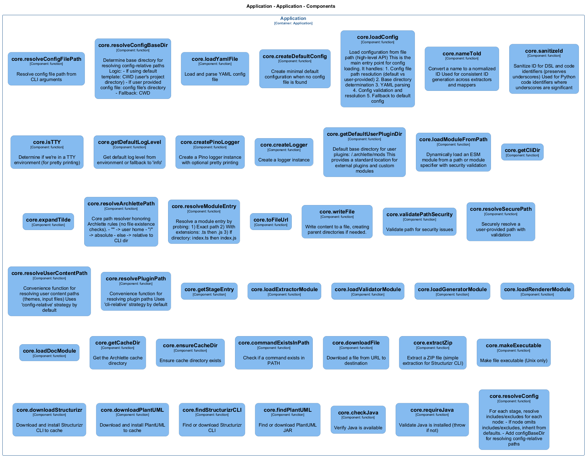

# core — Code View

[← Back to Container](./default-container.md) | [← Back to System](./README.md)

---

## Component Information

<table>
<tbody>
<tr>
<td><strong>Component</strong></td>
<td>core</td>
</tr>
<tr>
<td><strong>Container</strong></td>
<td>Application</td>
</tr>
<tr>
<td><strong>Type</strong></td>
<td><code>module</code></td>
</tr>
<tr>
<td><strong>Description</strong></td>
<td>Dynamic ESM module loader | Stage module interfaces for the AAC pipeline | Stage module loaders | Tool management for external rendering tools | Architecture-as-Code (AAC) configuration types and schemas | Archlette Intermediate Representation (IR) types and schemas | Core pipeline types</td>
</tr>
</tbody>
</table>

---

## Code Structure

### Class Diagram




### Code Elements

<details>
<summary><strong>32 code element(s)</strong></summary>


#### Functions

##### `nameToId()`

Convert a name to a normalized ID
Used for consistent ID generation across extractors and mappers

<table>
<tbody>
<tr>
<td><strong>Type</strong></td>
<td><code>function</code></td>
</tr>
<tr>
<td><strong>Visibility</strong></td>
<td><code>public</code></td>
</tr>
<tr>
<td><strong>Returns</strong></td>
<td><code>string</code> — Normalized ID (lowercase, hyphenated, alphanumeric)</td>
</tr>
<tr>
<td><strong>Location</strong></td>
<td><code>C:/Users/chris/git/archlette/src/core/constants.ts:56</code></td>
</tr>
</tbody>
</table>

**Parameters:**

- `name`: <code>string</code> — - The name to convert (component, actor, etc.)
**Examples:**
```typescript

```

---
##### `sanitizeId()`

Sanitize ID for DSL and code identifiers (preserves underscores)
Used for Python code identifiers where underscores are significant

<table>
<tbody>
<tr>
<td><strong>Type</strong></td>
<td><code>function</code></td>
</tr>
<tr>
<td><strong>Visibility</strong></td>
<td><code>public</code></td>
</tr>
<tr>
<td><strong>Returns</strong></td>
<td><code>string</code> — Sanitized ID (lowercase alphanumeric and underscores only)</td>
</tr>
<tr>
<td><strong>Location</strong></td>
<td><code>C:/Users/chris/git/archlette/src/core/constants.ts:78</code></td>
</tr>
</tbody>
</table>

**Parameters:**

- `id`: <code>string</code> — - The ID to sanitize
**Examples:**
```typescript

```

---
##### `isTTY()`

Determine if we're in a TTY environment (for pretty printing)

<table>
<tbody>
<tr>
<td><strong>Type</strong></td>
<td><code>function</code></td>
</tr>
<tr>
<td><strong>Visibility</strong></td>
<td><code>private</code></td>
</tr>
<tr>
<td><strong>Returns</strong></td>
<td><code>boolean</code></td>
</tr>
<tr>
<td><strong>Location</strong></td>
<td><code>C:/Users/chris/git/archlette/src/core/logger.ts:43</code></td>
</tr>
</tbody>
</table>


---
##### `getDefaultLogLevel()`

Get default log level from environment or fallback to 'info'

<table>
<tbody>
<tr>
<td><strong>Type</strong></td>
<td><code>function</code></td>
</tr>
<tr>
<td><strong>Visibility</strong></td>
<td><code>private</code></td>
</tr>
<tr>
<td><strong>Returns</strong></td>
<td><code>import("C:/Users/chris/git/archlette/src/core/logger").LogLevel</code></td>
</tr>
<tr>
<td><strong>Location</strong></td>
<td><code>C:/Users/chris/git/archlette/src/core/logger.ts:50</code></td>
</tr>
</tbody>
</table>


---
##### `createPinoLogger()`

Create a Pino logger instance with optional pretty printing

<table>
<tbody>
<tr>
<td><strong>Type</strong></td>
<td><code>function</code></td>
</tr>
<tr>
<td><strong>Visibility</strong></td>
<td><code>private</code></td>
</tr>
<tr>
<td><strong>Returns</strong></td>
<td><code>PinoLogger</code></td>
</tr>
<tr>
<td><strong>Location</strong></td>
<td><code>C:/Users/chris/git/archlette/src/core/logger.ts:66</code></td>
</tr>
</tbody>
</table>

**Parameters:**

- `level`: <code>import("C:/Users/chris/git/archlette/src/core/logger").LogLevel</code>- `pretty`: <code>boolean</code>

---
##### `createLogger()`

Create a logger instance

<table>
<tbody>
<tr>
<td><strong>Type</strong></td>
<td><code>function</code></td>
</tr>
<tr>
<td><strong>Visibility</strong></td>
<td><code>public</code></td>
</tr>
<tr>
<td><strong>Returns</strong></td>
<td><code>import("C:/Users/chris/git/archlette/src/core/logger").Logger</code> — Logger instance</td>
</tr>
<tr>
<td><strong>Location</strong></td>
<td><code>C:/Users/chris/git/archlette/src/core/logger.ts:131</code></td>
</tr>
</tbody>
</table>

**Parameters:**

- `options`: <code>import("C:/Users/chris/git/archlette/src/core/logger").LoggerOptions</code> — - Logger configuration
**Examples:**
```typescript

```

---
##### `getDefaultUserPluginDir()`

Default base directory for user plugins: ~/.archlette/mods
This provides a standard location for external plugins and custom modules

<table>
<tbody>
<tr>
<td><strong>Type</strong></td>
<td><code>function</code></td>
</tr>
<tr>
<td><strong>Visibility</strong></td>
<td><code>private</code></td>
</tr>
<tr>
<td><strong>Returns</strong></td>
<td><code>string</code></td>
</tr>
<tr>
<td><strong>Location</strong></td>
<td><code>C:/Users/chris/git/archlette/src/core/module-loader.ts:59</code></td>
</tr>
</tbody>
</table>


---
##### `loadModuleFromPath()`

Dynamically load an ESM module from a path or module specifier with security validation

<table>
<tbody>
<tr>
<td><strong>Type</strong></td>
<td><code>function</code></td>
</tr>
<tr>
<td><strong>Visibility</strong></td>
<td><code>public</code></td>
</tr>
<tr>
<td><strong>Async</strong></td>
<td>Yes</td>
</tr>
<tr>
<td><strong>Returns</strong></td>
<td><code>Promise<import("C:/Users/chris/git/archlette/src/core/module-loader").LoadedModule<T>></code> — Promise resolving to loaded module with metadata</td>
</tr>
<tr>
<td><strong>Location</strong></td>
<td><code>C:/Users/chris/git/archlette/src/core/module-loader.ts:111</code></td>
</tr>
</tbody>
</table>

**Parameters:**

- `spec`: <code>string</code> — - Module specifier (relative path, absolute path, or ~/ path)- `exts`: <code>(".ts" | ".js")[]</code> — - File extensions to probe (in order of preference)- `allowedAbsolutePaths`: <code>string[]</code> — - Optional allowlist for absolute plugin paths (external plugins)
   Defaults to [~/.archlette/mods] for user plugins
**Examples:**
```typescript

```

---
##### `getCliDir()`


<table>
<tbody>
<tr>
<td><strong>Type</strong></td>
<td><code>function</code></td>
</tr>
<tr>
<td><strong>Visibility</strong></td>
<td><code>public</code></td>
</tr>
<tr>
<td><strong>Returns</strong></td>
<td><code>string</code></td>
</tr>
<tr>
<td><strong>Location</strong></td>
<td><code>C:/Users/chris/git/archlette/src/core/path-resolver.ts:17</code></td>
</tr>
</tbody>
</table>


---
##### `expandTilde()`


<table>
<tbody>
<tr>
<td><strong>Type</strong></td>
<td><code>function</code></td>
</tr>
<tr>
<td><strong>Visibility</strong></td>
<td><code>public</code></td>
</tr>
<tr>
<td><strong>Returns</strong></td>
<td><code>string</code></td>
</tr>
<tr>
<td><strong>Location</strong></td>
<td><code>C:/Users/chris/git/archlette/src/core/path-resolver.ts:24</code></td>
</tr>
</tbody>
</table>

**Parameters:**

- `p`: <code>string</code>- `homeDir`: <code>string</code>

---
##### `resolveArchlettePath()`

Core path resolver honoring Archlette rules (no file existence checks).
- "~"  -> user home
- "/"  -> absolute
- else -> relative to CLI dir

<table>
<tbody>
<tr>
<td><strong>Type</strong></td>
<td><code>function</code></td>
</tr>
<tr>
<td><strong>Visibility</strong></td>
<td><code>public</code></td>
</tr>
<tr>
<td><strong>Returns</strong></td>
<td><code>string</code></td>
</tr>
<tr>
<td><strong>Location</strong></td>
<td><code>C:/Users/chris/git/archlette/src/core/path-resolver.ts:42</code></td>
</tr>
</tbody>
</table>

**Parameters:**

- `input`: <code>string</code>- `opts`: <code>{ cliDir: string; }</code>

---
##### `resolveModuleEntry()`

Resolve a module entry by probing:
1) Exact path
2) With extensions: .ts then .js
3) If directory: index.ts then index.js

<table>
<tbody>
<tr>
<td><strong>Type</strong></td>
<td><code>function</code></td>
</tr>
<tr>
<td><strong>Visibility</strong></td>
<td><code>public</code></td>
</tr>
<tr>
<td><strong>Returns</strong></td>
<td><code>string</code></td>
</tr>
<tr>
<td><strong>Location</strong></td>
<td><code>C:/Users/chris/git/archlette/src/core/path-resolver.ts:64</code></td>
</tr>
</tbody>
</table>

**Parameters:**

- `input`: <code>string</code>- `opts`: <code>{ cliDir: string; wantedExts?: (".ts" | ".js")[]; }</code>

---
##### `toFileUrl()`


<table>
<tbody>
<tr>
<td><strong>Type</strong></td>
<td><code>function</code></td>
</tr>
<tr>
<td><strong>Visibility</strong></td>
<td><code>public</code></td>
</tr>
<tr>
<td><strong>Returns</strong></td>
<td><code>string</code></td>
</tr>
<tr>
<td><strong>Location</strong></td>
<td><code>C:/Users/chris/git/archlette/src/core/path-resolver.ts:100</code></td>
</tr>
</tbody>
</table>

**Parameters:**

- `p`: <code>string</code>

---
##### `writeFile()`

Write content to a file, creating parent directories if needed.

<table>
<tbody>
<tr>
<td><strong>Type</strong></td>
<td><code>function</code></td>
</tr>
<tr>
<td><strong>Visibility</strong></td>
<td><code>public</code></td>
</tr>
<tr>
<td><strong>Returns</strong></td>
<td><code>void</code></td>
</tr>
<tr>
<td><strong>Location</strong></td>
<td><code>C:/Users/chris/git/archlette/src/core/path-resolver.ts:110</code></td>
</tr>
</tbody>
</table>

**Parameters:**

- `filename`: <code>string</code> — - Absolute path to the file- `content`: <code>string</code> — - Content to write

---
##### `loadExtractorModule()`


<table>
<tbody>
<tr>
<td><strong>Type</strong></td>
<td><code>function</code></td>
</tr>
<tr>
<td><strong>Visibility</strong></td>
<td><code>public</code></td>
</tr>
<tr>
<td><strong>Async</strong></td>
<td>Yes</td>
</tr>
<tr>
<td><strong>Returns</strong></td>
<td><code>Promise<{ entry: Function; resolved: string; }></code></td>
</tr>
<tr>
<td><strong>Location</strong></td>
<td><code>C:/Users/chris/git/archlette/src/core/stage-module-loader.ts:13</code></td>
</tr>
</tbody>
</table>

**Parameters:**

- `modulePath`: <code>string</code>

---
##### `loadValidatorModule()`


<table>
<tbody>
<tr>
<td><strong>Type</strong></td>
<td><code>function</code></td>
</tr>
<tr>
<td><strong>Visibility</strong></td>
<td><code>public</code></td>
</tr>
<tr>
<td><strong>Async</strong></td>
<td>Yes</td>
</tr>
<tr>
<td><strong>Returns</strong></td>
<td><code>Promise<{ entry: Function; resolved: string; }></code></td>
</tr>
<tr>
<td><strong>Location</strong></td>
<td><code>C:/Users/chris/git/archlette/src/core/stage-module-loader.ts:26</code></td>
</tr>
</tbody>
</table>

**Parameters:**

- `modulePath`: <code>string</code>

---
##### `loadGeneratorModule()`


<table>
<tbody>
<tr>
<td><strong>Type</strong></td>
<td><code>function</code></td>
</tr>
<tr>
<td><strong>Visibility</strong></td>
<td><code>public</code></td>
</tr>
<tr>
<td><strong>Async</strong></td>
<td>Yes</td>
</tr>
<tr>
<td><strong>Returns</strong></td>
<td><code>Promise<{ entry: Function; resolved: string; }></code></td>
</tr>
<tr>
<td><strong>Location</strong></td>
<td><code>C:/Users/chris/git/archlette/src/core/stage-module-loader.ts:39</code></td>
</tr>
</tbody>
</table>

**Parameters:**

- `modulePath`: <code>string</code>

---
##### `loadRendererModule()`


<table>
<tbody>
<tr>
<td><strong>Type</strong></td>
<td><code>function</code></td>
</tr>
<tr>
<td><strong>Visibility</strong></td>
<td><code>public</code></td>
</tr>
<tr>
<td><strong>Async</strong></td>
<td>Yes</td>
</tr>
<tr>
<td><strong>Returns</strong></td>
<td><code>Promise<{ entry: Function; resolved: string; }></code></td>
</tr>
<tr>
<td><strong>Location</strong></td>
<td><code>C:/Users/chris/git/archlette/src/core/stage-module-loader.ts:52</code></td>
</tr>
</tbody>
</table>

**Parameters:**

- `modulePath`: <code>string</code>

---
##### `loadDocModule()`


<table>
<tbody>
<tr>
<td><strong>Type</strong></td>
<td><code>function</code></td>
</tr>
<tr>
<td><strong>Visibility</strong></td>
<td><code>public</code></td>
</tr>
<tr>
<td><strong>Async</strong></td>
<td>Yes</td>
</tr>
<tr>
<td><strong>Returns</strong></td>
<td><code>Promise<{ entry: Function; resolved: string; }></code></td>
</tr>
<tr>
<td><strong>Location</strong></td>
<td><code>C:/Users/chris/git/archlette/src/core/stage-module-loader.ts:65</code></td>
</tr>
</tbody>
</table>

**Parameters:**

- `modulePath`: <code>string</code>

---
##### `getCacheDir()`

Get the Archlette cache directory

<table>
<tbody>
<tr>
<td><strong>Type</strong></td>
<td><code>function</code></td>
</tr>
<tr>
<td><strong>Visibility</strong></td>
<td><code>public</code></td>
</tr>
<tr>
<td><strong>Returns</strong></td>
<td><code>string</code></td>
</tr>
<tr>
<td><strong>Location</strong></td>
<td><code>C:/Users/chris/git/archlette/src/core/tool-manager.ts:64</code></td>
</tr>
</tbody>
</table>


---
##### `ensureCacheDir()`

Ensure cache directory exists

<table>
<tbody>
<tr>
<td><strong>Type</strong></td>
<td><code>function</code></td>
</tr>
<tr>
<td><strong>Visibility</strong></td>
<td><code>private</code></td>
</tr>
<tr>
<td><strong>Returns</strong></td>
<td><code>string</code></td>
</tr>
<tr>
<td><strong>Location</strong></td>
<td><code>C:/Users/chris/git/archlette/src/core/tool-manager.ts:72</code></td>
</tr>
</tbody>
</table>


---
##### `commandExistsInPath()`

Check if a command exists in PATH

<table>
<tbody>
<tr>
<td><strong>Type</strong></td>
<td><code>function</code></td>
</tr>
<tr>
<td><strong>Visibility</strong></td>
<td><code>private</code></td>
</tr>
<tr>
<td><strong>Returns</strong></td>
<td><code>string</code></td>
</tr>
<tr>
<td><strong>Location</strong></td>
<td><code>C:/Users/chris/git/archlette/src/core/tool-manager.ts:83</code></td>
</tr>
</tbody>
</table>

**Parameters:**

- `command`: <code>string</code>

---
##### `downloadFile()`

Download a file from URL to destination

<table>
<tbody>
<tr>
<td><strong>Type</strong></td>
<td><code>function</code></td>
</tr>
<tr>
<td><strong>Visibility</strong></td>
<td><code>private</code></td>
</tr>
<tr>
<td><strong>Async</strong></td>
<td>Yes</td>
</tr>
<tr>
<td><strong>Returns</strong></td>
<td><code>Promise<void></code></td>
</tr>
<tr>
<td><strong>Location</strong></td>
<td><code>C:/Users/chris/git/archlette/src/core/tool-manager.ts:102</code></td>
</tr>
</tbody>
</table>

**Parameters:**

- `url`: <code>string</code>- `dest`: <code>string</code>- `log`: <code>import("C:/Users/chris/git/archlette/src/core/logger").Logger</code>

---
##### `extractZip()`

Extract a ZIP file (simple extraction for Structurizr CLI)

<table>
<tbody>
<tr>
<td><strong>Type</strong></td>
<td><code>function</code></td>
</tr>
<tr>
<td><strong>Visibility</strong></td>
<td><code>private</code></td>
</tr>
<tr>
<td><strong>Async</strong></td>
<td>Yes</td>
</tr>
<tr>
<td><strong>Returns</strong></td>
<td><code>Promise<void></code></td>
</tr>
<tr>
<td><strong>Location</strong></td>
<td><code>C:/Users/chris/git/archlette/src/core/tool-manager.ts:144</code></td>
</tr>
</tbody>
</table>

**Parameters:**

- `zipPath`: <code>string</code>- `destDir`: <code>string</code>- `log`: <code>import("C:/Users/chris/git/archlette/src/core/logger").Logger</code>

---
##### `makeExecutable()`

Make file executable (Unix only)

<table>
<tbody>
<tr>
<td><strong>Type</strong></td>
<td><code>function</code></td>
</tr>
<tr>
<td><strong>Visibility</strong></td>
<td><code>private</code></td>
</tr>
<tr>
<td><strong>Returns</strong></td>
<td><code>void</code></td>
</tr>
<tr>
<td><strong>Location</strong></td>
<td><code>C:/Users/chris/git/archlette/src/core/tool-manager.ts:171</code></td>
</tr>
</tbody>
</table>

**Parameters:**

- `filePath`: <code>string</code>

---
##### `downloadStructurizr()`

Download and install Structurizr CLI to cache

<table>
<tbody>
<tr>
<td><strong>Type</strong></td>
<td><code>function</code></td>
</tr>
<tr>
<td><strong>Visibility</strong></td>
<td><code>private</code></td>
</tr>
<tr>
<td><strong>Async</strong></td>
<td>Yes</td>
</tr>
<tr>
<td><strong>Returns</strong></td>
<td><code>Promise<string></code></td>
</tr>
<tr>
<td><strong>Location</strong></td>
<td><code>C:/Users/chris/git/archlette/src/core/tool-manager.ts:180</code></td>
</tr>
</tbody>
</table>

**Parameters:**

- `cacheDir`: <code>string</code>- `log`: <code>import("C:/Users/chris/git/archlette/src/core/logger").Logger</code>

---
##### `downloadPlantUML()`

Download and install PlantUML to cache

<table>
<tbody>
<tr>
<td><strong>Type</strong></td>
<td><code>function</code></td>
</tr>
<tr>
<td><strong>Visibility</strong></td>
<td><code>private</code></td>
</tr>
<tr>
<td><strong>Async</strong></td>
<td>Yes</td>
</tr>
<tr>
<td><strong>Returns</strong></td>
<td><code>Promise<string></code></td>
</tr>
<tr>
<td><strong>Location</strong></td>
<td><code>C:/Users/chris/git/archlette/src/core/tool-manager.ts:218</code></td>
</tr>
</tbody>
</table>

**Parameters:**

- `cacheDir`: <code>string</code>- `log`: <code>import("C:/Users/chris/git/archlette/src/core/logger").Logger</code>

---
##### `findStructurizrCLI()`

Find or download Structurizr CLI

<table>
<tbody>
<tr>
<td><strong>Type</strong></td>
<td><code>function</code></td>
</tr>
<tr>
<td><strong>Visibility</strong></td>
<td><code>public</code></td>
</tr>
<tr>
<td><strong>Async</strong></td>
<td>Yes</td>
</tr>
<tr>
<td><strong>Returns</strong></td>
<td><code>Promise<string></code> — Path to structurizr executable/script</td>
</tr>
<tr>
<td><strong>Location</strong></td>
<td><code>C:/Users/chris/git/archlette/src/core/tool-manager.ts:244</code></td>
</tr>
</tbody>
</table>

**Parameters:**

- `log`: <code>import("C:/Users/chris/git/archlette/src/core/logger").Logger</code> — - Optional logger

---
##### `findPlantUML()`

Find or download PlantUML JAR

<table>
<tbody>
<tr>
<td><strong>Type</strong></td>
<td><code>function</code></td>
</tr>
<tr>
<td><strong>Visibility</strong></td>
<td><code>public</code></td>
</tr>
<tr>
<td><strong>Async</strong></td>
<td>Yes</td>
</tr>
<tr>
<td><strong>Returns</strong></td>
<td><code>Promise<string></code> — Path to plantuml.jar</td>
</tr>
<tr>
<td><strong>Location</strong></td>
<td><code>C:/Users/chris/git/archlette/src/core/tool-manager.ts:284</code></td>
</tr>
</tbody>
</table>

**Parameters:**

- `log`: <code>import("C:/Users/chris/git/archlette/src/core/logger").Logger</code> — - Optional logger

---
##### `checkJava()`

Verify Java is available

<table>
<tbody>
<tr>
<td><strong>Type</strong></td>
<td><code>function</code></td>
</tr>
<tr>
<td><strong>Visibility</strong></td>
<td><code>public</code></td>
</tr>
<tr>
<td><strong>Returns</strong></td>
<td><code>string</code> — Java version string if available, null otherwise</td>
</tr>
<tr>
<td><strong>Location</strong></td>
<td><code>C:/Users/chris/git/archlette/src/core/tool-manager.ts:313</code></td>
</tr>
</tbody>
</table>


---
##### `requireJava()`

Validate Java is installed (throw if not)

<table>
<tbody>
<tr>
<td><strong>Type</strong></td>
<td><code>function</code></td>
</tr>
<tr>
<td><strong>Visibility</strong></td>
<td><code>public</code></td>
</tr>
<tr>
<td><strong>Returns</strong></td>
<td><code>void</code></td>
</tr>
<tr>
<td><strong>Location</strong></td>
<td><code>C:/Users/chris/git/archlette/src/core/tool-manager.ts:334</code></td>
</tr>
</tbody>
</table>


---
##### `resolveConfig()`

For each stage, resolve includes/excludes for each node:
  - If node omits includes/excludes, inherit from defaults.
  - Add configBaseDir for resolving config-relative paths

<table>
<tbody>
<tr>
<td><strong>Type</strong></td>
<td><code>function</code></td>
</tr>
<tr>
<td><strong>Visibility</strong></td>
<td><code>public</code></td>
</tr>
<tr>
<td><strong>Returns</strong></td>
<td><code>import("C:/Users/chris/git/archlette/src/core/types-aac").ResolvedAACConfig</code></td>
</tr>
<tr>
<td><strong>Location</strong></td>
<td><code>C:/Users/chris/git/archlette/src/core/types-aac.ts:142</code></td>
</tr>
</tbody>
</table>

**Parameters:**

- `raw`: <code>unknown</code>- `options`: <code>{ configBaseDir?: string; }</code>

---

</details>

---

<div align="center">
<sub><a href="./default-container.md">← Back to Container</a> | <a href="./README.md">← Back to System</a> | Generated with <a href="https://github.com/architectlabs/archlette">Archlette</a></sub>
</div>
