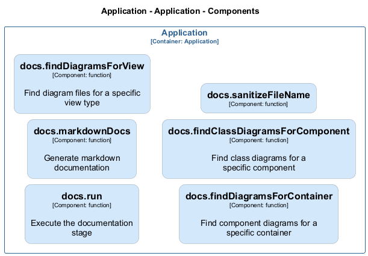

# docs — Code View

[← Back to Container](./default-container.md) | [← Back to System](./README.md)

---

## Component Information

| Field | Value |
| --- | --- |
| **Component** | docs |
| **Container** | Application |
| **Type** | `module` |
| **Description** | Documentation stage of the AAC pipeline \| Markdown documentation generator |
---

## Code Structure

### Class Diagram

### Code Elements

<strong>6 code element(s)</strong>

#### Functions

##### `run()`

Execute the documentation stage

| Field | Value |
| --- | --- |
| **Type** | `function` |
| **Visibility** | `public` |
| **Async** | Yes || **Returns** | `Promise<void>` || **Location** | `C:/Users/chris/git/archlette/src/5-docs/index.ts:35` |

**Parameters:**

- `ctx`: <code>import("C:/Users/chris/git/archlette/src/core/types").PipelineContext</code> — - Pipeline context with configuration, logging, IR, and rendered diagrams

---
##### `markdownDocs()`

Generate markdown documentation

| Field | Value |
| --- | --- |
| **Type** | `function` |
| **Visibility** | `public` |
| **Async** | Yes || **Returns** | `Promise<void>` || **Location** | `C:/Users/chris/git/archlette/src/docs/builtin/markdown-docs.ts:33` |

**Parameters:**

- `ctx`: <code>import("C:/Users/chris/git/archlette/src/core/types").PipelineContext</code>

---
##### `findDiagramsForView()`

Find diagram files for a specific view type

| Field | Value |
| --- | --- |
| **Type** | `function` |
| **Visibility** | `private` |
| **Returns** | `string[]` || **Location** | `C:/Users/chris/git/archlette/src/docs/builtin/markdown-docs.ts:262` |

**Parameters:**

- `rendererOutputs`: <code>import("C:/Users/chris/git/archlette/src/core/types").RendererOutput[]</code>- `diagramsDir`: <code>string</code>- `docsDir`: <code>string</code>- `viewType`: <code>string</code>- `log`: <code>import("C:/Users/chris/git/archlette/src/core/logger").Logger</code>

---
##### `findDiagramsForContainer()`

Find component diagrams for a specific container

| Field | Value |
| --- | --- |
| **Type** | `function` |
| **Visibility** | `private` |
| **Returns** | `string[]` || **Location** | `C:/Users/chris/git/archlette/src/docs/builtin/markdown-docs.ts:295` |

**Parameters:**

- `rendererOutputs`: <code>import("C:/Users/chris/git/archlette/src/core/types").RendererOutput[]</code>- `diagramsDir`: <code>string</code>- `docsDir`: <code>string</code>- `container`: <code>{ id: string; name: string; }</code>

---
##### `findClassDiagramsForComponent()`

Find class diagrams for a specific component

| Field | Value |
| --- | --- |
| **Type** | `function` |
| **Visibility** | `private` |
| **Returns** | `string[]` || **Location** | `C:/Users/chris/git/archlette/src/docs/builtin/markdown-docs.ts:334` |

**Parameters:**

- `rendererOutputs`: <code>import("C:/Users/chris/git/archlette/src/core/types").RendererOutput[]</code>- `diagramsDir`: <code>string</code>- `docsDir`: <code>string</code>- `component`: <code>z.infer<any></code>

---
##### `sanitizeFileName()`

| Field | Value |
| --- | --- |
| **Type** | `function` |
| **Visibility** | `private` |
| **Returns** | `string` || **Location** | `C:/Users/chris/git/archlette/src/docs/builtin/markdown-docs.ts:369` |

**Parameters:**

- `name`: <code>string</code>

---

---

<a href="./default-container.md">← Back to Container</a> | <a href="./README.md">← Back to System</a> | Generated with <a href="https://github.com/chrislyons-dev/archlette">Archlette</a>

