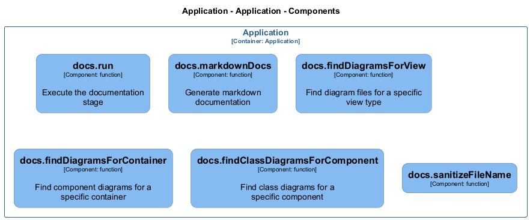

# docs — Code View

[← Back to Container](./default-container.md) | [← Back to System](./README.md)

---

## Component Information

<table>
<tbody>
<tr>
<td><strong>Component</strong></td>
<td>docs</td>
</tr>
<tr>
<td><strong>Container</strong></td>
<td>Application</td>
</tr>
<tr>
<td><strong>Type</strong></td>
<td><code>module</code></td>
</tr>
<tr>
<td><strong>Description</strong></td>
<td>Documentation stage of the AAC pipeline | Markdown documentation generator</td>
</tr>
</tbody>
</table>

---

## Code Structure

### Class Diagram

### Code Elements

<strong>6 code element(s)</strong>

#### Functions

##### `run()`

Execute the documentation stage

<table>
<tbody>
<tr>
<td><strong>Type</strong></td>
<td><code>function</code></td>
</tr>
<tr>
<td><strong>Visibility</strong></td>
<td><code>public</code></td>
</tr>
<tr>
<td><strong>Async</strong></td>
<td>Yes</td>
</tr>
<tr>
<td><strong>Returns</strong></td>
<td><code>Promise<void></code></td>
</tr>
<tr>
<td><strong>Location</strong></td>
<td><code>C:/Users/chris/git/archlette/src/5-docs/index.ts:35</code></td>
</tr>
</tbody>
</table>

**Parameters:**

- `ctx`: <code>import("C:/Users/chris/git/archlette/src/core/types").PipelineContext</code> — - Pipeline context with configuration, logging, IR, and rendered diagrams

---
##### `markdownDocs()`

Generate markdown documentation

<table>
<tbody>
<tr>
<td><strong>Type</strong></td>
<td><code>function</code></td>
</tr>
<tr>
<td><strong>Visibility</strong></td>
<td><code>public</code></td>
</tr>
<tr>
<td><strong>Async</strong></td>
<td>Yes</td>
</tr>
<tr>
<td><strong>Returns</strong></td>
<td><code>Promise<void></code></td>
</tr>
<tr>
<td><strong>Location</strong></td>
<td><code>C:/Users/chris/git/archlette/src/docs/builtin/markdown-docs.ts:33</code></td>
</tr>
</tbody>
</table>

**Parameters:**

- `ctx`: <code>import("C:/Users/chris/git/archlette/src/core/types").PipelineContext</code>

---
##### `findDiagramsForView()`

Find diagram files for a specific view type

<table>
<tbody>
<tr>
<td><strong>Type</strong></td>
<td><code>function</code></td>
</tr>
<tr>
<td><strong>Visibility</strong></td>
<td><code>private</code></td>
</tr>
<tr>
<td><strong>Returns</strong></td>
<td><code>string[]</code></td>
</tr>
<tr>
<td><strong>Location</strong></td>
<td><code>C:/Users/chris/git/archlette/src/docs/builtin/markdown-docs.ts:244</code></td>
</tr>
</tbody>
</table>

**Parameters:**

- `rendererOutputs`: <code>import("C:/Users/chris/git/archlette/src/core/types").RendererOutput[]</code>- `diagramsDir`: <code>string</code>- `docsDir`: <code>string</code>- `viewType`: <code>string</code>- `log`: <code>import("C:/Users/chris/git/archlette/src/core/logger").Logger</code>

---
##### `findDiagramsForContainer()`

Find component diagrams for a specific container

<table>
<tbody>
<tr>
<td><strong>Type</strong></td>
<td><code>function</code></td>
</tr>
<tr>
<td><strong>Visibility</strong></td>
<td><code>private</code></td>
</tr>
<tr>
<td><strong>Returns</strong></td>
<td><code>string[]</code></td>
</tr>
<tr>
<td><strong>Location</strong></td>
<td><code>C:/Users/chris/git/archlette/src/docs/builtin/markdown-docs.ts:276</code></td>
</tr>
</tbody>
</table>

**Parameters:**

- `rendererOutputs`: <code>import("C:/Users/chris/git/archlette/src/core/types").RendererOutput[]</code>- `diagramsDir`: <code>string</code>- `docsDir`: <code>string</code>- `container`: <code>{ id: string; name: string; }</code>

---
##### `findClassDiagramsForComponent()`

Find class diagrams for a specific component

<table>
<tbody>
<tr>
<td><strong>Type</strong></td>
<td><code>function</code></td>
</tr>
<tr>
<td><strong>Visibility</strong></td>
<td><code>private</code></td>
</tr>
<tr>
<td><strong>Returns</strong></td>
<td><code>string[]</code></td>
</tr>
<tr>
<td><strong>Location</strong></td>
<td><code>C:/Users/chris/git/archlette/src/docs/builtin/markdown-docs.ts:314</code></td>
</tr>
</tbody>
</table>

**Parameters:**

- `rendererOutputs`: <code>import("C:/Users/chris/git/archlette/src/core/types").RendererOutput[]</code>- `diagramsDir`: <code>string</code>- `docsDir`: <code>string</code>- `component`: <code>z.infer<any></code>

---
##### `sanitizeFileName()`

<table>
<tbody>
<tr>
<td><strong>Type</strong></td>
<td><code>function</code></td>
</tr>
<tr>
<td><strong>Visibility</strong></td>
<td><code>private</code></td>
</tr>
<tr>
<td><strong>Returns</strong></td>
<td><code>string</code></td>
</tr>
<tr>
<td><strong>Location</strong></td>
<td><code>C:/Users/chris/git/archlette/src/docs/builtin/markdown-docs.ts:348</code></td>
</tr>
</tbody>
</table>

**Parameters:**

- `name`: <code>string</code>

---

---

<a href="./default-container.md">← Back to Container</a> | <a href="./README.md">← Back to System</a> | Generated with <a href="https://github.com/chrislyons-dev/archlette">Archlette</a>

