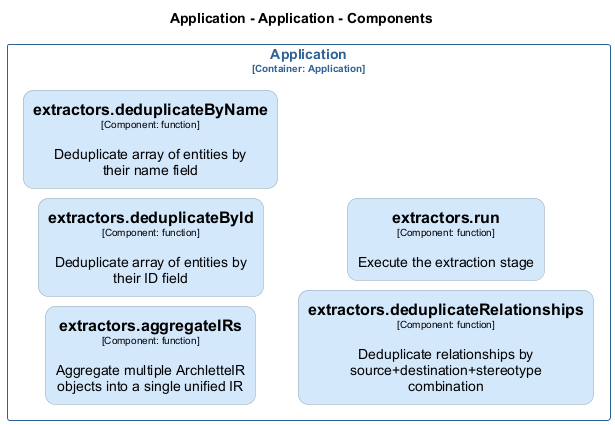

# extractors — Code View

[← Back to Container](./default-container.md) | [← Back to System](./README.md)

---

## Component Information

| Field | Value |
| --- | --- |
| **Component** | extractors |
| **Container** | Application |
| **Type** | `module` |
| **Description** | ArchletteIR aggregation utilities \| Extraction stage of the AAC pipeline |
---

## Code Structure

### Class Diagram



### Code Elements

<details>
<summary><strong>5 code element(s)</strong></summary>


#### Functions

##### `aggregateIRs()`

Aggregate multiple ArchletteIR objects into a single unified IR

| Field | Value |
| --- | --- |
| **Type** | `function` |
| **Visibility** | `public` |
| **Returns** | `z.infer<any>` - A single aggregated ArchletteIR with deduplicated elements || **Location** | `C:/Users/chris/git/archlette/src/1-extract/aggregator.ts:47` |

**Parameters:**

- `irs`: <code>z.infer<any>[]</code> — - Array of ArchletteIR objects to merge
**Examples:**
```typescript

```

---
##### `deduplicateById()`

Deduplicate array of entities by their ID field

| Field | Value |
| --- | --- |
| **Type** | `function` |
| **Visibility** | `private` |
| **Returns** | `T[]` - Array with duplicates removed (first occurrence preserved, descriptions merged) || **Location** | `C:/Users/chris/git/archlette/src/1-extract/aggregator.ts:104` |

**Parameters:**

- `items`: <code>T[]</code> — - Array of entities with id property

---
##### `deduplicateByName()`

Deduplicate array of entities by their name field

| Field | Value |
| --- | --- |
| **Type** | `function` |
| **Visibility** | `private` |
| **Returns** | `T[]` - Array with duplicates removed (first occurrence preserved, descriptions merged) || **Location** | `C:/Users/chris/git/archlette/src/1-extract/aggregator.ts:142` |

**Parameters:**

- `items`: <code>T[]</code> — - Array of entities with name property

---
##### `deduplicateRelationships()`

Deduplicate relationships by source+destination+stereotype combination

| Field | Value |
| --- | --- |
| **Type** | `function` |
| **Visibility** | `private` |
| **Returns** | `z.infer<any>[]` - Array with duplicate relationships removed || **Location** | `C:/Users/chris/git/archlette/src/1-extract/aggregator.ts:184` |

**Parameters:**

- `relationships`: <code>z.infer<any>[]</code> — - Array of relationships to deduplicate

---
##### `run()`

Execute the extraction stage

| Field | Value |
| --- | --- |
| **Type** | `function` |
| **Visibility** | `public` |
| **Async** | Yes || **Returns** | `Promise<void>` || **Location** | `C:/Users/chris/git/archlette/src/1-extract/index.ts:43` |

**Parameters:**

- `ctx`: <code>import("C:/Users/chris/git/archlette/src/core/types").PipelineContext</code> — - Pipeline context with configuration and logging

---

</details>

---

<div align="center">
<sub><a href="./default-container.md">← Back to Container</a> | <a href="./README.md">← Back to System</a> | Generated with <a href="https://github.com/chrislyons-dev/archlette">Archlette</a></sub>
</div>

