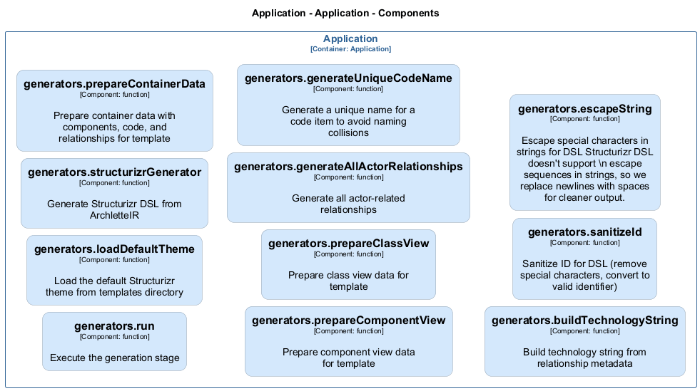

# generators — Code View

[← Back to Container](./default-container.md) | [← Back to System](./README.md)

---

## Component Information

| Field | Value |
| --- | --- |
| **Component** | generators |
| **Container** | Application |
| **Type** | `module` |
| **Description** | Generation stage of the AAC pipeline \| Structurizr DSL Generator (Template-based) |
---

## Code Structure

### Class Diagram

### Code Elements

<strong>11 code element(s)</strong>

#### Functions

##### `run()`

Execute the generation stage

| Field | Value |
| --- | --- |
| **Type** | `function` |
| **Visibility** | `public` |
| **Async** | Yes || **Returns** | `Promise<void>` || **Location** | `C:/Users/chris/git/archlette/src/3-generate/index.ts:36` |

**Parameters:**

- `ctx`: <code>import("C:/Users/chris/git/archlette/src/core/types").PipelineContext</code> — - Pipeline context with configuration, logging, and validated IR

---
##### `loadDefaultTheme()`

Load the default Structurizr theme from templates directory

| Field | Value |
| --- | --- |
| **Type** | `function` |
| **Visibility** | `private` |
| **Returns** | `string` - Theme DSL content as string || **Location** | `C:/Users/chris/git/archlette/src/generators/builtin/structurizr.ts:59` |

---
##### `structurizrGenerator()`

Generate Structurizr DSL from ArchletteIR

| Field | Value |
| --- | --- |
| **Type** | `function` |
| **Visibility** | `public` |
| **Returns** | `string` || **Location** | `C:/Users/chris/git/archlette/src/generators/builtin/structurizr.ts:75` |

**Parameters:**

- `ir`: <code>z.infer<any></code>- `node`: <code>any</code>

---
##### `prepareContainerData()`

Prepare container data with components, code, and relationships for template

| Field | Value |
| --- | --- |
| **Type** | `function` |
| **Visibility** | `private` |
| **Returns** | `any` || **Location** | `C:/Users/chris/git/archlette/src/generators/builtin/structurizr.ts:154` |

**Parameters:**

- `container`: <code>z.infer<any></code>- `ir`: <code>z.infer<any></code>

---
##### `prepareComponentView()`

Prepare component view data for template

| Field | Value |
| --- | --- |
| **Type** | `function` |
| **Visibility** | `private` |
| **Returns** | `{ containerId: any; viewName: string; relevantActors: any; components: any; }` || **Location** | `C:/Users/chris/git/archlette/src/generators/builtin/structurizr.ts:204` |

**Parameters:**

- `container`: <code>z.infer<any></code>- `ir`: <code>z.infer<any></code>

---
##### `prepareClassView()`

Prepare class view data for template

| Field | Value |
| --- | --- |
| **Type** | `function` |
| **Visibility** | `private` |
| **Returns** | `{ containerId: any; viewName: string; codeItems: any; }` || **Location** | `C:/Users/chris/git/archlette/src/generators/builtin/structurizr.ts:241` |

**Parameters:**

- `component`: <code>z.infer<any></code>- `ir`: <code>z.infer<any></code>

---
##### `generateAllActorRelationships()`

Generate all actor-related relationships

| Field | Value |
| --- | --- |
| **Type** | `function` |
| **Visibility** | `private` |
| **Returns** | `z.infer<any>[]` || **Location** | `C:/Users/chris/git/archlette/src/generators/builtin/structurizr.ts:256` |

**Parameters:**

- `ir`: <code>z.infer<any></code>

---
##### `generateUniqueCodeName()`

Generate a unique name for a code item to avoid naming collisions

| Field | Value |
| --- | --- |
| **Type** | `function` |
| **Visibility** | `private` |
| **Returns** | `string` || **Location** | `C:/Users/chris/git/archlette/src/generators/builtin/structurizr.ts:303` |

**Parameters:**

- `code`: <code>z.infer<any></code>

---
##### `buildTechnologyString()`

Build technology string from relationship metadata

| Field | Value |
| --- | --- |
| **Type** | `function` |
| **Visibility** | `private` |
| **Returns** | `string` || **Location** | `C:/Users/chris/git/archlette/src/generators/builtin/structurizr.ts:341` |

**Parameters:**

- `rel`: <code>z.infer<any></code>

---
##### `sanitizeId()`

Sanitize ID for DSL (remove special characters, convert to valid identifier)

| Field | Value |
| --- | --- |
| **Type** | `function` |
| **Visibility** | `private` |
| **Returns** | `string` || **Location** | `C:/Users/chris/git/archlette/src/generators/builtin/structurizr.ts:357` |

**Parameters:**

- `id`: <code>string</code>

---
##### `escapeString()`

Escape special characters in strings for DSL

Structurizr DSL doesn't support \n escape sequences in strings,
so we replace newlines with spaces for cleaner output.

| Field | Value |
| --- | --- |
| **Type** | `function` |
| **Visibility** | `private` |
| **Returns** | `string` || **Location** | `C:/Users/chris/git/archlette/src/generators/builtin/structurizr.ts:367` |

**Parameters:**

- `str`: <code>string</code>

---

---

<a href="./default-container.md">← Back to Container</a> | <a href="./README.md">← Back to System</a> | Generated with <a href="https://github.com/chrislyons-dev/archlette">Archlette</a>

