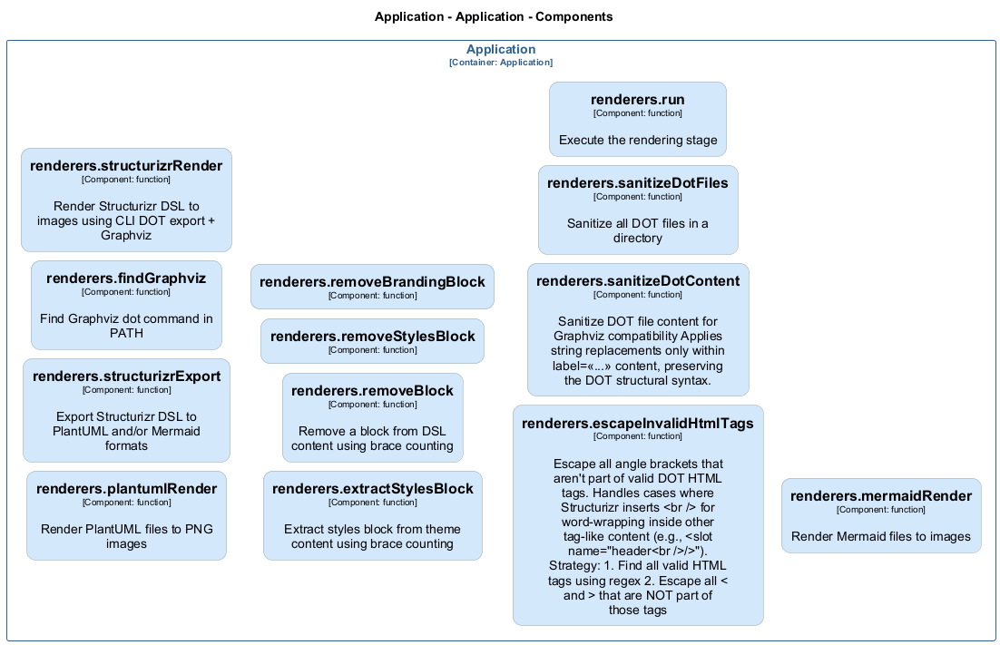

# renderers — Code View

[← Back to Container](./default-container.md) | [← Back to System](./README.md)

---

## Component Information

| Field | Value |
| --- | --- |
| **Component** | renderers |
| **Container** | Application |
| **Type** | `module` |
| **Description** | Render stage of the AAC pipeline \| Mermaid image renderer \| PlantUML image renderer \| Structurizr DSL export renderer \| Structurizr direct image renderer |
---

## Code Structure

### Class Diagram

### Code Elements

<strong>13 code element(s)</strong>

#### Functions

##### `run()`

Execute the rendering stage

| Field | Value |
| --- | --- |
| **Type** | `function` |
| **Visibility** | `public` |
| **Async** | Yes || **Returns** | `Promise<void>` || **Location** | `C:/Users/chris/git/archlette/src/4-render/index.ts:36` |

**Parameters:**

- `ctx`: <code>import("C:/Users/chris/git/archlette/src/core/types").PipelineContext</code> — - Pipeline context with configuration, logging, and DSL file location

---
##### `mermaidRender()`

Render Mermaid files to images

| Field | Value |
| --- | --- |
| **Type** | `function` |
| **Visibility** | `public` |
| **Async** | Yes || **Returns** | `Promise<void>` || **Location** | `C:/Users/chris/git/archlette/src/renderers/builtin/mermaid-render.ts:41` |

**Parameters:**

- `ctx`: <code>import("C:/Users/chris/git/archlette/src/core/types").PipelineContext</code>- `node`: <code>any</code>

---
##### `plantumlRender()`

Render PlantUML files to PNG images

| Field | Value |
| --- | --- |
| **Type** | `function` |
| **Visibility** | `public` |
| **Async** | Yes || **Returns** | `Promise<void>` || **Location** | `C:/Users/chris/git/archlette/src/renderers/builtin/plantuml-render.ts:28` |

**Parameters:**

- `ctx`: <code>import("C:/Users/chris/git/archlette/src/core/types").PipelineContext</code>

---
##### `structurizrExport()`

Export Structurizr DSL to PlantUML and/or Mermaid formats

| Field | Value |
| --- | --- |
| **Type** | `function` |
| **Visibility** | `public` |
| **Async** | Yes || **Returns** | `Promise<void>` || **Location** | `C:/Users/chris/git/archlette/src/renderers/builtin/structurizr-export.ts:36` |

**Parameters:**

- `ctx`: <code>import("C:/Users/chris/git/archlette/src/core/types").PipelineContext</code>- `node`: <code>any</code>

---
##### `findGraphviz()`

Find Graphviz dot command in PATH

| Field | Value |
| --- | --- |
| **Type** | `function` |
| **Visibility** | `private` |
| **Returns** | `string` || **Location** | `C:/Users/chris/git/archlette/src/renderers/builtin/structurizr-render.ts:41` |

**Parameters:**

- `log`: <code>{ debug?: (msg: string) => void; warn?: (msg: string) => void; }</code>

---
##### `structurizrRender()`

Render Structurizr DSL to images using CLI DOT export + Graphviz

| Field | Value |
| --- | --- |
| **Type** | `function` |
| **Visibility** | `public` |
| **Async** | Yes || **Returns** | `Promise<void>` || **Location** | `C:/Users/chris/git/archlette/src/renderers/builtin/structurizr-render.ts:74` |

**Parameters:**

- `ctx`: <code>import("C:/Users/chris/git/archlette/src/core/types").PipelineContext</code>- `node`: <code>any</code>

---
##### `extractStylesBlock()`

Extract styles block from theme content using brace counting

| Field | Value |
| --- | --- |
| **Type** | `function` |
| **Visibility** | `private` |
| **Returns** | `string` || **Location** | `C:/Users/chris/git/archlette/src/renderers/builtin/structurizr-render.ts:267` |

**Parameters:**

- `content`: <code>string</code>

---
##### `removeBlock()`

Remove a block from DSL content using brace counting

| Field | Value |
| --- | --- |
| **Type** | `function` |
| **Visibility** | `private` |
| **Returns** | `string` || **Location** | `C:/Users/chris/git/archlette/src/renderers/builtin/structurizr-render.ts:293` |

**Parameters:**

- `content`: <code>string</code>- `blockName`: <code>string</code>

---
##### `removeStylesBlock()`

| Field | Value |
| --- | --- |
| **Type** | `function` |
| **Visibility** | `private` |
| **Returns** | `string` || **Location** | `C:/Users/chris/git/archlette/src/renderers/builtin/structurizr-render.ts:319` |

**Parameters:**

- `content`: <code>string</code>

---
##### `removeBrandingBlock()`

| Field | Value |
| --- | --- |
| **Type** | `function` |
| **Visibility** | `private` |
| **Returns** | `string` || **Location** | `C:/Users/chris/git/archlette/src/renderers/builtin/structurizr-render.ts:323` |

**Parameters:**

- `content`: <code>string</code>

---
##### `escapeInvalidHtmlTags()`

Escape all angle brackets that aren't part of valid DOT HTML tags.

Handles cases where Structurizr inserts   for word-wrapping inside
other tag-like content (e.g., <slot name="header />").

Strategy:
1. Find all valid HTML tags using regex
2. Escape all < and > that are NOT part of those tags

| Field | Value |
| --- | --- |
| **Type** | `function` |
| **Visibility** | `private` |
| **Returns** | `string` || **Location** | `C:/Users/chris/git/archlette/src/renderers/builtin/structurizr-render.ts:359` |

**Parameters:**

- `content`: <code>string</code>- `debug`: <code>boolean</code>

---
##### `sanitizeDotContent()`

Sanitize DOT file content for Graphviz compatibility

Applies string replacements only within label=<<...>> content,
preserving the DOT structural syntax.

| Field | Value |
| --- | --- |
| **Type** | `function` |
| **Visibility** | `private` |
| **Returns** | `string` || **Location** | `C:/Users/chris/git/archlette/src/renderers/builtin/structurizr-render.ts:410` |

**Parameters:**

- `content`: <code>string</code>- `debug`: <code>boolean</code>

---
##### `sanitizeDotFiles()`

Sanitize all DOT files in a directory

| Field | Value |
| --- | --- |
| **Type** | `function` |
| **Visibility** | `private` |
| **Returns** | `void` || **Location** | `C:/Users/chris/git/archlette/src/renderers/builtin/structurizr-render.ts:501` |

**Parameters:**

- `dotDir`: <code>string</code>- `debug`: <code>boolean</code>

---

---

<a href="./default-container.md">← Back to Container</a> | <a href="./README.md">← Back to System</a> | Generated with <a href="https://github.com/chrislyons-dev/archlette">Archlette</a>

