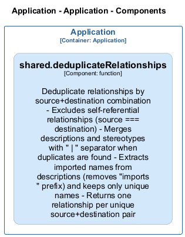

# shared — Code View

[← Back to Container](./default-container.md) | [← Back to System](./README.md)

---

## Component Information

| Field | Value |
| --- | --- |
| **Component** | shared |
| **Container** | Application |
| **Type** | `module` |

---

## Code Structure

### Class Diagram

### Code Elements

<strong>1 code element(s)</strong>

#### Functions

##### `deduplicateRelationships()`

Deduplicate relationships by source+destination combination
- Excludes self-referential relationships (source === destination)
- Merges descriptions and stereotypes with " | " separator when duplicates are found
- Extracts imported names from descriptions (removes "imports " prefix) and keeps only unique names
- Returns one relationship per unique source+destination pair

| Field | Value |
| --- | --- |
| **Type** | `function` |
| **Visibility** | `public` |
| **Returns** | `z.infer<any>[]` || **Location** | `C:/Users/chris/git/archlette/src/extractors/builtin/shared/relationship-utils.ts:15` |

**Parameters:**

- `relationships`: <code>z.infer<any>[]</code>

---

---

<a href="./default-container.md">← Back to Container</a> | <a href="./README.md">← Back to System</a> | Generated with <a href="https://github.com/chrislyons-dev/archlette">Archlette</a>

