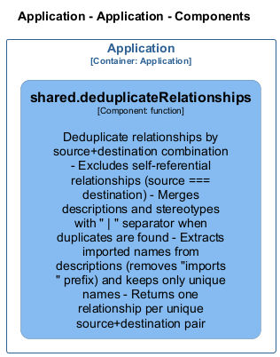

# shared — Code View

[← Back to Container](./default-container.md) | [← Back to System](./README.md)

---

## Component Information

<table>
<tbody>
<tr>
<td><strong>Component</strong></td>
<td>shared</td>
</tr>
<tr>
<td><strong>Container</strong></td>
<td>Application</td>
</tr>
<tr>
<td><strong>Type</strong></td>
<td><code>module</code></td>
</tr>
</tbody>
</table>

---

## Code Structure

### Class Diagram

### Code Elements

<strong>1 code element(s)</strong>

#### Functions

##### `deduplicateRelationships()`

Deduplicate relationships by source+destination combination
- Excludes self-referential relationships (source === destination)
- Merges descriptions and stereotypes with " | " separator when duplicates are found
- Extracts imported names from descriptions (removes "imports " prefix) and keeps only unique names
- Returns one relationship per unique source+destination pair

<table>
<tbody>
<tr>
<td><strong>Type</strong></td>
<td><code>function</code></td>
</tr>
<tr>
<td><strong>Visibility</strong></td>
<td><code>public</code></td>
</tr>
<tr>
<td><strong>Returns</strong></td>
<td><code>z.infer<any>[]</code></td>
</tr>
<tr>
<td><strong>Location</strong></td>
<td><code>C:/Users/chris/git/archlette/src/extractors/builtin/shared/relationship-utils.ts:15</code></td>
</tr>
</tbody>
</table>

**Parameters:**

- `relationships`: <code>z.infer<any>[]</code>

---

---

<a href="./default-container.md">← Back to Container</a> | <a href="./README.md">← Back to System</a> | Generated with <a href="https://github.com/chrislyons-dev/archlette">Archlette</a>

