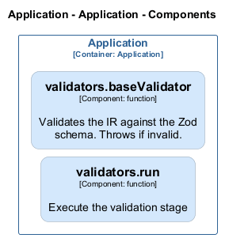

# validators — Code View

[← Back to Container](./default-container.md) | [← Back to System](./README.md)

---

## Component Information

| Field | Value |
| --- | --- |
| **Component** | validators |
| **Container** | Application |
| **Type** | `module` |
| **Description** | Validation stage of the AAC pipeline \| Base IR validator for Archlette pipeline |
---

## Code Structure

### Class Diagram

### Code Elements

<strong>2 code element(s)</strong>

#### Functions

##### `run()`

Execute the validation stage

| Field | Value |
| --- | --- |
| **Type** | `function` |
| **Visibility** | `public` |
| **Async** | Yes || **Returns** | `Promise<void>` || **Location** | `C:/Users/chris/git/archlette/src/2-validate/index.ts:38` |

**Parameters:**

- `ctx`: <code>import("C:/Users/chris/git/archlette/src/core/types").PipelineContext</code> — - Pipeline context with configuration, logging, and aggregated IR

---
##### `baseValidator()`

Validates the IR against the Zod schema. Throws if invalid.

| Field | Value |
| --- | --- |
| **Type** | `function` |
| **Visibility** | `private` |
| **Returns** | `z.infer<any>` - The same IR if valid || **Location** | `C:/Users/chris/git/archlette/src/validators/builtin/base-validator.ts:26` |

**Parameters:**

- `ir`: <code>z.infer<any></code> — - The input ArchletteIR

---

---

<a href="./default-container.md">← Back to Container</a> | <a href="./README.md">← Back to System</a> | Generated with <a href="https://github.com/chrislyons-dev/archlette">Archlette</a>

