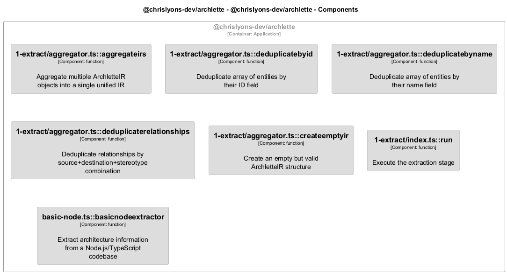

# 🧩 extractors

[← Back to System Overview](./README.md)

---

## 📋 Component Information

<table>
<tbody>
<tr>
<td><strong>Container</strong></td>
<td>@chrislyons-dev/archlette</td>
</tr>
<tr>
<td><strong>Type</strong></td>
<td><code>module</code></td>
</tr>
<tr>
<td><strong>Description</strong></td>
<td>ArchletteIR aggregation utilities | Extraction stage of the AAC pipeline | TypeScript/JavaScript code extractor</td>
</tr>
</tbody>
</table>

---

## 🏗️ Component Architecture


---

## 💻 Code Structure

### Class Diagram



### Code Elements

<details>
<summary><strong>7 code element(s)</strong></summary>


#### Functions

##### `aggregateIRs()`

Aggregate multiple ArchletteIR objects into a single unified IR

<table>
<tbody>
<tr>
<td><strong>Type</strong></td>
<td><code>function</code></td>
</tr>
<tr>
<td><strong>Visibility</strong></td>
<td><code>public</code></td>
</tr>
<tr>
<td><strong>Returns</strong></td>
<td><code>z.infer<any></code> — A single aggregated ArchletteIR with deduplicated elements</td>
</tr>
<tr>
<td><strong>Location</strong></td>
<td><code>C:/Users/chris/git/archlette/src/1-extract/aggregator.ts:46</code></td>
</tr>
</tbody>
</table>

**Parameters:**

- `irs`: <code>z.infer<any>[]</code>
**Examples:**
```typescript

```

---
##### `deduplicateById()`

Deduplicate array of entities by their ID field

<table>
<tbody>
<tr>
<td><strong>Type</strong></td>
<td><code>function</code></td>
</tr>
<tr>
<td><strong>Visibility</strong></td>
<td><code>private</code></td>
</tr>
<tr>
<td><strong>Returns</strong></td>
<td><code>T[]</code> — Array with duplicates removed (first occurrence preserved, descriptions merged)</td>
</tr>
<tr>
<td><strong>Location</strong></td>
<td><code>C:/Users/chris/git/archlette/src/1-extract/aggregator.ts:99</code></td>
</tr>
</tbody>
</table>

**Parameters:**

- `items`: <code>T[]</code>

---
##### `deduplicateByName()`

Deduplicate array of entities by their name field

<table>
<tbody>
<tr>
<td><strong>Type</strong></td>
<td><code>function</code></td>
</tr>
<tr>
<td><strong>Visibility</strong></td>
<td><code>private</code></td>
</tr>
<tr>
<td><strong>Returns</strong></td>
<td><code>T[]</code> — Array with duplicates removed (first occurrence preserved, descriptions merged)</td>
</tr>
<tr>
<td><strong>Location</strong></td>
<td><code>C:/Users/chris/git/archlette/src/1-extract/aggregator.ts:135</code></td>
</tr>
</tbody>
</table>

**Parameters:**

- `items`: <code>T[]</code>

---
##### `deduplicateRelationships()`

Deduplicate relationships by source+destination+stereotype combination

<table>
<tbody>
<tr>
<td><strong>Type</strong></td>
<td><code>function</code></td>
</tr>
<tr>
<td><strong>Visibility</strong></td>
<td><code>private</code></td>
</tr>
<tr>
<td><strong>Returns</strong></td>
<td><code>z.infer<any>[]</code> — Array with duplicate relationships removed</td>
</tr>
<tr>
<td><strong>Location</strong></td>
<td><code>C:/Users/chris/git/archlette/src/1-extract/aggregator.ts:175</code></td>
</tr>
</tbody>
</table>

**Parameters:**

- `relationships`: <code>z.infer<any>[]</code>

---
##### `createEmptyIR()`

Create an empty but valid ArchletteIR structure

<table>
<tbody>
<tr>
<td><strong>Type</strong></td>
<td><code>function</code></td>
</tr>
<tr>
<td><strong>Visibility</strong></td>
<td><code>private</code></td>
</tr>
<tr>
<td><strong>Returns</strong></td>
<td><code>z.infer<any></code> — A minimal valid ArchletteIR with no elements</td>
</tr>
<tr>
<td><strong>Location</strong></td>
<td><code>C:/Users/chris/git/archlette/src/1-extract/aggregator.ts:191</code></td>
</tr>
</tbody>
</table>


---
##### `run()`

Execute the extraction stage

<table>
<tbody>
<tr>
<td><strong>Type</strong></td>
<td><code>function</code></td>
</tr>
<tr>
<td><strong>Visibility</strong></td>
<td><code>public</code></td>
</tr>
<tr>
<td><strong>Async</strong></td>
<td>Yes</td>
</tr>
<tr>
<td><strong>Returns</strong></td>
<td><code>Promise<void></code></td>
</tr>
<tr>
<td><strong>Location</strong></td>
<td><code>C:/Users/chris/git/archlette/src/1-extract/index.ts:39</code></td>
</tr>
</tbody>
</table>

**Parameters:**

- `ctx`: <code>import("C:/Users/chris/git/archlette/src/core/types").PipelineContext</code>

---
##### `basicNodeExtractor()`

Extract architecture information from a Node.js/TypeScript codebase

<table>
<tbody>
<tr>
<td><strong>Type</strong></td>
<td><code>function</code></td>
</tr>
<tr>
<td><strong>Visibility</strong></td>
<td><code>public</code></td>
</tr>
<tr>
<td><strong>Async</strong></td>
<td>Yes</td>
</tr>
<tr>
<td><strong>Returns</strong></td>
<td><code>Promise<z.infer<any>></code> — Promise resolving to ArchletteIR with code, components, and relationships</td>
</tr>
<tr>
<td><strong>Location</strong></td>
<td><code>C:/Users/chris/git/archlette/src/extractors/builtin/basic-node.ts:65</code></td>
</tr>
</tbody>
</table>

**Parameters:**

- `node`: <code>any</code>
**Examples:**
```typescript

```

---

</details>

---

<div align="center">
<sub><a href="./README.md">← Back to System Overview</a> | Generated with <a href="https://github.com/architectlabs/archlette">Archlette</a></sub>
</div>
