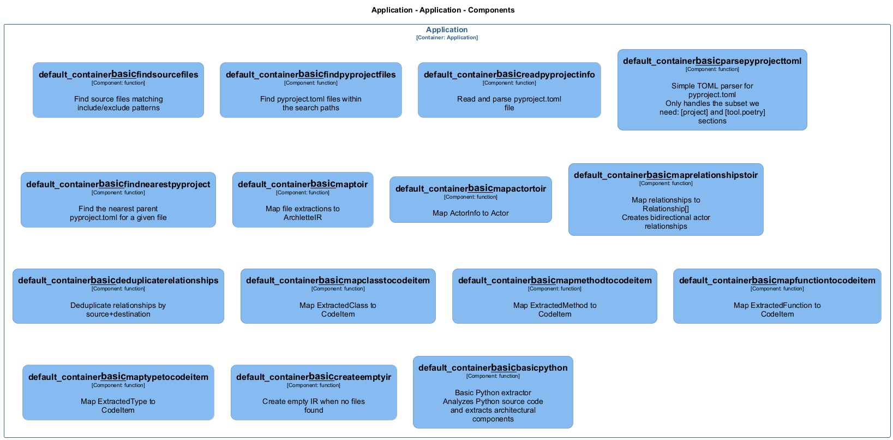

# basic — Code View

[← Back to Container](./default-container.md) | [← Back to System](./README.md)

---

## Component Information

<table>
<tbody>
<tr>
<td><strong>Component</strong></td>
<td>basic</td>
</tr>
<tr>
<td><strong>Container</strong></td>
<td>Application</td>
</tr>
<tr>
<td><strong>Type</strong></td>
<td><code>module</code></td>
</tr>
<tr>
<td><strong>Description</strong></td>
<td>Basic Python Extractor for Archlette
Extracts architecture information from Python source code</td>
</tr>
</tbody>
</table>

---

## Code Structure

### Class Diagram

### Code Elements

<strong>15 code element(s)</strong>

#### Functions

##### `basic__createEmptyIR()`

Create empty IR when no files found

<table>
<tbody>
<tr>
<td><strong>Type</strong></td>
<td><code>function</code></td>
</tr>
<tr>
<td><strong>Visibility</strong></td>
<td><code>private</code></td>
</tr>
<tr>
<td><strong>Returns</strong></td>
<td><code>z.infer<any></code></td>
</tr>
<tr>
<td><strong>Location</strong></td>
<td><code>C:/Users/chris/git/archlette/src/extractors/builtin/basic-python.ts:106</code></td>
</tr>
</tbody>
</table>

**Parameters:**

- `systemName`: <code>string</code>

---

##### `basic__basicPython()`

Basic Python extractor
Analyzes Python source code and extracts architectural components

<table>
<tbody>
<tr>
<td><strong>Type</strong></td>
<td><code>function</code></td>
</tr>
<tr>
<td><strong>Visibility</strong></td>
<td><code>public</code></td>
</tr>
<tr>
<td><strong>Async</strong></td>
<td>Yes</td>
</tr>
<tr>
<td><strong>Returns</strong></td>
<td><code>Promise<z.infer<any>></code></td>
</tr>
<tr>
<td><strong>Location</strong></td>
<td><code>C:/Users/chris/git/archlette/src/extractors/builtin/basic-python.ts:25</code></td>
</tr>
</tbody>
</table>

**Parameters:**

- `node`: <code>any</code>- `ctx`: <code>import("C:/Users/chris/git/archlette/src/core/types").PipelineContext</code>

---

##### `basic__findSourceFiles()`

Find source files matching include/exclude patterns

<table>
<tbody>
<tr>
<td><strong>Type</strong></td>
<td><code>function</code></td>
</tr>
<tr>
<td><strong>Visibility</strong></td>
<td><code>public</code></td>
</tr>
<tr>
<td><strong>Async</strong></td>
<td>Yes</td>
</tr>
<tr>
<td><strong>Returns</strong></td>
<td><code>Promise<string[]></code></td>
</tr>
<tr>
<td><strong>Location</strong></td>
<td><code>C:/Users/chris/git/archlette/src/extractors/builtin/basic-python/file-finder.ts:25</code></td>
</tr>
</tbody>
</table>

**Parameters:**

- `inputs`: <code>import("C:/Users/chris/git/archlette/src/extractors/builtin/basic-python/types").ExtractorInputs</code>

---

##### `basic__findPyProjectFiles()`

Find pyproject.toml files within the search paths

<table>
<tbody>
<tr>
<td><strong>Type</strong></td>
<td><code>function</code></td>
</tr>
<tr>
<td><strong>Visibility</strong></td>
<td><code>public</code></td>
</tr>
<tr>
<td><strong>Async</strong></td>
<td>Yes</td>
</tr>
<tr>
<td><strong>Returns</strong></td>
<td><code>Promise<string[]></code></td>
</tr>
<tr>
<td><strong>Location</strong></td>
<td><code>C:/Users/chris/git/archlette/src/extractors/builtin/basic-python/file-finder.ts:41</code></td>
</tr>
</tbody>
</table>

**Parameters:**

- `inputs`: <code>import("C:/Users/chris/git/archlette/src/extractors/builtin/basic-python/types").ExtractorInputs</code>

---

##### `basic__readPyProjectInfo()`

Read and parse pyproject.toml file

<table>
<tbody>
<tr>
<td><strong>Type</strong></td>
<td><code>function</code></td>
</tr>
<tr>
<td><strong>Visibility</strong></td>
<td><code>public</code></td>
</tr>
<tr>
<td><strong>Async</strong></td>
<td>Yes</td>
</tr>
<tr>
<td><strong>Returns</strong></td>
<td><code>Promise<import("C:/Users/chris/git/archlette/src/extractors/builtin/basic-python/file-finder").PyProjectInfo></code></td>
</tr>
<tr>
<td><strong>Location</strong></td>
<td><code>C:/Users/chris/git/archlette/src/extractors/builtin/basic-python/file-finder.ts:90</code></td>
</tr>
</tbody>
</table>

**Parameters:**

- `filePath`: <code>string</code>

---

##### `basic__parsePyProjectToml()`

Simple TOML parser for pyproject.toml
Only handles the subset we need: [project] and [tool.poetry] sections

<table>
<tbody>
<tr>
<td><strong>Type</strong></td>
<td><code>function</code></td>
</tr>
<tr>
<td><strong>Visibility</strong></td>
<td><code>private</code></td>
</tr>
<tr>
<td><strong>Returns</strong></td>
<td><code>PyProjectToml</code></td>
</tr>
<tr>
<td><strong>Location</strong></td>
<td><code>C:/Users/chris/git/archlette/src/extractors/builtin/basic-python/file-finder.ts:141</code></td>
</tr>
</tbody>
</table>

**Parameters:**

- `content`: <code>string</code>

---

##### `basic__findNearestPyProject()`

Find the nearest parent pyproject.toml for a given file

<table>
<tbody>
<tr>
<td><strong>Type</strong></td>
<td><code>function</code></td>
</tr>
<tr>
<td><strong>Visibility</strong></td>
<td><code>public</code></td>
</tr>
<tr>
<td><strong>Returns</strong></td>
<td><code>import("C:/Users/chris/git/archlette/src/extractors/builtin/basic-python/file-finder").PyProjectInfo</code></td>
</tr>
<tr>
<td><strong>Location</strong></td>
<td><code>C:/Users/chris/git/archlette/src/extractors/builtin/basic-python/file-finder.ts:195</code></td>
</tr>
</tbody>
</table>

**Parameters:**

- `filePath`: <code>string</code>- `pyprojects`: <code>import("C:/Users/chris/git/archlette/src/extractors/builtin/basic-python/file-finder").PyProjectInfo[]</code>

---

##### `basic__mapToIR()`

Map file extractions to ArchletteIR

<table>
<tbody>
<tr>
<td><strong>Type</strong></td>
<td><code>function</code></td>
</tr>
<tr>
<td><strong>Visibility</strong></td>
<td><code>public</code></td>
</tr>
<tr>
<td><strong>Returns</strong></td>
<td><code>z.infer<any></code></td>
</tr>
<tr>
<td><strong>Location</strong></td>
<td><code>C:/Users/chris/git/archlette/src/extractors/builtin/basic-python/to-ir-mapper.ts:38</code></td>
</tr>
</tbody>
</table>

**Parameters:**

- `extractions`: <code>import("C:/Users/chris/git/archlette/src/extractors/builtin/basic-python/types").FileExtraction[]</code>- `pyprojects`: <code>import("C:/Users/chris/git/archlette/src/extractors/builtin/basic-python/file-finder").PyProjectInfo[]</code>- `systemInfo`: <code>SystemInfo</code>

---

##### `basic__mapActorToIR()`

Map ActorInfo to Actor

<table>
<tbody>
<tr>
<td><strong>Type</strong></td>
<td><code>function</code></td>
</tr>
<tr>
<td><strong>Visibility</strong></td>
<td><code>private</code></td>
</tr>
<tr>
<td><strong>Returns</strong></td>
<td><code>z.infer<any></code></td>
</tr>
<tr>
<td><strong>Location</strong></td>
<td><code>C:/Users/chris/git/archlette/src/extractors/builtin/basic-python/to-ir-mapper.ts:251</code></td>
</tr>
</tbody>
</table>

**Parameters:**

- `actor`: <code>import("C:/Users/chris/git/archlette/src/extractors/builtin/basic-python/types").ActorInfo</code>- `actorTargets`: <code>Map<string, string[]></code>

---

##### `basic__mapRelationshipsToIR()`

Map relationships to Relationship[]
Creates bidirectional actor relationships

<table>
<tbody>
<tr>
<td><strong>Type</strong></td>
<td><code>function</code></td>
</tr>
<tr>
<td><strong>Visibility</strong></td>
<td><code>private</code></td>
</tr>
<tr>
<td><strong>Returns</strong></td>
<td><code>z.infer<any>[]</code></td>
</tr>
<tr>
<td><strong>Location</strong></td>
<td><code>C:/Users/chris/git/archlette/src/extractors/builtin/basic-python/to-ir-mapper.ts:265</code></td>
</tr>
</tbody>
</table>

**Parameters:**

- `relationships`: <code>import("C:/Users/chris/git/archlette/src/extractors/builtin/basic-python/types").RelationshipInfo[]</code>- `componentMap`: <code>Map<string, z.infer<any>></code>- `actorMap`: <code>Map<string, import("C:/Users/chris/git/archlette/src/extractors/builtin/basic-python/types").ActorInfo></code>- `actorTargets`: <code>Map<string, string[]></code>

---

##### `basic__deduplicateRelationships()`

Deduplicate relationships by source+destination

<table>
<tbody>
<tr>
<td><strong>Type</strong></td>
<td><code>function</code></td>
</tr>
<tr>
<td><strong>Visibility</strong></td>
<td><code>private</code></td>
</tr>
<tr>
<td><strong>Returns</strong></td>
<td><code>z.infer<any>[]</code></td>
</tr>
<tr>
<td><strong>Location</strong></td>
<td><code>C:/Users/chris/git/archlette/src/extractors/builtin/basic-python/to-ir-mapper.ts:312</code></td>
</tr>
</tbody>
</table>

**Parameters:**

- `relationships`: <code>z.infer<any>[]</code>

---

##### `basic__mapClassToCodeItem()`

Map ExtractedClass to CodeItem

<table>
<tbody>
<tr>
<td><strong>Type</strong></td>
<td><code>function</code></td>
</tr>
<tr>
<td><strong>Visibility</strong></td>
<td><code>private</code></td>
</tr>
<tr>
<td><strong>Returns</strong></td>
<td><code>z.infer<any></code></td>
</tr>
<tr>
<td><strong>Location</strong></td>
<td><code>C:/Users/chris/git/archlette/src/extractors/builtin/basic-python/to-ir-mapper.ts:327</code></td>
</tr>
</tbody>
</table>

**Parameters:**

- `cls`: <code>import("C:/Users/chris/git/archlette/src/extractors/builtin/basic-python/types").ExtractedClass</code>- `componentId`: <code>string</code>

---

##### `basic__mapMethodToCodeItem()`

Map ExtractedMethod to CodeItem

<table>
<tbody>
<tr>
<td><strong>Type</strong></td>
<td><code>function</code></td>
</tr>
<tr>
<td><strong>Visibility</strong></td>
<td><code>private</code></td>
</tr>
<tr>
<td><strong>Returns</strong></td>
<td><code>z.infer<any></code></td>
</tr>
<tr>
<td><strong>Location</strong></td>
<td><code>C:/Users/chris/git/archlette/src/extractors/builtin/basic-python/to-ir-mapper.ts:352</code></td>
</tr>
</tbody>
</table>

**Parameters:**

- `method`: <code>import("C:/Users/chris/git/archlette/src/extractors/builtin/basic-python/types").ExtractedMethod</code>- `className`: <code>string</code>- `componentId`: <code>string</code>

---

##### `basic__mapFunctionToCodeItem()`

Map ExtractedFunction to CodeItem

<table>
<tbody>
<tr>
<td><strong>Type</strong></td>
<td><code>function</code></td>
</tr>
<tr>
<td><strong>Visibility</strong></td>
<td><code>private</code></td>
</tr>
<tr>
<td><strong>Returns</strong></td>
<td><code>z.infer<any></code></td>
</tr>
<tr>
<td><strong>Location</strong></td>
<td><code>C:/Users/chris/git/archlette/src/extractors/builtin/basic-python/to-ir-mapper.ts:387</code></td>
</tr>
</tbody>
</table>

**Parameters:**

- `func`: <code>import("C:/Users/chris/git/archlette/src/extractors/builtin/basic-python/types").ExtractedFunction</code>- `componentId`: <code>string</code>

---

##### `basic__mapTypeToCodeItem()`

Map ExtractedType to CodeItem

<table>
<tbody>
<tr>
<td><strong>Type</strong></td>
<td><code>function</code></td>
</tr>
<tr>
<td><strong>Visibility</strong></td>
<td><code>private</code></td>
</tr>
<tr>
<td><strong>Returns</strong></td>
<td><code>z.infer<any></code></td>
</tr>
<tr>
<td><strong>Location</strong></td>
<td><code>C:/Users/chris/git/archlette/src/extractors/builtin/basic-python/to-ir-mapper.ts:418</code></td>
</tr>
</tbody>
</table>

**Parameters:**

- `type`: <code>import("C:/Users/chris/git/archlette/src/extractors/builtin/basic-python/types").ExtractedType</code>- `componentId`: <code>string</code>

---

---

<a href="./default-container.md">← Back to Container</a> | <a href="./README.md">← Back to System</a> | Generated with <a href="https://github.com/architectlabs/archlette">Archlette</a>

