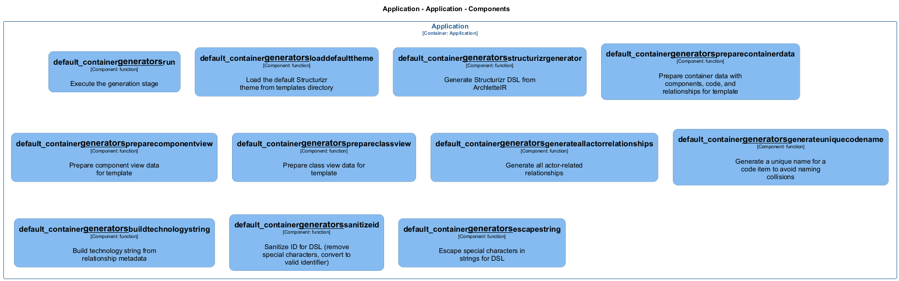

# generators — Code View

[← Back to Container](./default-container.md) | [← Back to System](./README.md)

---

## Component Information

<table>
<tbody>
<tr>
<td><strong>Component</strong></td>
<td>generators</td>
</tr>
<tr>
<td><strong>Container</strong></td>
<td>Application</td>
</tr>
<tr>
<td><strong>Type</strong></td>
<td><code>module</code></td>
</tr>
<tr>
<td><strong>Description</strong></td>
<td>Generation stage of the AAC pipeline | Structurizr DSL Generator (Template-based)</td>
</tr>
</tbody>
</table>

---

## Code Structure

### Class Diagram

### Code Elements

<strong>10 code element(s)</strong>

#### Functions

##### `generators__run()`

Execute the generation stage

<table>
<tbody>
<tr>
<td><strong>Type</strong></td>
<td><code>function</code></td>
</tr>
<tr>
<td><strong>Visibility</strong></td>
<td><code>public</code></td>
</tr>
<tr>
<td><strong>Async</strong></td>
<td>Yes</td>
</tr>
<tr>
<td><strong>Returns</strong></td>
<td><code>Promise<void></code></td>
</tr>
<tr>
<td><strong>Location</strong></td>
<td><code>C:/Users/chris/git/archlette/src/3-generate/index.ts:36</code></td>
</tr>
</tbody>
</table>

**Parameters:**

- `ctx`: <code>import("C:/Users/chris/git/archlette/src/core/types").PipelineContext</code> — - Pipeline context with configuration, logging, and validated IR

---

##### `generators__structurizrGenerator()`

Generate Structurizr DSL from ArchletteIR

<table>
<tbody>
<tr>
<td><strong>Type</strong></td>
<td><code>function</code></td>
</tr>
<tr>
<td><strong>Visibility</strong></td>
<td><code>public</code></td>
</tr>
<tr>
<td><strong>Returns</strong></td>
<td><code>string</code></td>
</tr>
<tr>
<td><strong>Location</strong></td>
<td><code>C:/Users/chris/git/archlette/src/generators/builtin/structurizr.ts:51</code></td>
</tr>
</tbody>
</table>

**Parameters:**

- `ir`: <code>z.infer<any></code>- `_node`: <code>any</code>

---

##### `generators__prepareContainerData()`

Prepare container data with components, code, and relationships for template

<table>
<tbody>
<tr>
<td><strong>Type</strong></td>
<td><code>function</code></td>
</tr>
<tr>
<td><strong>Visibility</strong></td>
<td><code>private</code></td>
</tr>
<tr>
<td><strong>Returns</strong></td>
<td><code>any</code></td>
</tr>
<tr>
<td><strong>Location</strong></td>
<td><code>C:/Users/chris/git/archlette/src/generators/builtin/structurizr.ts:95</code></td>
</tr>
</tbody>
</table>

**Parameters:**

- `container`: <code>z.infer<any></code>- `ir`: <code>z.infer<any></code>

---

##### `generators__prepareComponentView()`

Prepare component view data for template

<table>
<tbody>
<tr>
<td><strong>Type</strong></td>
<td><code>function</code></td>
</tr>
<tr>
<td><strong>Visibility</strong></td>
<td><code>private</code></td>
</tr>
<tr>
<td><strong>Returns</strong></td>
<td><code>{ containerId: any; viewName: string; relevantActors: any; components: any; }</code></td>
</tr>
<tr>
<td><strong>Location</strong></td>
<td><code>C:/Users/chris/git/archlette/src/generators/builtin/structurizr.ts:137</code></td>
</tr>
</tbody>
</table>

**Parameters:**

- `container`: <code>z.infer<any></code>- `ir`: <code>z.infer<any></code>

---

##### `generators__prepareClassView()`

Prepare class view data for template

<table>
<tbody>
<tr>
<td><strong>Type</strong></td>
<td><code>function</code></td>
</tr>
<tr>
<td><strong>Visibility</strong></td>
<td><code>private</code></td>
</tr>
<tr>
<td><strong>Returns</strong></td>
<td><code>{ containerId: any; viewName: string; codeItems: any; }</code></td>
</tr>
<tr>
<td><strong>Location</strong></td>
<td><code>C:/Users/chris/git/archlette/src/generators/builtin/structurizr.ts:174</code></td>
</tr>
</tbody>
</table>

**Parameters:**

- `component`: <code>z.infer<any></code>- `ir`: <code>z.infer<any></code>

---

##### `generators__generateAllActorRelationships()`

Generate all actor-related relationships

<table>
<tbody>
<tr>
<td><strong>Type</strong></td>
<td><code>function</code></td>
</tr>
<tr>
<td><strong>Visibility</strong></td>
<td><code>private</code></td>
</tr>
<tr>
<td><strong>Returns</strong></td>
<td><code>z.infer<any>[]</code></td>
</tr>
<tr>
<td><strong>Location</strong></td>
<td><code>C:/Users/chris/git/archlette/src/generators/builtin/structurizr.ts:189</code></td>
</tr>
</tbody>
</table>

**Parameters:**

- `ir`: <code>z.infer<any></code>

---

##### `generators__generateUniqueCodeName()`

Generate a unique name for a code item to avoid naming collisions

<table>
<tbody>
<tr>
<td><strong>Type</strong></td>
<td><code>function</code></td>
</tr>
<tr>
<td><strong>Visibility</strong></td>
<td><code>private</code></td>
</tr>
<tr>
<td><strong>Returns</strong></td>
<td><code>string</code></td>
</tr>
<tr>
<td><strong>Location</strong></td>
<td><code>C:/Users/chris/git/archlette/src/generators/builtin/structurizr.ts:236</code></td>
</tr>
</tbody>
</table>

**Parameters:**

- `code`: <code>z.infer<any></code>

---

##### `generators__buildTechnologyString()`

Build technology string from relationship metadata

<table>
<tbody>
<tr>
<td><strong>Type</strong></td>
<td><code>function</code></td>
</tr>
<tr>
<td><strong>Visibility</strong></td>
<td><code>private</code></td>
</tr>
<tr>
<td><strong>Returns</strong></td>
<td><code>string</code></td>
</tr>
<tr>
<td><strong>Location</strong></td>
<td><code>C:/Users/chris/git/archlette/src/generators/builtin/structurizr.ts:274</code></td>
</tr>
</tbody>
</table>

**Parameters:**

- `rel`: <code>z.infer<any></code>

---

##### `generators__sanitizeId()`

Sanitize ID for DSL (remove special characters, convert to valid identifier)

<table>
<tbody>
<tr>
<td><strong>Type</strong></td>
<td><code>function</code></td>
</tr>
<tr>
<td><strong>Visibility</strong></td>
<td><code>private</code></td>
</tr>
<tr>
<td><strong>Returns</strong></td>
<td><code>string</code></td>
</tr>
<tr>
<td><strong>Location</strong></td>
<td><code>C:/Users/chris/git/archlette/src/generators/builtin/structurizr.ts:290</code></td>
</tr>
</tbody>
</table>

**Parameters:**

- `id`: <code>string</code>

---

##### `generators__escapeString()`

Escape special characters in strings for DSL

<table>
<tbody>
<tr>
<td><strong>Type</strong></td>
<td><code>function</code></td>
</tr>
<tr>
<td><strong>Visibility</strong></td>
<td><code>private</code></td>
</tr>
<tr>
<td><strong>Returns</strong></td>
<td><code>string</code></td>
</tr>
<tr>
<td><strong>Location</strong></td>
<td><code>C:/Users/chris/git/archlette/src/generators/builtin/structurizr.ts:297</code></td>
</tr>
</tbody>
</table>

**Parameters:**

- `str`: <code>string</code>

---

---

<a href="./default-container.md">← Back to Container</a> | <a href="./README.md">← Back to System</a> | Generated with <a href="https://github.com/architectlabs/archlette">Archlette</a>

